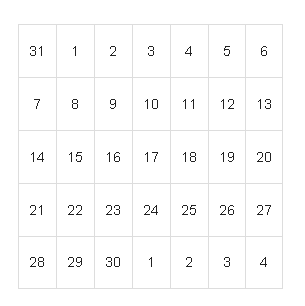
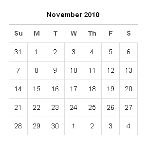
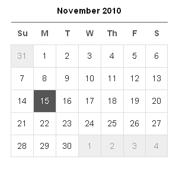
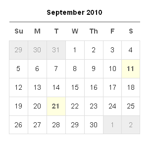
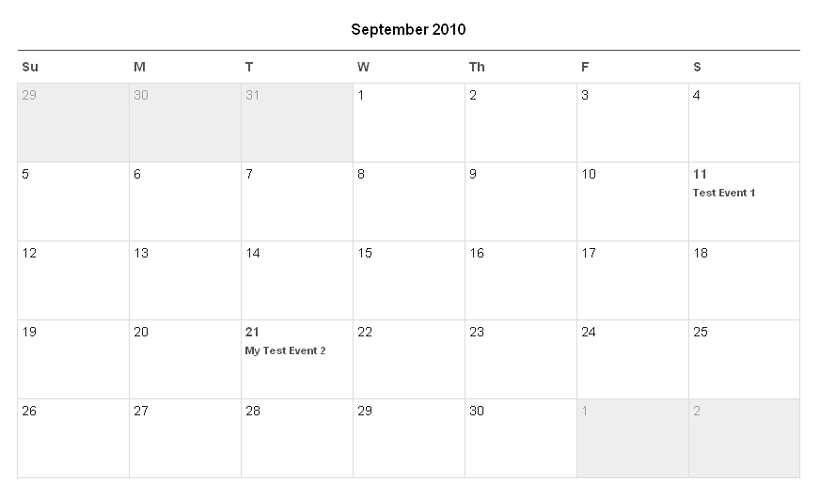

import { Steps } from "@astrojs/starlight/components";

Couch has a handy tag named [**calendar**](../../tags-reference/calendar/) that can be used to quickly display the traditional matrix of weeks and days belonging to a month. Additionally, we can associate a clonable template with this tag to make it display the pages cloned from the template as entries of the calendar.

It shouldn't be difficult to see that to build an Events Calendar, we can create a regular clonable template (let us call it `events.php`). Each cloned page will then represent an event. The publish date of a cloned page can represent the scheduled date for the event it represents. For all the other data that needs to be displayed for an event, editable regions can be created the usual way.

This `events.php` template then can be associated with a calendar to display the events (cloned pages) on the dates they are to fall on.

:::tip[End Date]
If you need an end date for your events, you can create an editable region of type `text` and set an appropriate regex validator on it to capture date in the proper format. Please see the last example on this page.
:::

### Displaying the calendar

The [**calendar**](../../tags-reference/calendar/) tag we mentioned has three auxiliary tags associated with it - [**weeks**](../../tags-reference/weeks/), [**days**](../../tags-reference/days/) and [**entries**](../../tags-reference/entries/). These three tags are slightly different from all the other Couch tags we have seen so far in that they are meant to be used only within certain tags. The [**weeks**](../../tags-reference/weeks/) tag will work only when nested within a calendar tag, the [**days**](../../tags-reference/days/) tag is meant to be used only within the weeks tag and finally the [**entries**](../../tags-reference/entries/) tag is expected to be placed only within the days tag.

The following example will make the relationship clear where we are displaying a calendar for the current month:

```php title="Basic Calendar Example"
<cms:calendar >
    <table class="calendar_small">
        <cms:weeks>
            <tr>
            <cms:days >
                <td ><cms:show k_day /></td>
            </cms:days>
            </tr>
        </cms:weeks>
    </table>
</cms:calendar>
```

:::tip[Styling]
For all the examples of calendar on this page, we'll use [**calendar.css**](https://www.couchcms.com/docs/code/calendar.css) to format the display. You can use the same CSS for your work or create your own CSS.
:::

Executing the code given above should result in the following:


> Calendar showing basic month view

As you can see, the generated calendar is an HTML table, where the weeks tag was used within the calendar tag to produce the rows of the table and the days tag was used within each row to produce seven cells each representing a day.

Depending on the month of the calendar, the weeks tag will repeat as many times as there are weeks in that month (will range from 4 to 6). The days tag will always repeat seven times within each week. Each of the iterated day can belong to either the previous month, the month being displayed or the next month.

As with the other Couch tags, these tags too set up variables to provide more information about the objects they represent.
Some of the variables that can be used are:

#### `calendar`

- `k_count_weeks` - Number of weeks in the month
- `k_calendar_date` - The month being displayed in yyyy-mm-dd format (e.g. 2010-10-01 for October, 2010)
- `k_next_calendar_date` - The month that comes after the one being displayed
- `k_prev_calendar_date` - The month that came before the one being displayed

#### `weeks`

- `k_week_num` - Number of the week being iterated

#### `days`

- `k_date` - date of the day being iterated
- `k_day` - Number representing the day
- `k_month` - Number representing the month of the day
- `k_year` - Number representing the year of the day
- `k_day_of_week` - Number representing the day of the week the day falls on
- `k_position` - One of these three values: `previous_month`, `current_month` or `next_month`
- `k_timeline_position` - One of these three values: `past`, `present` or `future`

We can use these variables to format the display of the calendar more finely.

Let us start by adding a few headers:

```php title="Calendar with Headers"
<cms:calendar >
    <table class="calendar_small">
        <tr>
            <th colspan="7"><cms:date k_calendar_date format='F Y' /></th>
        </tr>
        <tr>
            <cms:repeat count='7'>
            <td class="months_heading"><cms:zebra 'Su' 'M' 'T' 'W' 'Th' 'F' 'S'/></td>
            </cms:repeat>
        </tr>

        <cms:weeks>
            <tr>
            <cms:days >
                <td ><cms:show k_day /></td>
            </cms:days>
            </tr>
        </cms:weeks>
    </table>
</cms:calendar>
```

The result of the changes:


> Calendar showing month and day headers

Next we'll format the table cells to indicate whether the day represented by a cell lies in the past, present or future. The modified code of our calendar:

```php title="Calendar with Timeline Formatting"
<cms:calendar >
    <table class="calendar_small">
        <tr>
            <th colspan="7"><cms:date k_calendar_date format='F Y' /></th>
        </tr>
        <tr>
            <cms:repeat count='7'>
            <td class="months_heading"><cms:zebra 'Su' 'M' 'T' 'W' 'Th' 'F' 'S'/></td>
            </cms:repeat>
        </tr>

        <cms:weeks>
            <tr>
            <cms:days >
              <cms:if k_timeline_position='present'>
                   <cms:set tdclass='today' />
              <cms:else />
                   <cms:set tdclass='' />
              </cms:if>

              <cms:if k_position='current_month' >
                   <td class='<cms:show tdclass />' ><cms:show k_day /></td>
              <cms:else />
                   <td class='other_month'><cms:show k_day /></td>
              </cms:if>
            </cms:days>
            </tr>
        </cms:weeks>
    </table>
</cms:calendar>
```


> Calendar showing past, present and future dates

Notice how for days that belong to previous and next months we set up a class named `other_month`. Also note how for the current day amongst the days of the month being shown, we mark the cell with a `today` class.

The calendar generated is for the current date. To generate one for any arbitrary date, use the calendar tag's `date` parameter. For example, the following addition to our code will display the calendar for month of September, 2010:

```php title="Calendar with Custom Date"
<cms:calendar date='2010-09-01' >
    // ... existing code ...
</cms:calendar>
```

### Attaching a template to the calendar

A clonable template can be attached to a calendar, like the one we have created so far, by setting the `masterpage` parameter. Once a template gets associated with a calendar, the days tag starts supporting another tag named [**entries**](../../tags-reference/entries/) within it. The entries tag, when used within the days tag, will iterate through all cloned pages of the template that were published on the day being iterated through. The days tag also sets a variable named `k_count_entries` to indicate the number of entries (i.e. cloned pages) present for each day.

```php title="Calendar with Template Example"
<cms:calendar date='2010-09-01' masterpage='events.php'>
    <table class="calendar_small">
        <tr>
            <th colspan="7"><cms:date k_calendar_date format='F Y' /></th>
        </tr>
        <tr>
            <cms:repeat count='7'>
            <td class="months_heading"><cms:zebra 'Su' 'M' 'T' 'W' 'Th' 'F' 'S'/></td>
            </cms:repeat>
        </tr>

        <cms:weeks>
            <tr>
            <cms:days >
                <cms:if k_timeline_position='present'>
                    <cms:set tdclass='today' />
                <cms:else />
                    <cms:set tdclass='' />
                </cms:if>

                <cms:if k_position='current_month' >
                    <cms:if k_count_entries >
                        <td class='entries <cms:show tdclass />' >
                            <a href="<cms:link masterpage='events.php' year=k_year month=k_month day=k_day />"><cms:show k_day /></a>
                        </td>
                    <cms:else />
                        <td class='<cms:show tdclass />' ><cms:show k_day /></td>
                    </cms:if>
                <cms:else />
                    <td class='other_month'><cms:show k_day /></td>
                </cms:if>
            </cms:days>
            </tr>
        </cms:weeks>
    </table>
</cms:calendar>
```

Result of the changes:


> Calendar showing linked event dates

The calendar above is well suited to be placed in a sidebar. Notice how we are displaying the dates that have cloned pages in a different color and how that cell is linked to an archive_view (daily archive) of the template that can be used to display all pages belonging to a particular day in a list-view.

If we wish, we can display the names and links of pages right within the table cell they fall in by creating a bigger table.

```php title="Calendar with Event Details"
<cms:calendar date='2010-09-01' masterpage='events.php'>
    <table class="calendar_big">
        <tr>
            <th colspan="7"><cms:date k_calendar_date format='F Y' /></th>
        </tr>
        <tr>
            <cms:repeat count='7'>
            <td class="months_heading"><cms:zebra 'Su' 'M' 'T' 'W' 'Th' 'F' 'S'/></td>
            </cms:repeat>
        </tr>

        <cms:weeks>
            <tr>
            <cms:days pad_with_zeroes='0' >
                <cms:if k_timeline_position='present'>
                    <cms:set tdclass='today' />
                <cms:else />
                    <cms:set tdclass='' />
                </cms:if>

                <cms:if k_position='current_month' >
                    <cms:if k_count_entries >
                        <td class='entries <cms:show tdclass />' align='center'>
                            <a href="#"><cms:show k_day /></a>
                            <ul>
                                <cms:entries limit='2' skip_custom_fields='1'>
                                <li>
                                    <a href="<cms:show k_page_link />"><cms:show k_page_title /></a>
                                </li>
                                </cms:entries>
                            </ul>
                        </td>
                    <cms:else />
                        <td class='<cms:show tdclass />' ><cms:show k_day /></td>
                    </cms:if>
                <cms:else />
                    <td class='other_month'><cms:show k_day /></td>
                </cms:if>
            </cms:days>
            </tr>
        </cms:weeks>
    </table>
</cms:calendar>
```

The changes will result in the following:


> Calendar showing event titles in cells

Notice how we used the class `calendar_big` with the table. Also notice how we used the entries tag to enumerate two of the cloned pages available within a day. The `skip_custom_field` parameter is set to `1` to avoid the overhead of fetching in all the values contained within the editable regions of the cloned pages, as we won't be needing them here.

The date of the calendar shown is still hard-coded. As final modification, let us change that by providing the date via the querystring via a parameter named `cal`.

### A complete working example

Following is a real-world template that uses the concepts discussed above to build a working events calendar. You can use it as the starting point for your events calendar:

```php title="Complete Events Calendar Example"
<?php require_once( 'couch/cms.php' ); ?>
<cms:template title='Events' clonable='1'>
    <cms:editable name='desc' label='Description' type='textarea' />
    <cms:editable name='location' label='Location' type='text' />

    <cms:editable name="start_time" label="Time From (24 Hrs)"
      opt_values=' Unspecified |
                  00:00 | 00:30 | 01:00 | 01:30 | 02:00 | 02:30 | 03:00 | 03:30 |
                  04:00 | 04:30 | 05:00 | 05:30 | 06:00 | 06:30 | 07:00 | 07:30 |
                  08:00 | 08:30 | 09:00 | 09:30 | 10:00 | 10:30 | 11:00 | 11:30 |
                  12:00 | 12:30 | 13:00 | 13:30 | 14:00 | 14:30 | 15:00 | 15:30 |
                  16:00 | 16:30 | 17:00 | 17:30 | 18:00 | 18:30 | 19:00 | 19:30 |
                  20:00 | 20:30 | 21:00 | 21:30 | 22:00 | 22:30 | 23:00 | 23:30 |'
      type='dropdown'
    />

    <cms:editable name="end_time" label="Time Until (24 Hrs)"
      opt_values=' Unspecified |
                  00:00 | 00:30 | 01:00 | 01:30 | 02:00 | 02:30 | 03:00 | 03:30 |
                  04:00 | 04:30 | 05:00 | 05:30 | 06:00 | 06:30 | 07:00 | 07:30 |
                  08:00 | 08:30 | 09:00 | 09:30 | 10:00 | 10:30 | 11:00 | 11:30 |
                  12:00 | 12:30 | 13:00 | 13:30 | 14:00 | 14:30 | 15:00 | 15:30 |
                  16:00 | 16:30 | 17:00 | 17:30 | 18:00 | 18:30 | 19:00 | 19:30 |
                  20:00 | 20:30 | 21:00 | 21:30 | 22:00 | 22:30 | 23:00 | 23:30 |'
      type='dropdown'
    />

    <cms:editable name='end_date'
        label='Event End Date (if multi-days event)'
        desc='Enter date in yyyy-mm-dd format e.g. 2010-12-31'
        type='text'
        validator='regex=/(?:19|20)\d\d-(?:0[1-9]|1[012])-(?:0[1-9]|[12][0-9]|3[01])/'
        separator='#'
        validator_msg='regex=Incorrect date format'
    />

</cms:template>
<HTML>
<HEAD>
<TITLE></TITLE>
<link href="<cms:show k_site_link />calendar.css" rel="stylesheet" type="text/css">
</HEAD>
<BODY>
    <cms:if k_is_page >
        <!-- Page View -->
        <b>Event:</b> <cms:show k_page_title /><br>
        <b>Description:</b> <cms:show desc /><br>
        <b>Location:</b> <cms:show location /><br>
        <b>Date:</b> <cms:date k_page_date format='F j, Y' /><br>
        <cms:if start_time!='Unspecified' >
            <b>From:</b> <cms:show start_time /><br>
        </cms:if>
        <cms:if "<cms:not_empty end_date />" >
            <b>End Date:</b> <cms:date end_date format='F j, Y' /><br>
        </cms:if>
        <cms:if end_time!='Unspecified' >
            <b>Till:</b> <cms:show end_time /><br>
        </cms:if>

    <cms:else />
        <!-- List view -->
        <cms:calendar date="<cms:gpc 'cal' />" masterpage=k_template_name show_future_entries='1' >
            <table class="calendar_big">
                <tr>
                    <th><a href="<cms:concat k_page_link '?cal=' k_prev_calendar_date />"> << </a></th>
                    <th colspan="5"><cms:date k_calendar_date format='F Y' /></th>
                    <th><a href="<cms:concat k_page_link '?cal=' k_next_calendar_date />"> >> </a></th>
                </tr>
                <tr>
                    <cms:repeat count='7'>
                    <td class="months_heading"><cms:zebra 'Su' 'M' 'T' 'W' 'Th' 'F' 'S'/></td>
                    </cms:repeat>
                </tr>

                <cms:weeks>
                    <tr>
                    <cms:days >
                        <cms:if k_timeline_position='present'>
                            <cms:set tdclass='today' />
                        <cms:else />
                            <cms:set tdclass='' />
                        </cms:if>

                        <cms:if k_position='current_month' >
                            <cms:if k_count_entries >
                                <td class='entries <cms:show tdclass />' align='center'>
                                    <a href="#"><cms:show k_day /></a>
                                    <ul>
                                    <cms:entries limit='2' skip_custom_fields='1'>
                                        <li>
                                            <a href="<cms:show k_page_link />"><cms:show k_page_title /></a>
                                        </li>
                                    </cms:entries>
                                    </ul>
                                </td>
                            <cms:else />
                                <td class='<cms:show tdclass />' ><cms:show k_day /></td>
                            </cms:if>
                        <cms:else />
                            <td class='other_month'><cms:show k_day /></td>
                        </cms:if>
                    </cms:days>
                    </tr>
                </cms:weeks>
            </table>
        </cms:calendar>
    </cms:if>
</BODY>
</HTML>
<?php COUCH::invoke(); ?>
```

Points to note in the code above:

<Steps>

1. We have defined editable regions to capture details about events.
2. In the page-view of this template we display the details of the event in question.
3. In the list-view we display the calendar. The events show up as calendar entries and are linked to their page-views.
4. We are using a querystring variable named `cal` to set the `date` parameter of calendar tag. The Couch [**gpc**](../../tags-reference/gpc/) tag is used to get the value of this variable from the querystring. When this variable is not present in the querystring and hence the `date` parameter turns up empty, the calendar tag uses the current date instead.
5. We have set a link to the previous month and another to the next month by using the `k_prev_calendar_date` and `k_next_calendar_date` variables that are set by the calendar tag.
6. The calendar tag accepts all the parameters that are normally used with the pages tag. Similar to the pages tag, this tag too does not fetch pages that have their publication dates set in the future. Since events will normally be for the future, we have set the `show_future_entries` parameter to `1` to prevent the calendar tag from skipping future entries.

</Steps>
