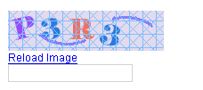
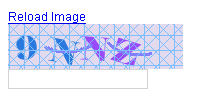
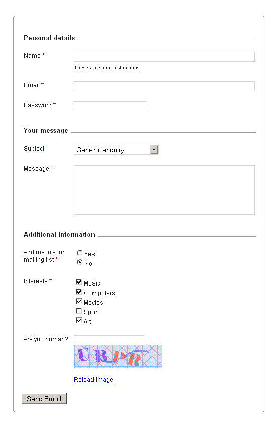

import { Steps } from '@astrojs/starlight/components';

Forms are an essential part of any website and even the simplest website is likely to have at least one form - the contact form. Creating a form in HTML is relatively simple. What is not so simple is creating a validation routine that allows only a properly filled form to be submitted. This usually entails coding a PHP script that handles all the validations upon form submission and takes necessary actions on success or failure.

Couch takes away this pain of coding validation routines for your forms by doing this automatically for you. A form of almost any complexity can be easily created by using a few Couch tags.

Let us begin with a simple example. The following is the HTML code one would use to create a simple form. Note how a PHP script (`action="contact.php"`) is needed to handle the posted values, validate them and then, probably, email them somewhere.

```html title="Basic HTML Form"
<form method="post" action="contact.php">
    Name: <input type="text" size="10" maxlength="40" name="name"> <br />
    Email: <input type="text" size="10" name="email"> <br />

    <input type="submit" value="Send">
</form>
```

The same form created using Couch tags would look like:

```php title="Basic Couch Form Example"
<cms:form method="post">
    Name: <cms:input type="text" size="10" maxlength="40" name="name" /> <br />
    Email: <cms:input type="text" size="10" name="email" /> <br />

    <cms:input name="submit" type="submit" value="Send" />
</cms:form>
```

Note how with just a little modification, an existing HTML form was transformed into a Couch managed form.

The [**`form`**](../../tags-reference/form/) and [**`input`**](../../tags-reference/input/) tags were converted to their Couch equivalents by simply adding `cms:` prefix.
Couch expects its single tags to be properly self-closed hence the two input tags were fitted with the closing slashes.
The `name` parameter is mandatory for an input tag in Couch hence the submit type was given a name.
Finally, since now Couch will be handling all the validation chores, the `action` attribute is removed.

:::tip[About the action attribute]
The `action` attribute can be retained if you wish the form to be processed by some other script. In such cases, Couch tags will simply be used to output the form.
:::

Submitting the form generated by our snippet above will do nothing useful yet. To make it do anything useful we'll need to understand how Couch handles form submission and validation.

### Form Validation

When a form is submitted, Couch validates the submitted contents of all constituent fields.

If all the fields validate, Couch makes available to your code all the submitted values by placing them in variables named after the respective fields. Thus if a form has two fields named 'name' and 'password', on successful submission of the form, two variables named `frm_name` and `frm_password` will become available in the context of the parent form. The values of these variables will be what was submitted by the user through these fields.
Additionaly, the names and values of each fields are concatenated using a `\n` newline character to get a single string and this string is placed in a variable named `k_success`.

Conversely, if even a single field fails to validate, Couch makes available to your code each field that failed validation. Thus if two fields named 'name' and 'password' did not validate, two variables named `k_error_name` and `k_error_password` will become available in the context of the parent form. These variables will contain the relavent error messages.
Additionaly, the names of each failed fields along with their error messages are concatenated using a `|` pipe character to get a single string and this string is placed in a variable named `k_error`.

We can test the `k_success` and `k_error` variables in our code to determine the result of the submission and then access the involved input fields to offer appropriate feedback to the user.

It should be evident from the discussion above that for both the success as well as the error conditions, there are two ways to access the input fields:

1. Individually via variables named after them
2. Through the `k_success` and `k_error` variables

Before we demonstrate how to use both the ways, let us first place some validation constrains on the input fields.
The most common validation that is required is making sure that a field has not been left empty. This can be done by setting the `required` parameter to `1`.

:::tip[About Form Validation]
For a `required` field further several kinds of validations can be enforced. The input tags use the same validators that are used by the [**Editable Regions**](../editable-regions/). Please see the [**validators**](../../tags-reference/editable/#validator) section of [**editable**](../../tags-reference/editable/) tag for a list of all the validators that can be used.
:::

For our example we'll make both the fields required and futher ensure that a valid email is always inputted in the email field by setting the `email` validator. Modify the input fields as follows:

```php title="Form with Validation"
<cms:form method="post">
    Name: <cms:input type="text" size="10" maxlength="40" name="name" required='1' /> <br />
    Email: <cms:input type="text" size="10" name="email" required='1' validator='email' /> <br />

    <cms:input name="submit" type="submit" value="Send" />
</cms:form>
```

The following snippets demonstrate the validation process and both the aforementioned ways of accessing the input fields:

### 1. Using k_success and k_error Variables

```php title="Form with Success Handling"
<cms:form method="post">
    <cms:if k_success >
        <h3>Form successfully submitted</h3>
        <cms:each k_success sep='\n'>
            <cms:show item /><br>
        </cms:each>
    </cms:if>

    <cms:if k_error >
        <h3>Failed to submit form</h3>
        <cms:each k_error >
            <cms:show item /><br>
        </cms:each>
    </cms:if>

    Name: <cms:input type="text" size="10" maxlength="40" name="name" required='1' />
    Email: <cms:input type="text" size="10" name="email" required='1' validator='email' />

    <cms:input name="submit" type="submit" value="Send" />
</cms:form>
```

Note the use of each tag to get the individual values within `k_success` and `k_error`.

### 2. Accessing input fields individually

```php title="Form with Individual Field Error Handling"
<cms:form method="post">
    <cms:if k_success >
        <h3>Form successfully submitted</h3>
        name: <cms:show frm_name /><br>
        email: <cms:show frm_email /><br>
    </cms:if>

    <cms:if k_error >
        <h3>Failed to submit form</h3>
    </cms:if>

    Name: <cms:input type="text" size="10" maxlength="40" name="name" required='1' />
          <cms:if k_error_name ><cms:show k_error_name /></cms:if> <br />
    Email: <cms:input type="text" size="10" name="email" required='1' validator='email' />
           <cms:if k_error_email ><cms:show k_error_email /></cms:if> <br />

    <cms:input name="submit" type="submit" value="Send" />
</cms:form>
```

Notice how we append an error message after each field if a validation error occurs.

Submit the form and see how the validation takes place.

### Taking Action Upon Successful Submission

In our examples given above we have simply been echoing back the submitted values upon successful submission of form. Usually you'll wish to do something more substantial - like emailing the values to some address etc. This is how it could be done:

```php title="Form with Email Notification"
<cms:form method="post">
    <cms:if k_success >
        <h3>Thanks for your submission. We'll get back to you.</h3>
        <cms:send_mail from='abc@somemail.com' to='xyz@somemail.com' subject='Feedback from your site'>
            The following is an email sent by a visitor to your site:
            <cms:show k_success />
        </cms:send_mail>
    </cms:if>

    <cms:if k_error >
        <h3>Failed to submit form</h3>
        <cms:each k_error >
            <cms:show item /><br>
        </cms:each>
    </cms:if>

    Name: <cms:input type="text" size="10" maxlength="40" name="name" required='1' /> <br />
    Email: <cms:input type="text" size="10" name="email" required='1' validator='email' /> <br />

    <cms:input name="submit" type="submit" value="Send" />
</cms:form>
```

Notice how we use the `k_success` variable to email the data via [**send_mail**](../../tags-reference/send_mail/).

### Input Types

As seen in the snippets above, Couch employs its own variations of the [**form**](../../tags-reference/form/) tag and the [**input**](../../tags-reference/input/) tags to create and validate forms. Most (but not all) of the input types of Couch have one to one correlation with their HTML counterparts. The types of input tags that are currently supported by Couch and how they relate with the HTML equivalents are given below.

:::note
For a full list of all the parameters accepted by the [**input**](../../tags-reference/input/) tag, please see its [**parameters**](../../tags-reference/input/#parameters) section.
:::

**The following four input types are almost identical to the HTML types.**

Porting these HTML tags to Couch tags requires only the addition of the 'cms:' prefix as we have seen in the snippets above. These tags are self-closing hence the end-slash is required - and so is the 'name' attribute.

-   `text`
-   `password`
-   `submit`
-   `hidden`

HTML version:

```html title="HTML Input Types"
<input type="text" size="10" maxlength="40" name="name">
<input type="password" size="10" maxlength="10" name="password">
<input type="submit" name="submit" value="Send">
<input type="hidden" name="max_val" value="100">
```

Couch equivalent:

```php title="Couch Input Types"
<cms:input type="text" size="10" maxlength="40" name="name" />
<cms:input type="password" size="10" maxlength="10" name="password" />
<cms:input type="submit" name="submit" value="Send" />
<cms:input type="hidden" name="max_val" value="100" />
```

**The following Couch input types are a little different from their equivalent HTML types.**

#### `textarea`

HTML version:

```html title="HTML Textarea"
<textarea rows="5" cols="20" wrap="physical" name="comments">
    Enter Comments Here
</textarea>
```

Couch equivalent:

```php title="Couch Textarea"
<cms:input type='textarea' rows="5" cols="20" wrap="physical" name="comments">
    Enter Comments Here
</cms:input>
```

#### `radio`

HTML version:

```html title="HTML Radio Buttons Example"
What kind of shirt are you wearing? <br />

Shade:
<input type="radio" name="shade" value="dark">Dark
<input type="radio" name="shade" value="light">Light <br />

Size:
<input type="radio" name="size" value="small">Small
<input type="radio" name="size" value="medium">Medium
<input type="radio" name="size" value="large">Large <br />
```

Couch equivalent:

```php title="Couch Radio Buttons Example"
What kind of shirt are you wearing? <br />

Shade:
<cms:input type="radio" name="shade" opt_values="Dark=dark | Light=light" /><br />

Size:
<cms:input type="radio" name="size" opt_values="Small=small | Medium=medium | Large=large" /><br />
```

#### `checkbox`

HTML version:

```html title="HTML Checkboxes"
Select your favorite cartoon characters:
<input type="checkbox" name="toon" value="Goofy">Goofy
<input type="checkbox" name="toon" value="Donald">Donald
<input type="checkbox" name="toon" value="Bugs">Bugs Bunny
<input type="checkbox" name="toon" value="Scoob">Scooby Doo
```

Couch equivalent:

```php title="Couch Checkboxes"
Select your favorite cartoon characters:
<cms:input type="checkbox" name="toon" opt_values="Goofy | Donald | Bugs Bunny=Bugs | Scooby Doo=Scoob" />
```

:::note[About Multiple Checkbox Values]
In case the user selects multiple checkboxes, the value in the resulting variable will be a comma separated string containing all the selected checkbox values. Thus if in the given example, the user selects Goofy, Bugs Bunny and Scooby Doo, the variable `frm_toon` will have the value - '_Goofy, Bugs, Scoob_'.
:::

#### `dropdown`

HTML version:

```html title="HTML Dropdown"
College Degree?
<select name="degree">
    <option>Choose One</option>
    <option>High School Degree</option>
    <option>Some College</option>
    <option>Bachelor's Degree</option>
    <option>Doctorate</option>
</select>
```

Couch equivalent:

```php title="Couch Dropdown"
College Degree?
<cms:input type="dropdown"
    name="degree"
    opt_values="Choose One | High School Degree | Some College | Bachelor's Degree | Doctorate"
/>
```

:::tip[About Dropdown Size]
Setting the `size` parameter will convert the dropdown to a plain selection list.

```php title="Selection List" "size"
<cms:input type="dropdown"
    name="degree"
    size='4'
    opt_values="Choose One | High School Degree | Some College | Bachelor's Degree | Doctorate"
/>
```
:::

:::caution[Important Limitation]
Multiple selection is not currently supported.
:::

**The following Couch type has no HTML equivalent.**

#### `captcha`

It is used to create a CAPTCHA that prevents spammers from abusing your form.

:::note[About Required Parameter]
The `required` parameter is always assumed to be set to '1' for a `captcha`.
:::

```php title="Basic Captcha"
<cms:input type='captcha' name='my-captcha' />
```

The captcha type, unlike the other input types, is a composite input and consists of three discrete elements:

<Steps>

1.  A generated image that has some random numbers.
2.  A textbox input that will be used by the user to enter the number shown to him.
3.  A 'Reload Image' link that can be used by the user to get another image without reloadng the entire page.

</Steps>

You can use the `format` parameter to control which of the three constituent elements are shown and in which order. The `format` parameter expects a text string that can consist of 4 different characters:
- 't' = textbox
- 'i' = image  
- 'r' = reload link
- '-' = HTML break

Since each of these characters represent a constituent element of the captcha, it is easy to see how these elements can be manipulated, e.g.:

```php title="Captcha Format Examples"
<cms:input type='captcha' name='my-captcha' format='i-r-t' />
```

Shows:



While:

```php title="Alternative Format"
<cms:input type='captcha' name='my-captcha' format='r-i-t' />
```

Shows:



If you do not wish the three elements to be separated by `<br>`s, use this:

```php title="Compact Format"
<cms:input type='captcha' name='my-captcha' format='rit' />
```

:::note[About Format Parameter]
The default value of `format` is 't-i-r'
:::

The `reload_text` parameter can be used to change the 'Reload Image' text to anything you wish.
The `width` parameter can be used to set the width of the text box.

:::caution[File Upload Limitation]
Couch, as of the current version, does not support file uploads e.g.
```html
<input name="file" type="file" />
```
:::

### Using Fieldset

As demonstrated so far, an easy way to create a working form in Couch is to start with an existing HTML coded form and convert the existing form and input tags to their Couch equivalents. This way you can add validation to any of your existing forms.

However, if are required to code a form from scratch, you can use the [**fieldset**](../../tags-reference/fieldset/) tag of Couch to give you a helping hand. Couch's version of this tag is the exact equivalent of its HTML counterpart and serves the same purpose of grouping together related form elements. Additionaly it also outputs `<dl>`, `<dt>` and `<dd>` tags to wrap correctly the child input tags. This way you can quickly get a semantically correct form quite easily.

The following Couch snippet:

```php title="Fieldset Example"
<cms:fieldset>
    <cms:input type="text" size="10" maxlength="40" name="name" required='1' />
    <cms:input type="password" size="10" maxlength="10" name="password" />
</cms:fieldset>
```

Outputs:

```html title="Generated HTML"
<fieldset>
    <dl>
        <dt><label for="name">name <span class="k_fielderror">*</span> </label></dt>
        <dd><input type="text" maxlength="40" size="10" value="aa" id="name" name="name"/></dd>

        <dt><label for="password">password </label></dt>
        <dd><input type="password" maxlength="10" size="10" value="" id="password" name="password"/></dd>
    </dl>
</fieldset>
```

:::tip[About Fieldset Labels]
For input tags that are wrapped within [**fieldset**](../../tags-reference/fieldset/) tags, you can set the `label` and `desc` parameters to properly label the fields.
:::

### Example of a Full Form

Following is an example of a real-world form:

```php title="Complete Contact Form"
<cms:form enctype="multipart/form-data" method="post" class="k_form">

        <cms:if k_success >
            <div class="k_successmessage">
                <cms:send_mail from=k_email_from to=k_email_to subject='Feedback from your site'>
                    The following is an email sent by a visitor to your site:
                    <cms:show k_success />
                </cms:send_mail>

                <h3>Message sent</h3>
                <pre> <cms:show k_success /> </pre>
            </div>
        </cms:if>

        <cms:if k_error >
            <div class="k_errormessage">
                <ul>
                    <cms:each k_error >
                        <li><cms:show item /></li>
                    </cms:each>
                </ul>
            </div>
        </cms:if>

        <cms:fieldset label='Personal details'>
            <cms:input type="text"
                       name="name"
                       label="Name"
                       desc='These are some instructions'
                       maxlength="100"
                       required='1'
                       validator='min_len=3'/>

            <cms:input type="text"
                       name="email"
                       label='Email'
                       maxlength="100"
                       validator='email'
                       required='1' />

            <cms:input type="password"
                       name="userpassword"
                       label='Password'
                       maxlength="12"
                       required='1' />

        </cms:fieldset>

        <cms:fieldset label='Your message'>
            <cms:input type="dropdown"
                       name="subject"
                       label='Subject'
                       opt_values='Please select a subject=- | General enquiry | Booking enquiry'
                       opt_selected='General enquiry'
                       required='1' />

            <cms:input type="textarea" cols="35" rows="5" name="message"
                       required='1'
                       label='Message'></cms:input>

        </cms:fieldset>

        <cms:fieldset label='Additional information'>
            <cms:input type="radio"
                       name="mailinglist"
                       label='Add me to your mailing list'
                       opt_values='Yes=y | No=n'
                       opt_selected='n'
                       required='1' />

            <cms:input type="checkbox"
                       name="interests_arr"
                       label='Interests'
                       opt_values='Music | Computers | Movies | Sport | Art'
                       opt_selected='Music | Computers | Movies | Art'
                       required='1' />

            <cms:input type='captcha'
                       name='my-captcha'
                       label='Are you human?'
                       />

        </cms:fieldset>

        <input type="submit" value="Send Email" name="submit"/>

</cms:form>
```

The code above results in the following form:



:::note[About Styling]
The form above uses [form.css](https://www.couchcms.com/docs/code/form.css) for styling.
:::
