import { FileTree, Steps } from '@astrojs/starlight/components';

A typical website usually consists of two kinds of pages:

<Steps>

1. Pages that can be grouped together under a common section (e.g. all the pages belonging to the blog section or portfolio section)
2. Standalone single pages that are distinct enough to form a section of their own (e.g. **About Us**, **Contact Us** or **Privacy Policy**)

</Steps>

In Couch we handle the first kind of pages mentioned above by cloning them out of a single template. For example, all the pages of the blog section will actually use only a single physical template `blog.php` (see: [**Cloned Pages**](../cloned-pages/)).

We handle the second kind of pages by using a separate template for each of such pages. For example, the **About Us** section might use `about-us.php` while **Contact Us** uses `contact.php`.

Very often we find that these two kinds of pages have a hierarchical relation with each other. For example, the following could be the site-map of a typical website:

<FileTree>
- Home
- About&nbsp;Us/
    - What&nbsp;we&nbsp;do/
        - Portfolio/
        - Testimonials
    - Our&nbsp;team/
    - Contact&nbsp;Us
- Blog/
- Privacy&nbsp;Policy
</FileTree>

The hierarchical relation between the pages usually manifests itself in these ways:

<Steps>

1. In the menu - where the hierarchical structure is represented by having menus that in turn have submenus
2. The breadcrumbs - where the crumbs represent the hierarchy of pages leading up to the page being visited
3. The URL of a page - where the page's hierarchy in the site-tree shows up as segments of the URL (if prettyURLs are used)

</Steps>

:::tip[Menu Management]
Creating a menu that reflects the site structure is the more pressing demand that is encountered. A related requirement that often crops up with building a site's menu is the site-owner's demand to be able to manipulate the menu themselves (i.e. to decide which pages show up in the menu and at which location).
:::

If a site having the structure shown above was to be built in Couch, we already know how to create each of the sections. Creating the hierarchical relation between them, however, would not be so straightforward.

One way could be by placing the templates within physical folders that mimic the structure. Apart from being a little convoluted, this approach also rules out granting the site-owner the ability to manage the site menu by themselves. Also, creating a new standalone page would entail expecting them to be able to place a physical template on their website. Clearly, a better way is required.

Couch version 1.2 introduces the "Nested Pages" feature to provide such a way.

### What is a Nested Page?

A nested-page, internally, is just a variation of the regular cloned-page in Couch that you are already familiar with.

:::danger[Important]
If not, please first take a look at the [**Cloned Pages**](../cloned-pages/) documentation. Much of the current discussion will not make much sense unless you are familiar with the regular cloned pages in Couch.
:::

It is almost identical to the regular cloned page except for the following characteristics:

<Steps>

1. A nested-page allows another nested-page (cloned out of the same template) to be placed below it as its child page. The child page in its turn can have another nested-page as its child and so on. This allows us to create the hierarchical relation between the pages that we were looking for.

2. The position of a nested-page in the hierarchy gets reflected in its URL (if prettyURLs are used) with its parent pages listed before it.
    For example, if the URL of a nested-page is:

    ```txt title="Nested Page URL Example"
    https://www.yoursite.com/one/two/three/
    ```

    "three" would be the page itself with "two" and "one" being its parent nested-pages.

3. Nested-pages do not have a folder-view.
    Regular cloned-pages (i.e. non-nested) use "folders" to create the hierarchical structure. Since for nested-pages, the pages themselves fulfill this task a folder-view is redundant. In fact, if you look closely at the sample URL of a nested-page given in the point above:

    ```txt title="URL Structure Example"
    https://www.yoursite.com/one/two/three/
    ```

    you'll notice that had this URL been of a regular cloned template (i.e. non-nested), it would represent a folder-view - with "one", "two" and "three" being folders of the template. For a nested-page, the "three" becomes the name of the page (notice that unlike regular cloned pages, there is no `.html` extension).

</Steps>

### Creating Nested Pages

As mentioned above, a nested-page is just a variation of the regular cloned page. We create a nested-page exactly the same way a normal page gets created. The process, as usual, begins by declaring the template as "clonable":

```php title="Basic Template Declaration"
<cms:template clonable="1"> 

    // ... existing code ...

</cms:template>
```

The key is that we additionally also declare this clonable template as supporting nested-pages by using this new parameter:

```php title="Nested Pages Template"
<?php require_once "couch/cms.php"; ?>
<cms:template clonable="1" nested_pages="1">

    // ... existing code ... 

</cms:template>
<html>
<head>
```

That is it. Define all required editable regions and follow it all up with the mandatory visit to the template while logged-in as super-admin to add the template in Couch.
Returning back to the admin-panel we'll find that, as happens with regular templates, Couch creates a default cloned page for the template.

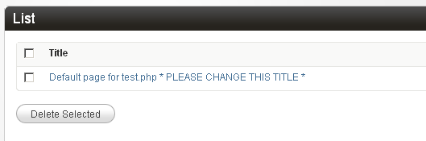

> Admin panel showing the default cloned page

We can rename the default page to create our first nested-page.

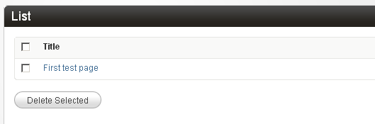

> Renaming the default page

So far everything is exactly the same as happens with the regular cloned pages.
Create another cloned page and edit it to find the first difference.

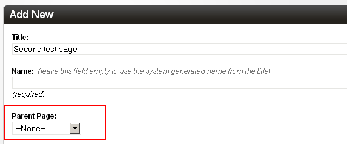

> Parent selection dropdown in nested pages

Nested-pages get an additional system field - a dropdown that lists all the existing pages of the same template. We can choose to place the page being created/edited below another page. We have only one existing page so far so that is the only entry available to choose.

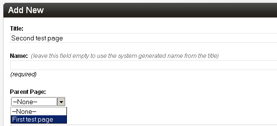

> Setting a parent page for nesting

Place the new second page below the first one we created and save. Create a third page in a similar fashion and also place it below the first page. So now the first page becomes the parent of the next two pages.

The admin page that lists cloned nested-pages looks a little different than what we are used to seeing.

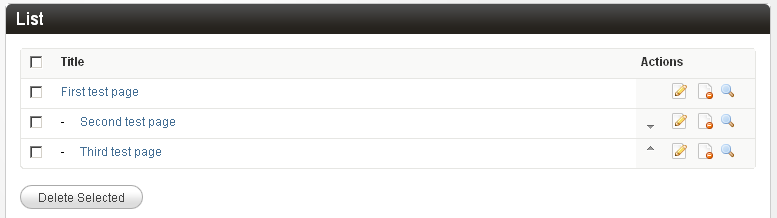

> Admin panel showing nested pages list

You'll find that Couch indicates the hierarchical relation between the pages by using indentation.
Also notice that the two sibling pages at the same level have these little arrows added. You can use them to easily change their display order below their parent.

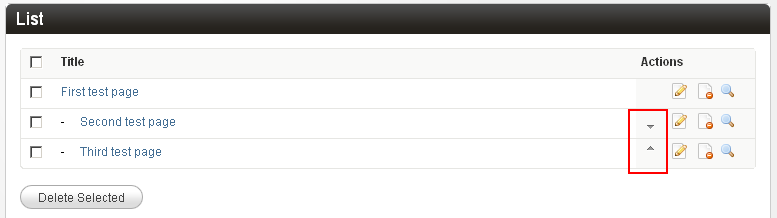

> Arrows for changing page order

Also there is no dropdown showing the folders (as nested-pages do not support and actually ignore any folders defined for the template).

Apart from these minor differences, there are a few more that lie hidden in the "Advanced settings" dropdown. We'll describe them in the next section when we actually make use of them.

So, as you can see, handling nested-pages is not much different from handling regular pages that we are familiar with.

Let us now put the nested-pages feature into action by using it to implement the hierarchical site structure we came across at the top.

### Putting Nested Pages into Action

Please take a look at the proposed site-map again.

<FileTree>
- Home
- About&nbsp;Us/
    - What&nbsp;we&nbsp;do/
        - Portfolio/
        - Testimonials
    - Our&nbsp;team/
    - Contact&nbsp;Us
- Blog/
- Privacy&nbsp;Policy
</FileTree>

As we already mentioned, the blog and portfolio sections can be implemented using the regular cloned pages.

<FileTree>
- Home
- About&nbsp;Us/
    - What&nbsp;we&nbsp;do/
        - **Portfolio/**
        - Testimonials
    - Our&nbsp;team/
    - Contact&nbsp;Us
- **Blog/**
- Privacy&nbsp;Policy
</FileTree>

Get them done first using clonable templates (e.g. `blog.php` and `portfolio.php`).

:::note[Regular Pages]
We assume you already know how to create regular cloned pages. Please see the [**Cloned Pages**](../cloned-pages/) documentation if you need a refresher.
:::

With those sections done we can move on to the isolated standalone pages. It is these pages that we'll implement using the nested-pages feature.

<FileTree>
- **Home**
- **About&nbsp;Us/**
    - **What&nbsp;we&nbsp;do/**
        - Portfolio/
        - **Testimonials**
    - **Our&nbsp;team**
    - **Contact&nbsp;Us**
- Blog/
- **Privacy&nbsp;Policy**
</FileTree>

This is the plan: We'll declare our `index.php` as clonable (and as supporting nested-pages) and then create all the standalone pages as cloned pages of `index.php`. By using `index.php` as the template we'll benefit from the URL structure that will emerge with prettyURLs turned on (the word "index" gets removed from the URL). For example, the URL of "about-us" page will become:

```txt title="About Us URL"
https://www.yoursite.com/about-us/
```

while that of "testimonials" will become:

```txt title="Testimonials URL"
https://www.yoursite.com/about-us/what-we-do/testimonials/
```

It is easy to see that when the URL:

```txt title="Parent Page URL"
https://www.yoursite.com/about-us/
```

is visited, the "about-us" in the URL will indicate to Couch to load the "about-us" page.
Same applies for the "testimonials" in:

```txt title="Child Page URL"
https://www.yoursite.com/about-us/what-we-do/testimonials/
```

However which page do you think will get loaded for this URL?:

```txt title="Home URL"
https://www.yoursite.com/
```

If you are familiar with the regular cloned pages, you'll recognize that this is the "list-view" (see [**Cloned Pages**](../cloned-pages/) and [**Views**](../views/)). Since no page is indicated, none gets loaded. Only the empty template will show up (i.e. the HTML will appear but the editable regions will be empty). We also know that in "list-view", we usually list all the cloned pages of the template (we can choose to do any other thing we want to - point is we'll have to handle the view ourselves). As with any other clonable template, we'll add the following logic to the `index.php` template:

```php title="List View Logic"
<cms:if k_is_page>
    <!-- Single page being visited. Show contents of its editable regions -->
<cms:else />
    <!-- List view. Show a listing of pages -->
</cms:if>
```

This is all staple stuff we use with cloned pages. I am repeating it here to bring home the point that the "home page" (`https://www.yoursite.com/`) of the site is not a "page" that we can create but is a "view" that has to be handled in template code.

Moving on, we now define the editable regions for `index.php`. Since all the cloned pages will share these editable regions, we'll create one that can be generically used in all the stand-alone pages. We'll create only a single region of type richtext and name it "content".

```php title="Template with Editable Region"
<?php require_once "couch/cms.php"; ?>
<cms:template clonable="1" nested_pages="1">
    <cms:editable 
        name="content" 
        label="Content"
        type="richtext" 
    />
</cms:template>
<html>
<head>
```

:::tip[Template Flexibility]
Most of the standalone pages are usually similar and can share the same template and editable regions but what happens when one of them happens to differ from the rest (e.g. contact-us page will usually have a different markup than the others)? Please read on. We'll illustrate how to handle that a little further down.
:::

With the preparations done, make the mandatory visit to `index.php` as super-admin. This will make Couch persist all the changes and add `index.php` as a template managed by it.

Rest should be easy. Simply create a cloned page for each of the standalone pages. Use the "Parents" dropdown list to set the appropriate parents and use the up/down arrows to set the order of their appearance. Once we are through, this is how our tree should look like:

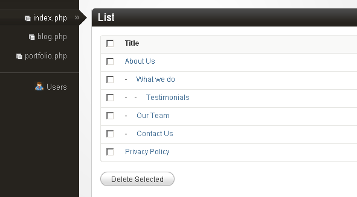

> Complete nested pages structure in admin panel

Fine, but if we are supposed to use this tree structure to create the site's menu - where are the "blog", "portfolio" and the "home" items? This brings us to a feature of nested-pages that is not shared by the regular pages.

### Pointer Pages

A nested-page, as we have seen so far, is no different from a regular page (except that it supports nesting). However a nested-page has one more card up its sleeve - it can act as a _pointer_ to a different page or section. When one visits a nested-page that is acting as a pointer, instead of seeing the nested-page's own data, one gets to see the data of the page that is being pointed to.

Try this out - we already have a discrete "portfolio" section. Let us suppose its URL is:

```txt title="Portfolio Section URL"
http://www.yoursite.com/portfolio/
```

(assuming the template is `portfolio.php` and prettyURLs are turned on). To assimilate this section into the hierarchical tree of nested-pages that we have created so far, create a new cloned page of `index.php` and name it "portfolio". Set the "what-we-do" page as its parent to end up having this structure:

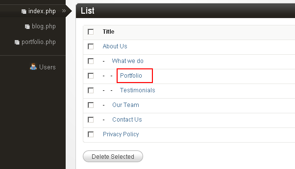

> Portfolio page added to nested structure

The new page is now part of the hierarchy and can be accessed as:

```txt title="Nested Portfolio URL"
http://www.yoursite.com/about-us/what-we-do/portfolio/
```

Now for the fun part - edit this nested "portfolio" page. Click on the "Advanced settings". You'll see that nested-pages have some new options in their advanced settings.


> Advanced settings for nested pages

We'll discuss them in detail when we create the menu - what we are interested in for now is the "Points to another page" option.

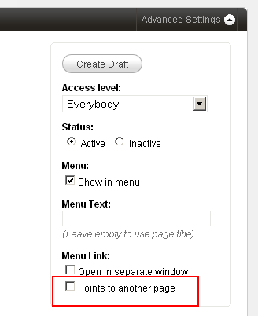

> Points to another page option

Click on this to set the check box. Close the "Advanced settings" dropdown. You'll see that the main body of the edit page now no longer shows the editable regions defined for the template. Instead this is what gets shown:

Before:

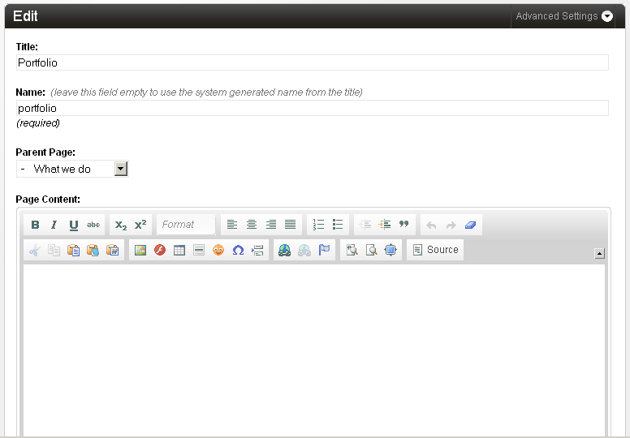

> Regular page edit view

After:

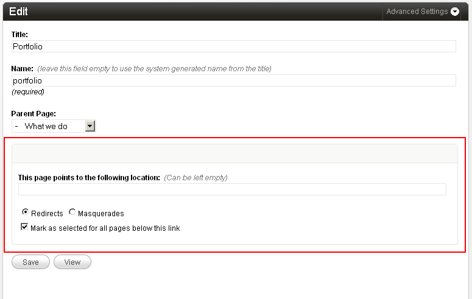

> Pointer page edit view

Paste the URL of the actual portfolio section into the textbox:

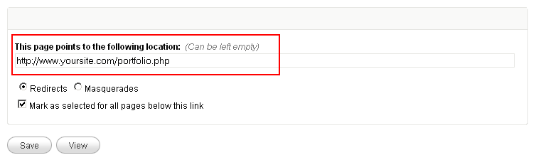

> Setting the pointer URL

:::danger[Important]
Always get the URL of any section being pointed to by visiting it and copying its URL from the address bar of the browser.
:::

Click save. Click on the "View" button to visit this nested page of ours. You'll notice that, instead of:

```txt title="Nested URL"
http://www.yoursite.com/about-us/what-we-do/portfolio/
```

(this nested "portfolio" page's canonical URL), we get redirected to:

```txt title="Target URL"
http://www.yoursite.com/portfolio/
```

#### Masquerading

In the example above, notice that the nested-page acting as pointer **redirected** us to the target page.

If `index.php` is being used as the template for the nested-pages (as we are doing in this example), we get another option to set the method used by the pointer pages to show us the target page - **masquerading**.

Masquerading is a very powerful method that can be used to **make the pointer page behave as if it were the target section itself**. By using this option we can virtually move an entire section anywhere within the nested-pages hierarchy, thus being able to choose any arbitrary URL for that section.

:::note[Pretty URLs Required]
Masquerading requires prettyURLs to be enabled. This is understandable because the whole purpose of masquerading is to impose a new URL structure (established by the pointer page's hierarchy) upon the section being masqueraded. Please see [**Pretty URLs**](../pretty-urls/) section in documentation if you require information on how to enable this feature.
:::

A slight modification to the previous example should make the concept of masquerading clear.

Edit the nested "portfolio" page we used above. This time, instead of the previously chosen "Redirects" method, choose "Masquerades".

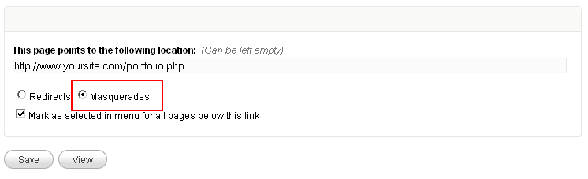

> Setting masquerade option

Remember that the canonical URL of this nested-page is:

```txt title="Original Nested URL"
http://www.yoursite.com/about-us/what-we-do/portfolio/
```

and we are making it point to a separate portfolio section with the canonical URL of:

```txt title="Original Portfolio URL"
http://www.yoursite.com/portfolio/
```

(with prettyURLs enabled).

Save your changes and visit the nested page:

```txt title="New Nested URL"
http://www.yoursite.com/about-us/what-we-do/portfolio/
```

You'll find that this time, instead of redirecting to:

```txt title="Old Portfolio URL"
http://www.yoursite.com/portfolio/
```

the nested-page itself shows the same content that you would have seen had you visited:

```txt title="Original URL"
http://www.yoursite.com/portfolio/
```

If the portfolio section has links to its cloned pages and to its various views (i.e. page-view, folder-view, archive-view etc.), try clicking on them and you'll find that all the links of the portfolio section have now changed automatically.

The URLs will change as follows:

**Original URLs:**

```txt title="Original Portfolio URLs"
https://www.yoursite.com/portfolio/somepagename.html
https://www.yoursite.com/portfolio/some-folder/
```

**New URLs after masquerading:**

```txt title="New Portfolio URLs"
https://www.yoursite.com/about-us/what-we-do/portfolio/somepagename.html
https://www.yoursite.com/about-us/what-we-do/portfolio/some-folder/
```

**For all practical purposes, the portfolio section has been moved in its entirety** from:

```txt title="Old Base URL"
https://www.yoursite.com/portfolio/
```

to:

```txt title="New Base URL"
https://www.yoursite.com/about-us/what-we-do/portfolio/
```

**without making any changes whatsoever to the portfolio section!**

:::note[Original URL Handling]
If you try to access the portfolio section using its original URL, it will send you back to its new URL with a 301 HTTP code indicating that the page has moved to the new location.
:::

A comparison between the two methods used by pointer pages may be in order:

| Redirection | Masquerading |
| :---------- | :----------- |
| Primarily meant to create menus (where menu-items, i.e. nested-pages, direct the visitors to proper sections of the website) | Primarily meant to relocate entire discrete sections at any desired location within the site's hierarchy. Also helps providing the site-owner a unified and compact interface to manage all the sections of the web-site |
| Available in pages of all templates that support nested-pages | Available only in pages of `index.php` template (if configured to support nested-pages) |
| Does not depend on prettyURLs to work | Requires prettyURLs |
| Multiple nested-pages of a template can point to the same section. E.g. one nested-page of a template may point to a particular page of "portfolio" section while another nested-page of the same template may point to another page or folder of the same "portfolio" section | A template can be masqueraded only once by any of the nested-pages of `index.php`. E.g. if "portfolio" section is masqueraded by a particular nested-page of `index.php`, no other nested-page of `index.php` can masquerade "portfolio" section again. Also, the "portfolio" section will be masqueraded in its entirety - i.e. all its pages and all its views will get masqueraded and hence their original URLs changed |

### Moving on

With the 'pointer page' concept understood, it should be easy to see how a menu of any complexity can be implemented using the nested-pages. Simply create a nested-page that reflects the desired hierarchical position and make it point to any page (hence the title 'AKA Menu maker').

Create a similar pointer-page for the 'blog' section and another one for the 'home' section.
Remember that the 'home' section' is actually a 'view' (as opposed to being a 'page'). That is perfectly okay. Just paste in the home page's URL `https://www.yoursite.com/` in the 'points to' textbox. Uncheck the 'Mark as selected for all pages below this link' (this is important - we'll explain why a little later. For now just be sure to uncheck it).

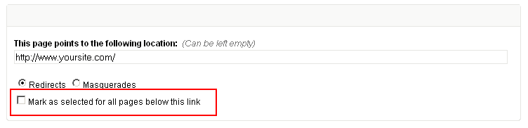

Visit and page and it will dutifully redirect to the site's home page.

The site structure we now have looks like this:

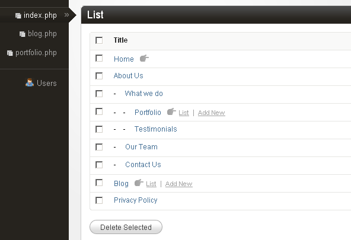

Notice how the pointer pages have a 'hand' icon indicating that they are pointers. Also that you can access the pointed sections directly from the links that appear alongside.

We are almost there. Just implementing the 'contact-us' section remains and we can move on to create our site's menu using this tree structure of `index.php`.

In the tree structure that we have now, all the standalone pages share the same HTML markup and the same editable regions - not surprising as that is how the cloned pages are supposed to be. The 'contact-us' page, however, needs a different HTML markup (will have an HTML form etc.).

Such pages can be implemented using the same method that was used with the 'portfolio' and 'blog' sections above. Implement the 'contact-us' page as a section in itself by using a separate non-clonable template, say named `contact-us.php`:

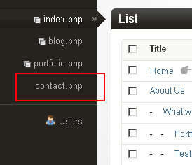

Edit the nested-page named 'contact-us' (`https://www.yoursite.com/about-us/contact-us/`) that we have in our tree and make it a pointer page masquerading as the `contact-us.php` we implemented above:

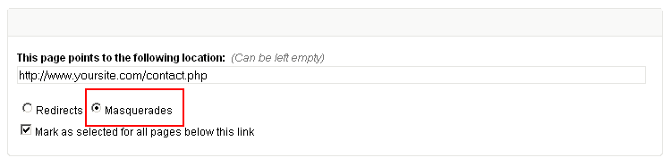

Visit:

```txt
http://www.yoursite.com/about-us/contact-us/
```

and the contents of the original:

```txt
http://www.yoursite.com/contact-us/
```

should appear.

Our hierarchical tree structure is now complete.

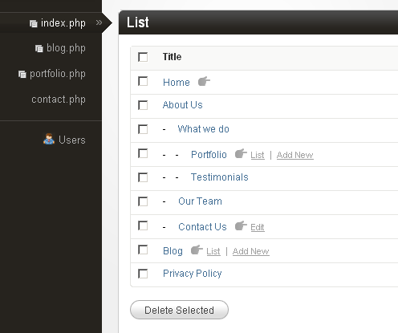

What remains now is to make Couch automatically generate a menu for the site that reflects this hierarchy.

### Creating the Menu

Typically, menu and breadcrumbs are the two elements on a web page that reflect the hierarchical structure of the website. The tree we created above using nested-pages contains all the information that is needed to create such menus and breadcrumbs. To help us with this task, Couch now has three new tags that can iterate through our tree and output the desired markup:

- [**nested_pages**](../../tags-reference/nested_pages/)
- [**menu**](../../tags-reference/menu/)
- [**nested_crumbs**](../../tags-reference/nested_crumbs/)

The `nested_pages` tag is a rather low-level (but very powerful) tag that can be used to iterate through the hierarchy of nested-pages and output just about any kind of markup. The `menu` and `nested_crumbs` tags are actually just thin veneers around the `nested_pages` tag but can be used to very quickly generate the typical markup associated with menus and breadcrumbs respectively.

More often than not, you'll find the `menu` and `nested_crumbs` tags more than sufficient for working with typical menus and breadcrumbs of a website and will rarely need to resort to using `nested_pages` tag directly.
Here is how we use them.

#### `menu`

Using the `menu` tag is pretty straightforward. Following is a sample code:

```php title="Basic Menu Tag"
<cms:menu masterpage="index.php" />
```

It couldn't get any simpler than that. Notice the mandatory `masterpage` parameter to specify the template of the nested-pages tree.

This is the output we get:

```html title="Menu Output"
<ul class="level-0">
    <li id="item-home" class="level-0 first "><a href="https://www.yoursite.com/index.php">Home</a></li>
    <li id="item-about-us" class="level-0 has-submenu active "><a href="https://www.yoursite.com/index.php?p=1">About Us</a>
        <ul class="level-1">
            <li id="item-what-we-do" class="level-1 has-submenu first active "><a href="https://www.yoursite.com/index.php?p=6">What we do</a>
                <ul class="level-2">
                    <li id="item-portfolio" class="level-2 first "><a href="https://www.yoursite.com/portfolio.php">Portfolio</a></li>
                    <li id="item-testimonials" class="level-2 last active current "><a href="https://www.yoursite.com/index.php?p=8">Testimonials</a></li>
                </ul>
            </li>
            <li id="item-our-team" class="level-1 "><a href="https://www.yoursite.com/index.php?p=9">Our Team</a></li>
            <li id="item-contact-us" class="level-1 last "><a href="https://www.yoursite.com/index.php?p=10">Contact Us</a></li>
        </ul>
    </li>
    <li id="item-blog" class="level-0 "><a href="https://www.yoursite.com/blog.php">Blog</a></li>
    <li id="item-privacy-policy" class="level-0 last "><a href="https://www.yoursite.com/index.php?p=12">Privacy Policy</a></li>
</ul>
```

As you can see, this is the typical `<ul><li>` markup used to create menus. Each nested-page in the tree is represented by a menu-item using the `<li>` element while the hierarchy is represented by creating nested sub-menus using the `<ul>` element.

Each nested-page has certain settings in its "Advanced Settings" that may be used to control its appearance in the menu markup generated by the `menu` tag.


> Menu settings in advanced options

- Show in menu
- Menu Text
- Open in separate window
- Points to another page

The settings should be self-explanatory.

#### Styling the Menu

We now have the requisite HTML structure for our menu. What remains now is putting in some CSS styling and we are done.

We could code up all the CSS required to shape up a good-looking dropdown menu ourselves or use any of the several very good off-the-shelf scripts that do the job for us. For our example, we'll make use of a jQuery plugin: [Superfish](https://superfish.joelbirch.design/).

Superfish is a set of CSS and JavaScript files that need to be included within our templates.
You can choose to either download the files from Superfish's site or [use the slightly modified version that we used for this example](https://www.couchcms.com/docs/code/superfish.zip).
For our example we have placed the Superfish folder within the site's root. If you choose to place the files elsewhere make sure to adjust the paths in the code that follows.

Since the menu is likely to be shown on all the templates of our website, instead of placing the menu related code in each of our site's templates, we'll put it in a single snippet (name it `menu.html`) and then embed the snippet in our templates.

Create a snippet file named `menu.html` placing it within the `snippets` folder of Couch.
Place the following code within it:

```html title="menu.html"
<cms:set path_to_superfish="<cms:show k_site_link />/superfish/" />
<link rel="stylesheet" media="screen" href="<cms:show path_to_superfish />css/superfish.css" />

<script src="<cms:show path_to_superfish />js/jquery-1.2.6.min.js"></script>
<script src="<cms:show path_to_superfish />js/superfish.js"></script>

<script>

    $(document).ready(function(){
        $("ul.sf-menu").superfish();
    });

</script>

<div id="navwrap">
    <cms:menu masterpage="index.php" menu_class="sf-menu" />
</div>
```

As you can see, the snippet starts off with linking to the Superfish CSS and JavaScript files.
The portion that outputs the HTML markup for the menu using our `menu` tag is at the end:

```php title="Menu Tag Usage"
<div id="navwrap">
    <cms:menu masterpage="index.php" menu_class="sf-menu" />
</div>
```

and this is the portion that actually attaches Superfish with the markup:

```js title="Superfish Initialization"
$(document).ready(function(){
    $("ul.sf-menu").superfish();
});
```

Superfish needs to be informed about the classname of the menu's outermost list container (`<ul>` or `<ol>`). In our case we have indicated "sf-menu". Notice how we use the `menu` tag's `menu_class` parameter to make the tag apply a classname of "sf-menu" to the menu markup.

Finally, embed the menu snippet within each of our templates by placing the following line within each of them:

```php title="Embedding Menu"
<cms:embed "menu.html" />
```

Visit the site and this is the menu that should appear:

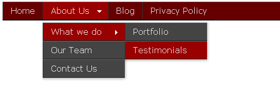

> Final menu with styling

Play around with this menu and you'll notice that not only does it automatically highlight the page being visited but also all the parent pages above the current page (if there are any). For example, in the image above, the page being visited is "Testimonials". As can be seen, both the parent pages of it are also highlighted. By default, the `menu` tag applies the classname "current" to the current menu-item. It also applies the classname "active" to all the parent menu-items leading to (and including) the current menu-item. We can use this behavior to set appropriate CSS styles for highlighting the selected items.

:::note[Menu Item Selection]
How the `menu` tag recognizes a menu-item to be current requires a little explanation.

When a page is visited, the `menu` tag iterates through its associated nested-pages tree testing each menu-item (i.e. nested-page) against the visited page to determine if they match.

For normal menu-items (i.e. those that are not pointers to other pages) the process is straightforward - if the page being visited is the same as the menu-item, the menu-item is marked as "current" and all menu-items leading to it (including the current menu-item) as "active".

For menu-items that point to other pages, however, the `menu` tag needs to apply a fair bit of intelligence to recognize if a menu-item is current. Let us say that a menu-item being tested by the `menu` tag points to the following location (with prettyURLs enabled):

```txt title="Portfolio Home URL"
https://www.yoursite.com/portfolio.php
```

the home-view of template `portfolio.php`.

Now if the page being visited is:

```txt title="Exact Match URL"
https://www.yoursite.com/portfolio.php
```

It is perfect match and so the menu-item in question will be marked as "current", its parents will be marked as "active" and the process will end i.e. no further menu-items will be examined (there can be only one current page in the tree at any time). This was no different than what happens with non-pointer pages.

However, consider if the page being visited happens to be a cloned page of `portfolio.php`:

```txt title="Portfolio Item URL"
https://www.yoursite.com/portfolio.php?p=34
```

With prettyURLs enabled, this is equivalent to:

```txt title="Pretty URL"
https://www.yoursite.com/portfolio/some-item.html
```

Or it happens to be a folder-view of `portfolio.php`:

```txt title="Folder View URL"
https://www.yoursite.com/portfolio.php?f=2
```

With prettyURLs enabled, this is equivalent to:

```txt title="Pretty Folder URL"
https://www.yoursite.com/portfolio/some-folder/
```

In both these cases, although the same template is involved (i.e. `portfolio.php`), the URL of the pages does not match that which the menu-item is pointing to.  

For such cases, by default, the `menu` tag tries to figure out if the page being visited "logically" falls below the page being pointed to.

Thus, in the example above, both:

```txt title="Logical Sub-pages"
https://www.yoursite.com/portfolio/some-item.html
https://www.yoursite.com/portfolio/some-folder/
```

are logically sub-pages of:

```txt title="Parent URL"
https://www.yoursite.com/portfolio/
```

and consequently, the `menu` tag proceeds to mark the relevant menu item as "current" and all its parent items as "active".

Now consider a different menu item - this one leading to a folder view of `portfolio.php`, for example:

```txt title="Folder View URL"
https://www.yoursite.com/portfolio.php?f=2
```

In this case, the menu item will be designated as "current" only for the same folder:

```txt title="Matching Folder URL"
https://www.yoursite.com/portfolio/some-folder/
```

and for any page that resides within the folder:

```txt title="Page in Folder URL"
https://www.yoursite.com/portfolio/some-folder/some-item.html
```

but NOT for the following URLs, as they are not logically considered sub-pages of the designated folder:

```txt title="Non-matching URLs"
https://www.yoursite.com/portfolio/
https://www.yoursite.com/portfolio/some-item.html
https://www.yoursite.com/portfolio/some-other-folder/
```

This is a powerful functionality and allows the menu to seamlessly blend with other discrete sections of the site, for example the portfolio section, as we saw above.

Finally, consider a point we touched upon earlier but deferred the explanation for later - in our tree, we have a "Home" menu item that points to the home view of `index.php` (`https://www.yoursite.com/`), and we have separate menu items that represent other pages of `index.php`, e.g.:

```txt title="Other Page URLs"
https://www.yoursite.com/about-us/
https://www.yoursite.com/about-us/what-we-do/
```

Going by the logic we discussed above, if we visit:

```txt title="Child Page URLs"
https://www.yoursite.com/about-us/
```

or:

```txt
https://www.yoursite.com/about-us/what-we-do/
```

Since in the tree the "Home" menu-item physically comes before the menu-item representing the visited page, **it is the "Home" menu-item that will always get selected although we have a menu-item that specifically represents the visited page**. For such cases we can configure the nested-page behind the menu-item NOT to be marked as current for the child-pages (i.e. be marked as current only for the page that is perfect match).
:::

The `menu` tag supports a rich set of parameters that can be used to create menus of almost any complexity. Please see [**menu**](../../tags-reference/menu/) for a full list of the parameters and their use.

### `breadcrumbs`

Another element on a typical web page that reflects the hierarchy of pages is the breadcrumb where the parent pages of the page being visited show up as crumbs.

The Couch tag that can be used to easily create breadcrumbs is the [**nested_crumbs**](../../tags-reference/nested_crumbs/) tag.

:::note[Breadcrumb Tags]
There already is an existing tag named [**breadcrumbs**](../../tags-reference/breadcrumbs/) which is used with the folder hierarchy associated with normal cloned pages. The [**nested_crumbs**](../../tags-reference/nested_crumbs/) tag on the other hand works with nested-pages only.
:::

#### Usage

<Steps>

1. As self-closing tag:

    ```php title="Basic Breadcrumbs"
    <cms:nested_crumbs masterpage="index.php" />
    ```

    where `masterpage` points to the template behind the nested-pages tree.

2. As a tag-pair for better control over the generated breadcrumbs markup:

    ```php title="Custom Breadcrumbs"
    <cms:nested_crumbs masterpage="index.php" ignore_show_in_menux="1" prepend='<ul class="breadcrumb">' append="</ul>">
        <li><a href="<cms:show k_crumb_link />"><cms:show k_crumb_text /></a><cms:if k_crumb_is_last="0"> &raquo; </cms:if></li>
    </cms:nested_crumbs>
    ```

</Steps>

Please see the [**nested_crumbs**](../../tags-reference/nested_crumbs/) tag's documentation for a full list of the parameters and their use.
