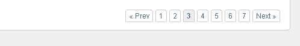

import { Steps } from "@astrojs/starlight/components";

The [**pages**](../../tags-reference/pages/), [**search**](../../tags-reference/search/) and [**comments**](../../tags-reference/comments/) tags can fetch more items than specified by the `limit` parameter. In such cases, it's common to display items in a paginated manner - split across several pages with navigation buttons. These tags provide several variables that help implement pagination.

## Basic Usage

Here's a basic example to demonstrate pagination:

```php title="Basic Pagination Example"
<cms:pages masterpage="blog.php" limit="10" paginate="1">
    <!-- Pagination variables available here -->
</cms:pages>
```

:::note[Tag Compatibility]
While we use the [**pages**](../../tags-reference/pages/) tag in examples, all pagination variables work identically with [**search**](../../tags-reference/search/) and [**comments**](../../tags-reference/comments/) tags.
:::

Suppose a total of 23 records have been fetched by the given snippet. Since the limit has been set to 10, splitting up 
the total in chunks of 10 records will result in:
- Page 1: Records **1-10**
- Page 2: Records **11-20**
- Page 3: Records **21-23**

## Pagination Variables

The following variables are available as the tag iterates through items:

### Record Information

#### `k_total_records`
Total number of records fetched (23 in our example)

#### `k_count`
Will range from 1 to 10 on each page.
- Page 1: **1-10**
- Page 2: **1-10**
- Page 3: **1-10**

Thus it points to the relative position of the current record on the page. Can be changed by setting `startcount` parameter. Thus if `startcount` is set to `0`, `k_count` will range from 0-9 on each page.
- Page 1: **0-9**
- Page 2: **0-9**
- Page 3: **0-9**

#### `k_current_record`
Always points to the absolute position of the current record.
- Page 1: **1-10**
- Page 2: **11-20**
- Page 3: **21-23**

Adjusts with `startcount` parameter. For instance, if `startcount` is set to `0`, the `k_record_to` values will be:
- Page 1: **0-9**
- Page 2: **10-19**
- Page 3: **20-22**

#### `k_record_from`
First record number on current page
- Page 1: **1**
- Page 2: **11**
- Page 3: **21**

Adjusts with `startcount` parameter. For instance, if `startcount` is set to `0`, the `k_record_to` values will be:
- Page 1: **0**
- Page 2: **10**
- Page 3: **20**

#### `k_record_to`
Last record number on current page
- Page 1: **10**
- Page 2: **20**
- Page 3: **23**

Adjusts with `startcount` parameter. For instance, if `startcount` is set to `0`, the `k_record_to` values will be:
- Page 1: **9**
- Page 2: **19**
- Page 3: **22**

### Page Information

#### `k_total_pages`
Total number of pages (3 in our example)

#### `k_current_page`
Current page number - will change from 1 to 3 in our example.

### Loop Position

#### `k_paginated_top`
The `pages` tag loops through 10 records on each page in our example. The `k_paginated_top` gets set for the first record of each page. It can be used to output something at the very start of the loop.

#### `k_paginated_bottom`
The `pages` tag loops through 10 records on each page in our example. The `k_paginated_bottom` gets set for the last 
record of each page. It can be used to output something at the very end of the loop.

### Navigation

#### `k_paginator_required`
When the total number of records exceeds the 'limit' parameter and `paginate` is set, the records are split across multiple pages. The `k_paginator_required` variable is set to indicate this. Use it to display pagination controls like 'next', 'prev', or 'Page 1 of 3'.

#### `k_paginate_link_next`
Link to next page (if available)

#### `k_paginate_link_prev`
Link to previous page (if available)

## Implementation Examples

### Manual Pagination

```php title="Manual Pagination Example"
<cms:pages masterpage="blog.php" limit="10" paginate="1">
    <cms:if k_paginated_top>
        <cms:if k_paginator_required >
            Page <cms:show k_current_page /> of <cms:show k_total_pages /><br>
        </cms:if>
        <cms:show k_total_records /> Pages Found.
        Displaying: <cms:show k_record_from />-<cms:show k_record_to />
    </cms:if>

    <!-- All the page variables can be accessed here -->

    <cms:if k_paginated_bottom >
        <cms:if k_paginate_link_prev >
            <a href="<cms:show k_paginate_link_prev />">prev</a>
        </cms:if>
        <cms:if k_paginate_link_next >
            <a href="<cms:show k_paginate_link_next />">next</a>
        </cms:if>
    </cms:if>
</cms:pages>
```

### Using Paginator Tag

Instead of manually coding the 'next' and 'prev' buttons for navigating through the pages, use the [**paginator**](../../tags-reference/paginator/) tag for a more polished look:

```php title="Using Paginator Tag"
<cms:pages masterpage="blog.php" limit="10" paginate="1">
    <cms:if k_paginated_top>
        <cms:if k_paginator_required >
            Page <cms:show k_current_page /> of <cms:show k_total_pages /><br>
        </cms:if>
        <cms:show k_total_records /> Pages Found.
        Displaying: <cms:show k_record_from />-<cms:show k_record_to />
    </cms:if>

    <!-- All the page variables can be accessed here -->

    <cms:paginator />
</cms:pages>
```

### Styling the Paginator

If the [**paginator**](../../tags-reference/paginator/) tag is used to generate the navigation buttons, the following 
CSS code may be used to properly style the buttons:

```css title="Paginator Styling"
/*
    Paginator -
    Source: http://www.strangerstudios.com/sandbox/pagination/diggstyle.php (strangerstudios.com)
*/

div.pagination {
    padding: 3px;
    margin: 3px;
}

div.pagination a {
    padding: 2px 5px 2px 5px;
    margin: 2px;
    border: 1px solid #AAAADD;
    zoom: 100%;
    text-decoration: none; /* no underline */
    color: #000099;
}
div.pagination a:hover, div.pagination a:active {
    border: 1px solid #000099;
    color: #000;
}
div.pagination span.page_current {
    padding: 2px 5px 2px 5px;
    margin: 2px;
    border: 1px solid #000099;
    * zoom: 100%;
    font-weight: bold;
    background-color: #000099;
    color: #FFF;
}
div.pagination span.page_disabled {
    padding: 2px 5px 2px 5px;
    margin: 2px;
    border: 1px solid #EEE;
    * zoom: 100%;
    color: #DDD;
}

* span.elipsis {zoom:100%}
```

Here's how the paginator looks with the styling applied:


> Example of styled pagination output