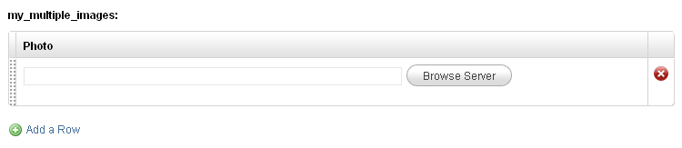
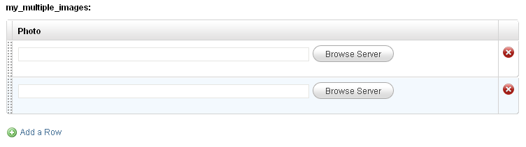
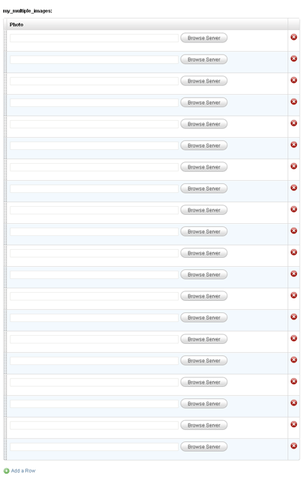
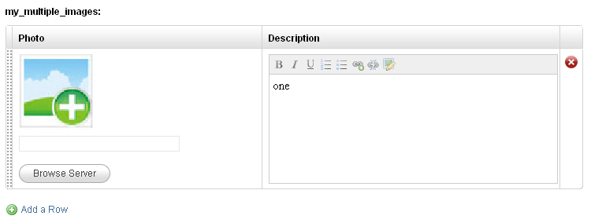

import { Steps } from '@astrojs/starlight/components';

An oft-requested feature has been the ability to define an editable region in a template only once and then, on each cloned page, dynamically add as many instances of the region as desired.

A commonly encountered scenario requiring this feature goes something like this:
We are building a portfolio section where each cloned page represents a single portfolio item.
Each portfolio item will have, of other things, a number of images associated with it.
We know that we can define an editable region of type 'image' for each image however the problem here is that **we cannot know beforehand exactly how many images any portfolio item might have**.
Some item might require only a single image while another one might require 20 images (or even more).

The solution used up till now ([see forum discussion](https://www.couchcms.com/forum/viewtopic.php?p=790#p790)) has been to work out the maximum number of images an item could possibly have and then define as many editable regions.
This works but it is far from perfect:

- It clutters up the admin panel. If suppose we define twenty regions for the images - while editing, every single portfolio page will display all the twenty regions even if the page requires only one image.
- The code required to define multiple regions as well as to display back their data on the front-end of the site is convoluted.
- There is also the possibility that some page in the future might require even more images than the number of regions we have defined. By defining a fixed number of regions, we are placing a restriction on the maximum number of images a portfolio item can have.

Beginning with Couch v1.3, we can tackle the problem this way:

<Steps>
1. Define only a single editable region of type 'image' in the template the regular way:

   ```php
   <cms:editable type='image' name='my_image' label='Photo' />
   ```

2. Enclose the editable region defined above with a newly introduced tag - [**repeatable**](../../tags-reference/repeatable/):

   ```php
   <cms:repeatable name='my_multiple_images' >
       <cms:editable type='image' name='my_image' label='Photo' />
   </cms:repeatable>
   ```
</Steps>

After making the mandatory visit to the template as super-admin, the edit-panel for any cloned page should show:



As can be seen, it shows the usual 'image' editable region. However, click the button below it that says 'Add item' and one more identical editable region gets added dynamically:



You are free to add as many images as you desire:



:::tip
You can also sort the regions by manually dragging and dropping the rows.
:::

This was the 'Repeatable regions' feature in action and I'm sure you'll agree this is a much better way of doing things.

:::note[Supported Region Types]
At this point you might want to ask if 'image' is the only type of editable region that can be repeated.
Well, no! Of the 12 native types of editable regions in Couch, the [**repeatable**](../../tags-reference/repeatable/) tag supports the following 8:

- **text**
- **password**
- **textarea**
- **image**
- **file**
- **radio**
- **checkbox**
- **dropdown**

Out of the remaining 4 types that are unsupported, the 'message' and 'group' types actually make no sense getting repeated.
However the 'richtext' and 'thumbnail' types are really far too important to be left out.
The reason for the two being left out is rather technical however considering the importance that 'richtext' and 'thumbnail' types carry, Couch v1.3 offers us alternatives for both.

Instead of using the 'richtext' type we can now use a new type of editable region named [**nicedit**](../../tags-reference/editable/nicedit/).
'nicedit' uses a very light-weight wysiwyg editor of the same name. It is not as full-featured as the CKEditor that 'richtext' uses however it gets the job done well and is light enough to be repeated any number of times on a single page (we'll find an example of its use below).

**We can also use 'nicedit' type as a regular editable region (i.e. as the usual non-repeatable regions)**.

As for the 'thumbnail' type, we do not have any substitute editable region for it but v1.3 has a new tag named [**thumbnail**](../../tags-reference/thumbnail/) that does an identical job. Please see [**thumbnail**](../../tags-reference/thumbnail/) documentation for this tag's use.
:::

## Repeating Multiple Regions Together

So far we have only repeated a single editable region of type 'image'. However, you can use any number of editable regions together to form a 'repeatable' unit.

For example, this is how we use 'image' and 'nicedit' together:

```php
<cms:repeatable name='my_multiple_images' >
    <cms:editable type='image' name='my_image' label='Photo' show_preview='1' preview_width='150' input_width='200' col_width='300' />
    <cms:editable type='nicedit' label='Description' name='my_desc' />
</cms:repeatable>
```

The edit panel now shows:



As you can see, the two editable regions form a 'row' that can be repeated.
This is ideal for inputting tabular data where each row can represent a table's `<tr>`.

:::note[Column Width Control]
Since all the editable regions forming the 'repeatable unit' appear side-by-side in a single row, you'll want to have more control over how wide individual region appears in a row.

For this purpose, all editable regions in Couch v1.3 (when being used within the [**repeatable**](../../tags-reference/repeatable/) tag) now support a `col_width` parameter that sets how wide the containing column of the region will be.
Additionally, the 'image' as well as the 'file' types also support an `input_width` parameter that sets the width of the textbox the two regions display.

Please take a look at the definition of the 'nicedit' type in the code above for an example of the use of these new parameters.
:::

## Displaying the Values

With the definition and data entry of the repeatable regions completed, now comes the time to display the inputted data on the front-end of our site.

Since the repeatable editable regions now actually form a 'composite' entry (i.e. do not have a single value), we have to use a new tag named [**show_repeatable**](../../tags-reference/show_repeatable/) as a helper to make the individual values available to us.

The following snippet placed in the page_view of our template will display the data contained within each 'cell' of each 'row' of our repeatable regions defined above:

```php
<cms:show_repeatable 'my_multiple_images' >
    <b>Image:</b> " /> 
    <b>Desc:</b> <cms:show my_desc />
    <hr>
</cms:show_repeatable>
```

Please note that the [**show_repeatable**](../../tags-reference/show_repeatable/) tag has to be given the name associated with a [**repeatable**](../../tags-reference/repeatable/) tag (take care of using the quotes).
It iterates through each row of regions in the set making available the values within each constituent region. These values then can be displayed using the regular [**show**](../../tags-reference/show/) tag.

Tag 'show_repeatable' sets two variables of its own - 'k_count' and 'k_total_records' as it iterates through the rows. It accepts a parameter named 'startcount' that can be set to specify the start value of 'k_count' (default value being '1'). Following is the same snippet as above with the parameters and variables used.

```php
<cms:show_repeatable 'my_multiple_images' startcount='0' >
    <cms:show k_count /> / <cms:show k_total_records />
    <b>Image:</b> " /> 
    <b>Desc:</b> <cms:show my_desc />
    <hr>
</cms:show_repeatable>
```
