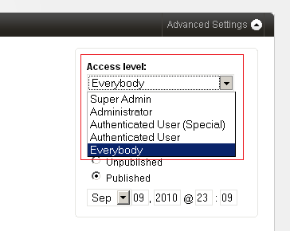

import { Steps } from '@astrojs/starlight/components';

Couch supports creation of any number of user accounts. Each user account can be assigned to one of the four groups discussed below and depending on the containing group, the account's access to the web-site is controlled.

## User Groups

### 1. Super Admin

The first user account that gets created during Couch's installation. It is an all-powerful account and only one such account can exist in Couch. A Super Admin can do everything that a user possibly can in Couch. Specifically, they can:

- Create/manage templates and define editable regions, folders etc. within templates
- Access the Admin panel and create new pages and edit/delete all existing pages
- Create/manage any number of lower level user accounts
- Access the website

Usually it is the designer/coder building the site that uses this **super-admin** account. If you've gone through the creation of [**editable regions**](../editable-regions/) and some other tags like the [**folder**](../../tags-reference/folder/) tag, you'll recall that persisting the changes made to the template using these tags requires visiting the web-page while logged in as this super-admin account. Hence this account is used by someone who makes structural changes to the web-site.

### 2. Administrator

The *super-admin* can create any number of administrator level accounts. These accounts are meant to be used by the web-site owners who will be responsible for managing the contents and day to day operations of the web-site. An Administrator can:

- Access the Admin panel and create new pages and edit/delete all existing pages except those that have been marked by the Super Admin has having only super-admin access (usually done to prevent the site owners from accidently modifying them)
- Create/manage any number of lower level user accounts
- Access the website

All the users belonging to the Administrator group have identical access permissions and can add/delete/modify each other's pages.

### 3. Registered Users

The super-admin/administrators can create registered users by placing them in either of these two lower-level accounts:

- **Authenticated User (Special)**
- **Authenticated User**

These two accounts are meant for visitors who are registered with the website.

Registered users can:

- Only access the website

### 4. Unauthenticated

Every visitor to the website who is not logged-in is automatically placed in this group by Couch. Thus unregistered users as well as registered users who have not yet logged-in by providing their username/password are placed in this group.

Unauthenticated users can:

- Only access the website

:::note[Access Levels]
Only users belonging to the *Super Admin* and the *Administrator* groups can access the Couch's Admin panel. All users, as far as Couch is concerned, can equally access the website. It is you, who as the designer/coder decides which pages or portion of the pages within the website these users can access. Couch will simply, by setting relevant variables, indicate the group of the visitor so that your code can take appropriate action.
:::

## Access Control

To be honest, the access mechanism currently implemented is fairly coarse (you can expect some major changes in the coming versions). However some very powerful access control can be wired up by properly using the available functionality. Before we see how, we need to know a few facts that we'll use.

### User Variables

Upon the execution of every page, the following variables are set by Couch to give information about the visitor accessing the page:

- `k_logged_in`
- `k_logged_out`
- `k_user_id`
- `k_user_name`
- `k_user_title`
- `k_user_email`
- `k_user_access_level`
- `k_user_disabled`
- `k_login_link`
- `k_logout_link`

The `k_logged_in` or `k_logged_out` variable can be used to figure out if the visitor is currently logged in and hence possesses an account on the website. If they are logged-in, the `k_user_id`, `k_user_name`, `k_user_title`, `k_user_email` and `k_user_access_level` can be used to get details about them.

### Access Level Values

The `k_user_access_level` is an important variable and indicates the 'group' of the user by the following numeric values:

| Group | Level |
| :--- | ---: |
| Super Admin | 10 |
| Administrator | 7 |
| Authenticated User (Special) | 4 |
| Authenticated User | 2 |
| Everybody | 0 |

As can be seen, the higher the number, the more powerful an account is deemed to be.

### Template Level Access

All the pages cloned from a particular template can be configured to be accessible by only users of a certain level by simply setting the `access_level` parameter of the [**template**](../../tags-reference/template/) tag to the minimum level required. Thus:

```php title="Template Access Control"
<cms:template title='News' clonable='1' access_level='2'>
    <!-- Editable regions and Folders are usually defined here -->
</cms:template>
```

To access any of the pages cloned from the template above the user must at least be an *Authenticated User*. None of the pages would be accessible without being logged in.

### Page Level Access

Access to any individual page can be controlled by selecting the minimum access level required from the dropdown list visible while editing the page in Admin Panel:



> Page access level selection in the admin panel

:::note[Access Denied]
In both the cases mentioned above, if a page is accessed by a user who is not logged-in, the login box is displayed to them to input their credentials. If the user is already logged-in but their current access level is less than that required to access the page, a message is displayed prompting them to logout and re-login with proper credentials.
:::

### Element Level Access

The most fine-grained access control can be achieved by restricting access to certain parts of a page - e.g. text or links to files that are to be made available to only registered users.

```php title="Element Access Control"
<cms:if k_user_access_level ge '4' >
    <h1>If you can see this you must at least be an Authenticated User (Special)</h1>
<cms:else />
    <cms:if k_logged_out >
        <p>
            You need to be logged in as an Authenticated User (Special) or higher to access this area
        </p>
        <p>
            Please <a href="<cms:show k_login_link />">Login</a>.
        </p>
    <cms:else />
        <p>
            You do not have sufficient privileges to access this area
        </p>
        <p>
            You need to be logged in as an Authenticated User (Special) or higher.
        </p>
        <p>
            Please <a href="<cms:show k_logout_link />">Logout</a> and login again with the right credentials.
        </p>
    </cms:if>
</cms:if>
```

In the snippet given above, we first check if the access level of the current visitor is sufficient for them to see the text. If it is not, it could either be that the user is not logged-in or that they are logged-in but the access level of their account is lesser than the required level. We check this by the `k_logged_out` variable and then show the appropriate message. Note how we use the `k_login_link` and `k_logout_link` to display the links that the user can click to either login or logout.

### Access Control of Discrete Files

Access control can be exercised upon discrete files placed on your server, e.g. image files and PDF files, by using the [**cloak_url**](../../tags-reference/cloak_url/) tag. Please see [**Cloaked Links - Allowing Only Registered Users to Access Links**](../cloaked-links/#allowing-only-registered-users-to-access-links) section for a full discussion of this.
