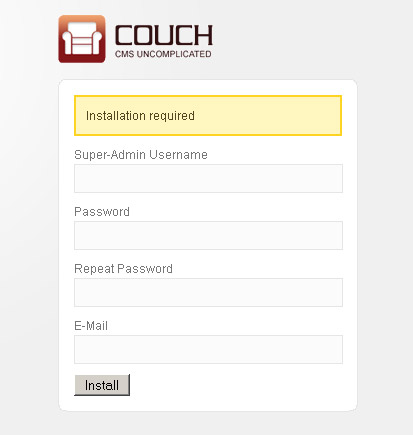

import { FileTree, Steps } from '@astrojs/starlight/components';

CouchCMS is a user-friendly and powerful Content Management System (CMS) perfect for small to medium-sized projects. Below, you'll learn how to install CouchCMS on your web server in just a few simple steps.

### Requirements
Before getting started, make sure your server meets the following requirements:

1. **PHP**: Version 5.0.0 or higher
2. **MySQL**: MySQL 4.1.2 or greater
3. **Webserver**: Apache (or compatible Web Servers like LiteSpeed etc.)

:::note
You can use any hosted space that you might have for the purpose of this tutorial. However that would entail FTP'ing the modified files back to the server every time you make any changes.

A more pragmatic approach would be to use [XAMPP](https://www.apachefriends.org/download.html) or [WampServer](https://www.wampserver.com/en/) on your local machine for Windows, or [MAMP](https://www.mamp.info/en/downloads/) for macOS. This way you can directly make changes to local files.
:::

### Step 1: Download CouchCMS
<Steps>
1. Visit the official website: [couchcms.com](https://www.couchcms.com).
2. Download the latest version of CouchCMS.
</Steps>
You can also download the latest version from [GitHub](https://github.com/couchcms/couchcms/releases).

### Step 2: Upload to Your Server
<Steps>
1. Extract the downloaded ZIP file.
2. You'll get a folder named `couch` containing the following files:

    <FileTree>
    - addons/
    - auth/
    - cache/
    - includes/
    - lang/
    - parser/
    - snippets/
    - theme/
    - uploads/
    - _index.php
    - ajax.php
    - base.php
    - captcha.php
    - cms.php
    - comment.php
    - conditional-fields.php
    - config.example.php
    - config.php
    - couchcms-logo.gif
    - db.php
    - download.php
    - edit-comments.php
    - edit-drafts.php
    - edit-folders.php
    - edit-pages.php
    - edit-users.php
    - event.php
    - field.php
    - folder.php
    - forgotpassword.php
    - functions.php
    - gen_dump.php
    - gen_htaccess.php
    - header.php
    - index.php
    - install.php
    - LICENSE.txt
    - login.php
    - page.php
    - restore_dump.php
    - route.php
    - search.php
    - tags.php
    - upgrade.php
    - upload.php
    - uploader.php
    </FileTree>

3. Upload the contents to your desired folder on your server. For example: 

    <FileTree>
    - www
        - yourwebsite
            - **couch/**
    </FileTree>

    :::tip[Tip]
    Use FTP software like FileZilla, or upload via a control panel like cPanel.
    :::

    :::caution[Good to know]
    The uploaded `couch` folder is your site's admin section.
    It is a good security measure to rename this folder to anything else you wish. This way you'll make it more difficult for unwanted visitors to try and access your admin section.
    :::

</Steps>

:::tip
Alternatively, you can use the [Git](https://git-scm.com/downloads) command in your terminal to clone the repository:

```bash "mywebsite"
git clone https://github.com/couchcms/couchcms.git mywebsite
```

This will create a new directory called `mywebsite` and clone the CouchCMS repository into it. You can choose any name you want for the directory, instead of `mywebsite`.
:::

### Step 3: Set Up a MySQL Database
<Steps>
1. Create a new database via your hosting panel or using a local tool like phpMyAdmin.
   
   **Using Hosting Panel:**
   - Log in to your hosting panel (e.g., cPanel, Plesk).
   - Navigate to the MySQL Databases section.
   - Create a new database by entering a name and clicking the "Create Database" button.
   - Create a new database user and assign it to the database with all privileges.

   **Using phpMyAdmin:**
   - Open phpMyAdmin in your browser (usually accessible via `http://localhost/phpmyadmin` if working locally).
   - Click on the "Databases" tab.
   - Enter a name for your new database in the "Create database" field and click "Create".
   - Go to the "User accounts" tab to create a new user.
   - Click "Add user account", fill in the username and password, and select "Create database with same name and grant all privileges".

2. Note down the database name, username, password, and server address (often `localhost`).
</Steps>

### Step 4: Configure CouchCMS
<Steps>
1. Rename the file named `config.example.php` to `config.php`, located in the `couch` folder. 
2. Open it in your text editor and find the following lines:

    ```php title="couch/config.php" "database_name" "database_username" "database_password" "localhost"
    // MySQL settings. You need to get this info from your web host.
    // 4.
    // Name of the database
    define( 'K_DB_NAME', 'database_name' );
    // 5.
    // Database username
    define( 'K_DB_USER', 'database_username' );
    // 6.
    // Database password
    define( 'K_DB_PASSWORD', 'database_password' );
    // 7.
    // MySQL hostname (it will usually be 'localhost')
    define( 'K_DB_HOST', 'localhost' );
    ```

3. Change the values to match those of your MySQL database.
</Steps>

### Step 5: Run the Installation
<Steps>
1. Open your browser and go to: 

    ```
    http://yourdomain.com/couch
    ```

2. You'll see the CouchCMS installation screen. Couch will sense that installation is required and will display the following form for you to fill:

    

    :::caution
    If, however, at this point you get an '500 Internal Server Error', please try deleting the `.htaccess` file present in the `couch` installation folder. Certain hosts, notably GoDaddy, have problems with the directive contained in this file.
    :::

3. Enter your desired name, password and email address. Press install and in a little while you should be prompted with the following screen:

    

    Couch created an account with super-admin privilege using the information provided by you in the last step and is now prompting you to login using the same.

    :::danger[Very Important]
    This account created for you by Couch is a very special one. This is the account you need to be logged in with, whenever you wish to make any 'structural' changes to the website as a designer - (which, for the site we are building now, is the entire duration of this tutorial).

    Only one such account can ever exist in one installation of Couch. Be sure to provide a valid email address during installation so that it could be used in password recovery if you happen to forget this account's password.
    :::

 4. Login using the super-admin account you created and brace yourself for facing the most 'barren' admin section you'll ever come across:

    

    This almost bare admin panel is an important feature of Couch.
    We realize that the person most often logged into it is going to be the client that you'll be building the website for and, more often than not, he is not going to be as computer savvy as you are.
    Instead of overwhelming such a client with an admin panel that resembles the cockpit of an airliner, we wished to confront him with just as much information as is absolutely essential.
    As we move along with building the site, the admin panel will start displaying more information. This is the admin panel of our finished site:

    

    It is important to note that the admin panels of no two sites built with Couch are going to be identical. As the designer of a website, it is you who'll choose how much data gets exposed to the client within the admin section.

</Steps>

With Couch installed you can now begin porting your files to it.

### Step 6: Integrate CouchCMS with Your HTML
<Steps>
1. To integrate CouchCMS with your existing website, follow these steps for each HTML file you want to manage with CouchCMS:
   - Rename your `.html` or `.htm` files to `.php`. For example, if you have a file named `about.html`, rename it to `about.php`.
   - Open the renamed `.php` file in a text editor and add the following line of PHP code at the very top of the file:

    ```php
    <?php require_once( 'couch/cms.php' ); ?>
    ```

2. At the end of the same `.php` file, add the following line of PHP code to close the file:

    ```php
    <?php COUCH::invoke(); ?>
    ```

3. Save the changes and upload the modified `.php` files back to your server.

4. Access the modified `.php` files through your browser to ensure they are working correctly. For example, if you renamed `about.html` to `about.php`, visit `https://yourdomain.com/about.php` in your browser.

5. If everything is set up correctly, the page should display as it did before, but now it is managed by CouchCMS. You can verify this by logging into the CouchCMS admin panel and checking if the new template appears in the list of managed templates.

</Steps>

For more details about templates, please refer to the [Templates](../../concepts/templates) page.