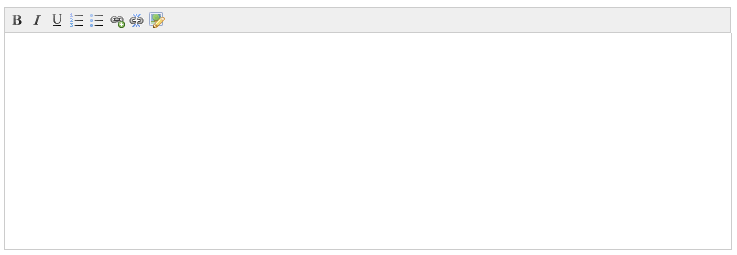

Editable region of type nicedit can be used as a light-weight alternative to editable region of type [**richtext**](../richtext/).
It is primarily meant to be used with [**repeatable regions**](../../../concepts/repeatable-regions/), however it can be used as an independent editable region too.

Unlike 'richtext' that uses CKEditor - a full fledged Wysiwyg editor, 'nicedit' is somewhat limited in the wysiwyg features it offers but is perfect for situations where only basic HTML editing capability is required.



A region of this type may either be defined like this :

```php
<cms:editable type='nicedit' label='Description' name='my_desc' />
```

or

```php
<cms:editable type='nicedit' label='Description' name='my_desc' >
    This enclosed text will appear as the default value of the editor
</cms:editable>
```

## Parameters

In addition to the parameters common to all the types of editable regions, nicedit accepts the following parameters

*   width
*   height
*   maxheight
*   buttons

### width

### height

### maxheight

The dimensions of the editor can be changed by setting the **width**, **height**, and **maxheight** parameters. For example, the following will make it 400px wide and 200px high (and expand to 600px high as content is entered) -

```php
<cms:editable type='nicedit' label='Description' name='my_desc'
    width='400'
    height='200'
    maxheight='600' />
```

### buttons

This parameter can be used to specify which buttons are displayed in the toolbar of the editor.

```php
<cms:editable type='nicedit' label='Description' name='my_desc'
    buttons='italic, bold' />
```

This parameter takes a comma seperated string containing the names of the buttons.
Following are the values that can be used:

*   bold
*   italic
*   underline
*   left
*   center
*   right
*   justify
*   ol
*   ul
*   subscript
*   superscript
*   strikethrough
*   removeformat
*   indent
*   outdent
*   hr
*   fontsize
*   fontfamily
*   fontformat
*   link
*   unlink
*   forecolor
*   bgcolor
*   image
*   source

If the 'buttons' parameter is not specified, the following set of buttons is used as the default:
bold, italic, underline, ol, ul, link, unlink, image, removeformat, source

## Related Tags

*   [editable](../../editable/)
*   [editable (checkbox)](../checkbox/)
*   [editable (dropdown)](../dropdown/)
*   [editable (file)](../file/)
*   [editable (group)](../group/)
*   [editable (image)](../image/)
*   [editable (message)](../message/)
*   [editable (nicedit)](../nicedit/)
*   [editable (password)](../password/)
*   [editable (radio)](../radio/)
*   [editable (relation)](../relation/)
*   [editable (text)](../text/)
*   [editable (textarea)](../textarea/)
*   [editable (thumbnail)](../thumbnail/)