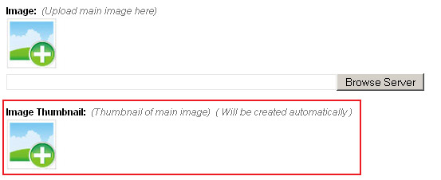
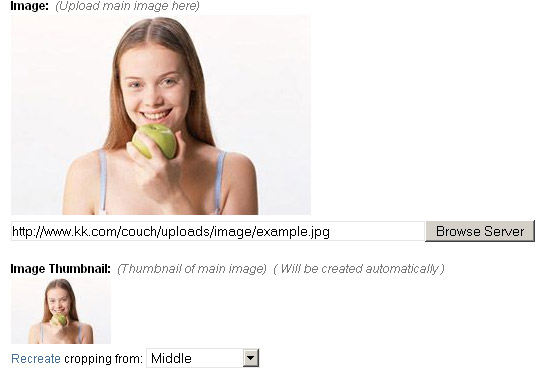
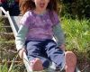
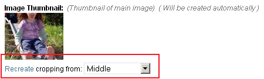
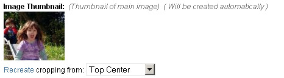
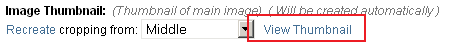

Editable region of type `thumbnail`, as the name suggests, is used to automatically create thumbnail images.

The `thumbnail` type is different from all other types of editable regions in that the user does not directly edit anything within it. Instead it is attached to an existing editable region of type `image` which then becomes the source for the thumbnail. Any time the content of the `image` type is edited, the thumbnail attached to it also gets automatically updated.

## Basic Usage

Once the thumbnail has been created, this editable region then holds its fully qualified URL.

:::note[Location]
The thumbnail gets created in the same folder as that of the main image.
:::

Suppose we have an editable region, named `my_image`, of type `image`:

```php title="Basic Image Region Example" "type="image""
<cms:editable 
    name="my_image" 
    label="Image" 
    desc="Upload main image here" 
    type="image" 
/>
```

To create a thumbnail automatically for any image that gets selected into it, we can define a new editable region of type `thumbnail` and associate it with the region above by using the `assoc_field` parameter:

```php title="Thumbnail Region Example" "type="thumbnail"" "assoc_field="my_image""
<cms:editable
    name="my_image_thumb"
    label="Image Thumbnail"
    desc="Thumbnail of main image"
    width="100"
    show_preview="1"
    assoc_field="my_image"
    type="thumbnail"
/>
```

The code above will result in something like this below the parent `image` type editable region:


> Thumbnail Preview Interface

Once the user selects an image into the main image region (and saves the page), the thumbnail gets created automatically:


> Automatic Thumbnail Generation

Anytime the user changes the main image (and saves the changes), the thumbnail automatically reflects the changes.

:::tip[Multiple Thumbnails]
To create multiple thumbnail images of the same image (one might be square, the other rectangular, perhaps), define multiple regions and associate them all with the same parent image.
:::

The contents of this region can be accessed, as with all other editable regions, by using the variable named after it:

```php title="Basic Usage Example"
" />
```

## Parameters

Apart from the parameters common to all types of editable regions, the regions of `thumbnail` type can take the following parameters:

- `width`
- `height`
- `enforce_max`
- `quality`
- `show_preview`
- `preview_width`
- `preview_height`

### `width` and `height`

Parameters `width` and `height` specify the dimensions of the thumbnail. If neither `width` nor `height` are specified, the resulting thumbnail is of exactly the same dimensions as the associated image.

Specifying a single dimension only will create a thumbnail with that dimension of the specified value and the other dimension of a value that retains the original proportion of the image. e.g.:

```php title="Width-Only Thumbnail Example" "width="100""
<cms:editable 
    name="my_image_thumb" 
    label="Image Thumbnail" 
    desc="Thumbnail of main image"
    width="100"
    show_preview="1"
    assoc_field="my_image"
    type="thumbnail" 
/>
```


> Parent Image (200 x 300)


> Thumbnail (100 x 150)

:::note[Proportional Scaling]
The width was made 100px and the height was proportionately scaled to 150px so that the original proportion between the dimensions is retained.
:::

Specifying both the dimensions will create a thumbnail with each dimension of the specified values. The original proportion between the dimensions is preserved and hence this could lead to cropping off of any dimension that overshoots the specified value in the attempt to retain proportion. e.g.:

```php title="Fixed Dimensions Example" "width="100"" "height="80""
<cms:editable 
    name="my_image_thumb" 
    label="Image Thumbnail" 
    desc="Thumbnail of main image"
    width="100"
    height="80"
    show_preview="1"
    assoc_field="my_image"
    type="thumbnail" 
/>
```


> Parent Image (200 x 300)


> Thumbnail (100 x 80)

:::note[Cropping Behavior]
The width was made 100px and the height was proportionately scaled resulting in a dimension of 150px. Since a height of only 80px was asked for, the surplus 70px were cropped off (35px equally from both sides with the two images aligned in the center).
:::

As is obvious from the second example above, if both the dimensions are specified and the thumbnail's ratio does not match that of the parent image, the cropping that inevitably occurs can sometimes lead to unacceptable results. In the thumbnail above the most important part of the image has been cropped off. This can be rectified by asking Couch to recreate the thumbnail but this time aligning it to the top of the parent image instead of the default center.

 
> Parent image with top alignment indicator

The following is the resulting thumbnail:


> Resulting thumbnail aligned to top

### `enforce_max`

Setting this parameter will cause Couch to simply scale (instead of cropping as in the example above) the thumbnail, ensuring that none of its two dimensions exceed those specified by the `width` and `height` parameters.

### `quality`

```php title="Quality Parameter Example" "quality="50""
<cms:editable 
    name="my_image_thumb" 
    label="Image Thumbnail" 
    desc="Thumbnail of main image"
    width="100"
    show_preview="1"
    quality="50"
    assoc_field="my_image"
    type="thumbnail" 
/>
```

You can set `quality` from `0` (worst quality, smaller file) to `100` (best quality, biggest file). The default value is `80`.

### `show_preview`

```php title="Preview Parameter Example" "show_preview="1""
<cms:editable 
    name="my_image_thumb" 
    label="Image Thumbnail" 
    desc="Thumbnail of main image"
    width="100"
    show_preview="1"
    assoc_field="my_image"
    type="thumbnail" 
/>
```

Setting `show_preview` to `1` makes Couch display a preview of the created thumbnail (as visible in the examples above). Omitting this parameter or explicitly setting it to `0` will make Couch display only a link to the thumbnail instead of the preview image.


> Preview Display Option

### `preview_width` and `preview_height`

As noted above, setting `show_preview` to `1` causes a preview of the thumbnail to appear. The dimensions of this preview can be set by using `preview_width` and `preview_height` (needless to say, these two parameters take effect only with `show_preview` set to `1`).

```php title="Preview Size Example" "show_preview="1"" "preview_width="80""
<cms:editable 
    name="my_image_thumb" 
    label="Image Thumbnail" 
    desc="Thumbnail of main image"
    width="100"
    show_preview="1"
    preview_width="80"
    assoc_field="my_image"
    type="thumbnail" 
/>
```

:::tip[Preview Dimensions]
If both `preview_width` and `preview_height` are omitted, the thumbnail preview is of exactly the same dimensions as the thumbnail. Usually this is what you'd want and you won't find yourself setting `preview_width` or `preview_height` too often.
:::

## Related Tags

- [**editable**](../../editable)
- [editable (**checkbox**)](../checkbox)
- [editable (**dropdown**)](../dropdown)
- [editable (**file**)](../file)
- [editable (**group**)](../group)
- [editable (**image**)](../image)
- [editable (**message**)](../message)
- [editable (**nicedit**)](../nicedit)
- [editable (**password**)](../password)
- [editable (**radio**)](../radio)
- [editable (**relation**)](../relation)
- [editable (**richtext**)](../richtext)
- [editable (**text**)](../text)
- [editable (**textarea**)](../textarea)
- [editable (**thumbnail**)](../thumbnail)
