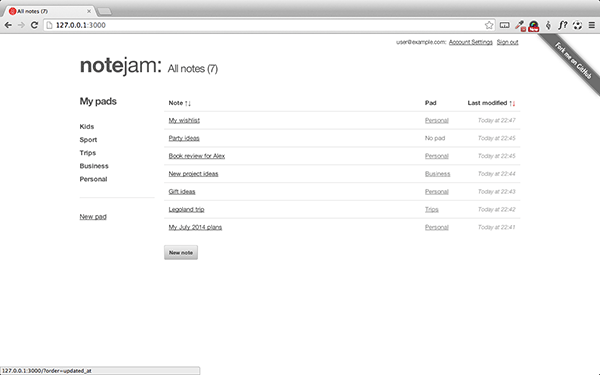
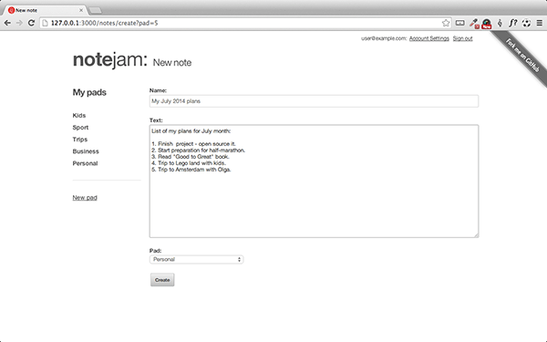
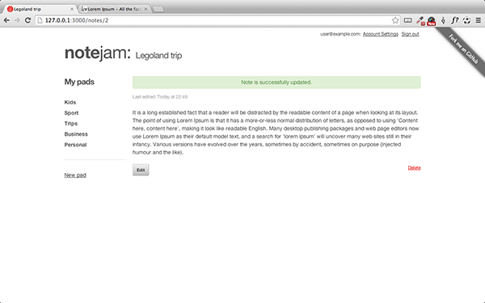

In this tutorial we'll bring together some of the more advanced features of Couch like ['relations'](../../../concepts/relationships), ['data-bound forms'](../../../concepts/databound-forms), ['extended users'](https://github.com/trendoman/Midware/tree/main/concepts/Extended-Users#extended-users) and ['custom routes'](https://github.com/trendoman/Midware/tree/main/concepts/Custom-Routes#custom-routes) to create a, not-so-simple, 'application' (as opposed to a regular site that Couch is usually used for).

So what shall we be building? Please take a look at [Notejam](https://github.com/komarserjio/notejam) for that.

Notejam is a unified sample web application implemented using different server-side frameworks (like Laravel, Yii etc.). In this tutorial, we'll attempt to implement it using [**CouchCMS**](https://github.com/CouchCMS/CouchCMS).

Broadly speaking, following is what this sample application does (details can be found at [Notejam Application Overview](https://github.com/komarserjio/notejam/blob/master/contribute.rst#application-overview)):

1. Visitors can sign up/in/out
2. Logged-in users can create/view/edit/delete their own 'notes'
3. The notes can be grouped in 'pads' (functionally equivalent to our 'folders' but user specific)
4. Logged-in users can create/view/edit/delete their own 'pads'

For this tutorial, instead of starting off with a blank slate and developing the features step-by-step (as done in our first tutorial at [Portfolio Site Tutorial](../../../portfolio-site)), we'll take a different approach - we'll start with a fully developed and functional application and then analyze it by going through all its code line-by-line.

Here are the two versions of the application:
- [**HTML version**](./Notejam-static-HTML.zip) - Static HTML design of Notejam application
- [**Couchified version**](./Notejam-Couchified.zip) - Complete CouchCMS implementation

Before we begin our tour through this application's codebase to see how it was implemented using Couch, I think you'd find it helpful to have it up and running on your local system. This way you can explore its functionality first-hand as we discuss the code behind it.

So please bear through this, unavoidably bland, preparatory step of installing a working copy of Notejam on your system before we dive into its code which is where all the excitement lies.

---

**Next: [Installing the application →](../02-installing-the-application)**
