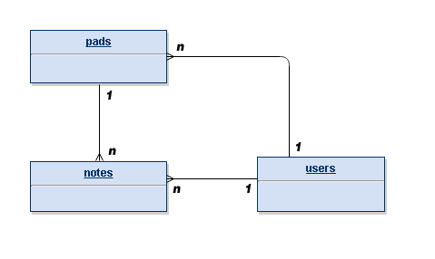

## Entity Relationships

Let us begin with a bird-eye view of how the three entities comprising Notejam (i.e. users, notes and pads) relate to each other using the following ERD (the 'crow-feet' end if the 'many' end of the relationship):

> Entity Relationship Diagram for the Notejam application showing one-to-many relationships between entities

:::note[Relationship Summary]
The relationships can be summarized as follows:

### 1. Notes and Users
A user can have many notes but a note can belong to only one user.

### 2. Pads and Users  
A user can have many pads but a pad can belong to only one user.

### 3. Notes and Pads
A pad can contain many notes but a note can only be within a single pad.
:::

Keep these relationships in mind as we now go through the templates and see how they are implemented.

:::tip[Next Steps]
We'll begin with the notes template, as it forms the core functionality of our application.
:::

---

[Next Chapter: **Notes**](../04-notes/)
