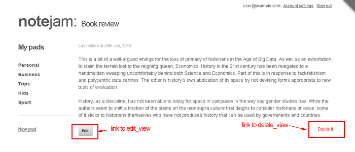

# Views » Notes Page View

Dit onderdeel toont de inhoud van een enkele notitie met links naar de 'edit_view' en 'delete_view':



Laten we de code in `views/notes/page_view.html` bekijken die deze weergave implementeert:

```php title="page_view.html"
<cms:pages id=rt_id limit='1' show_future_entries='1'>

    <cms:set my_title=k_page_title 'global' />

    <cms:capture into='my_content'>
        <p class="hidden-text">Last edited at <cms:date k_page_modification_date format='jS M, Y' /></p>
        <div class="note">
            <cms:nl2br><cms:show content /></cms:nl2br>
            <p></p>
        </div>
        <a href="<cms:route_link 'edit_view' rt_id=k_page_id />" class="button">Edit</a>
        <a href="<cms:route_link 'delete_view' rt_id=k_page_id />" class="delete-note">Delete it</a>
    </cms:capture>

</cms:pages>

<cms:embed 'views/layout_with_sidebar.html' />
```

Vergeleken met de vorige weergave die we hebben bestudeerd, is deze code relatief eenvoudig.

### Pages Block

Het belangrijkste element is het `cms:pages` block dat bijna alle code in de snippet omsluit:

```php title="page_view.html - Pages Block"
<cms:pages id=rt_id limit='1' show_future_entries='1'>
    ...
</cms:pages>
```

Een page_view wordt aangeroepen met de volgende URL-structuren:

```txt
https://www.yoursite.com/notes/16
https://www.yoursite.com/notes.php?q=16  # zonder prettyURLs
```

In deze voorbeelden is `16` de ID van de notitie die moet worden weergegeven.

De `cms:match_route` maakt deze waarde beschikbaar als een variabele genaamd `rt_id`. De `cms:pages` tag haalt vervolgens de enkele gekloonde pagina op met de ID die is opgegeven in `rt_id` en maakt deze beschikbaar voor alle code die het omsluit:

```php title="page_view.html - Data Access"
<cms:pages id=rt_id limit='1' show_future_entries='1'>
    ... alle gegevens van de pagina uit de URL zijn hier beschikbaar voor gebruik ...
</cms:pages>
```

### Content Weergave

De ingesloten code heeft nu toegang tot alle gegevens van de opgegeven pagina:

```php title="page_view.html - Content Display"
<cms:set my_title=k_page_title 'global' />

<cms:capture into='my_content'>
    <p class="hidden-text">Last edited at <cms:date k_page_modification_date format='jS M, Y' /></p>
    <div class="note">
        <cms:nl2br><cms:show content /></cms:nl2br>
        <p></p>
    </div>
    <a href="<cms:route_link 'edit_view' rt_id=k_page_id />" class="button">Edit</a>
    <a href="<cms:route_link 'delete_view' rt_id=k_page_id />" class="delete-note">Delete it</a>
</cms:capture>
```

Het instellen van de `my_title` en `my_content` variabelen zou nu bekend moeten zijn, evenals de manier waarop de `cms:route_link` tag wordt gebruikt om de links naar de 'edit_view' en 'delete_view' te maken.

### Layout Integratie

De laatste regel geeft de `my_title` en `my_content` variabelen door aan de decorator template voor de uiteindelijke weergave:

```php title="page_view.html - Layout Integration"
<cms:embed 'views/layout_with_sidebar.html' />
```

## Volgende Stap

We gaan nu kijken naar de implementatie van de create_view.

---

**Next: [Create View →](./11-create-view)**
