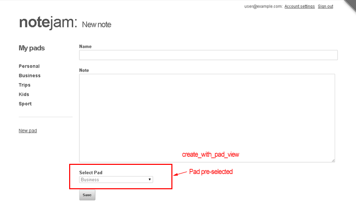

## Context-Aware Note Creation

Click one of the pads listed in the sidebar and you'll see a list of notes that belong to that particular pad.

On this screen if we click 'New note', we get the same 'create_view' we discussed in [the previous section](./11-create-view), except that now the pad we were browsing in the last step appears to be selected automatically:



## Implementation Overview

This is the 'create_with_pad_view' and is actually just a thin wrapper around the base create view. Let's examine how it works.

### Core Implementation

Take a look at the snippet implementing it (`views/notes/create_with_pad_view.html`). You'll find that it simply sets a variable named `my_current_pad` and delegates the page rendering to `views/notes/create_view.html`:

```php title="views/notes/create_with_pad_view.html"
<cms:set my_current_pad=rt_id 'global' />

<cms:embed "views/notes/create_view.html" />
```

### Route Configuration

The `rt_id` variable used above contains the value passed in the URL for the path parameter named `{:id}` as defined in this view's route:

```php title="Route Definition"
<cms:route
    name='create_with_pad_view'
    path='{:id}/create'
    filters='authenticated | pad_exists | owns_pad'
    >

    <cms:route_validators
        id='non_zero_integer'
    />
</cms:route>
```

### URL Structure

For example, the URL invoking the 'create_with_pad_view' would look like:

```txt title="Example URLs"
https://www.yoursite.com/notes/12/create
# or without prettyURLs:
https://www.yoursite.com/notes.php?q=12/create
```

In this case, the `rt_id` (and hence the `my_current_pad`) variable will contain a value of `12`.

## Integration with Create View

The action then gets delegated to the snippet implementing the 'create_view'. Remember the dropdown input showing all pads belonging to the current user:

```php title="Pad Selection Dropdown"
<cms:input
    type='dropdown'
    name='pad'
    id='list'
    opt_values=my_opt_values
    opt_selected=my_current_pad
    required='1'
/>
```

Notice how it uses the `my_current_pad` set by this view to pre-select the pad specified in the URL. In our example, any listed pad with an ID of '12' would appear already selected in the form.

## Next Steps

With that we now move on to the 'edit_view'.

---

**Next: [Edit View →](../edit-view/)**
