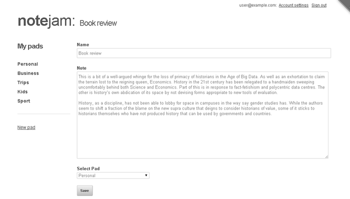

This view shows a form with the content of the page being edited pre-populated in the inputs for further editing:



## Implementation Details

To study this view, please open the `views/notes/edit_view.html` snippet implementing this view in your text editor and also open the *create_view* snippet we studied above in another instance of the editor.

You'll notice that more than 95% of code is the same in both views. This is a common occurrence in almost all applications and you'll usually always find the 'edit' and 'create' code to be very similar.

Since we have already studied the 'create' code in detail, for this view I'll just focus on the aspects that differ from it.

### Pages Block Implementation

The first important thing that you'll notice in the *edit_view* is that we are wrapping up almost the entire code within a `cms:pages` block:

```php title="Pages Block"
<cms:pages id=rt_id limit='1' show_future_entries='1'>
    // ... existing code ...
</cms:pages>
```

This is identical to what we did in the *page_view*. The idea is to fetch the single page (a 'note' in our case) specified in the `rt_id` variable (which contains the page ID as specified in the URL). Since the rest of the code is then enveloped within the `cms:pages` block, all the variables belonging to the fetched page (e.g. `k_page_title`, `k_page_name`, all editable regions etc.) will be available directly to the code within.

### Form Configuration

You'll immediately see the form code making use of the fetched page's data as its parameters:

```php title="Form Configuration"
<cms:form
    masterpage=k_template_name
    mode='edit'
    page_id=k_page_id
    enctype='multipart/form-data'
    method='post'
    class="note"
    anchor='0' >
    // ... existing code ...
</cms:form>
```

Notice that this view has the DataBound Form's *mode* set to `edit` (as opposed to the *create_view* where it was 'create').

### Input Field Handling

The definition of the three inputs defined within the form are almost the same except for some minor changes in the two inputs that we are using in a non-bound manner:

1. The 'content' input is a 'bound' input and automatically shows the existing data
2. The 'name' and 'pad' inputs are non-bound and require explicit data population

#### Name Field

For the 'name' field, we explicitly set the 'value' parameter:

```php title="Name Field Configuration"
<cms:input type="text" name='name' id="name" required='1' value="<cms:show k_page_title />" />
```

#### Pad Field

For the 'pad' field (dropdown showing all pads belonging to the logged-in user), we fetch the pad the note belongs to using:

```php title="Pad Selection"
<cms:related_pages 'note_pad' ids_only='1' />
```

The `ids_only` parameter returns only the ID of the related page. We then set this value as the `opt_selected` parameter:

```php title="Pad Field Configuration"
<cms:input
    type='dropdown'
    name='pad'
    id='list'
    opt_values=my_opt_values
    opt_selected="<cms:related_pages 'note_pad' ids_only='1' />"
    required='1' />
```

This ensures that whatever pad the note belonged to will appear in a selected state.

### Form Persistence

The final difference between `create_view` and this `edit_view` is the reduced number of parameters we need to set in the `cms:db_persist_form` tag:

```php title="Form Persistence"
<cms:if k_success>
    <cms:db_persist_form
        k_page_title=frm_name
        note_pad=frm_pad
    />
    // ... existing code ...
</cms:if>
```

Notice that:
- We don't need to explicitly set the 'content' field as it's bound and saves automatically
- The two non-bound fields must be explicitly passed to `cms:db_persist_form`

Compare this to the code used in `create_view`:

```php title="Create View Form Persistence"
<cms:if k_success>
    <cms:db_persist_form
        k_page_title=frm_name
        k_page_name="<cms:random_name />"
        note_pad=frm_pad
        note_owner=k_user_id
    />
    // ... existing code ...
</cms:if>
```

The key differences are:
- No need to set `k_page_name` and `note_owner`
- These values won't change once set at creation time

:::note[Important]
Depending on your particular application's needs, the `k_page_name` might be editable (but then you'd certainly not set it initially to a random value) but the 'owner' will definitely remain unchanged.
:::

## Next Steps

We've covered the edit_view. We'll cover the last view of 'notes' next - the 'delete_view'.

---

**Next: [Delete View →](./14-delete-view)**
