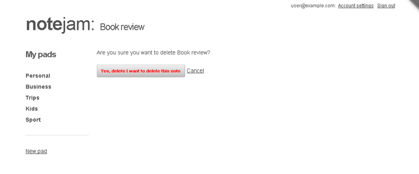

The *delete_view*, reached by clicking the 'Delete it' link found on the *page_view*, shows a prominent button asking for confirmation about the action (and a 'Cancel' link that leads back to the *page_view* of the note):



The overall logic of this view is pretty simple - pressing the confirmation button submits a form. The `k_success` code of the form then effects the actual deletion.

## Implementation Details

Please take a look at the snippet implementing this view - `views/notes/delete_view.html`.

You'll notice that, similar to *page_view* and *create_view*, there is a `cms:pages` block enveloping all the main code:

```php title="views/notes/delete_view.html - Pages Block"
<cms:pages id=rt_id limit='1' show_future_entries='1'>
    // ... form shown here ...
</cms:pages>
```

Needless to say, it fetches the page to be deleted and makes it available to the form enclosed within the block. The form, you'll recognize, is a DataBound Form attached to the page fetched above (via its 'page_id' parameter set to `k_page_id`):

```php title="views/notes/delete_view.html - Delete Form Configuration"
<cms:form
    masterpage=k_template_name
    mode='edit'
    page_id=k_page_id
    method='post'
    anchor='0'
    >

    // ... existing code ...

    <p>Are you sure you want to delete <cms:show k_page_title />?</p>
    <cms:input name='submit' type="submit" class="button red" value="Yes, delete I want to delete this note" />
    <a href="<cms:route_link 'page_view' rt_id=k_page_id />">Cancel</a>

</cms:form>
```

### Form Processing

All the action of this view lies in the `k_success` block of the form:

```php title="Form Success Handler"
<cms:if k_success>
    <cms:db_delete_form />
    <cms:redirect "<cms:route_link 'list_view' />"  />
</cms:if>
```

The `cms:db_delete_form` tag simply goes ahead and deletes the page bound to the containing form. The `cms:redirect` statement that follows it leads the user back to the list_view.

## Important Security Considerations

That ends our tour through this view but in closing I'd like to mention a few important points about the `cms:db_delete_form` tag we used.

### Single vs Multiple Page Deletion

The `cms:db_delete_form` tag works only from within a DataBound Form, as done above. This necessarily constrains us in deleting only single pages (as a DataBound Form can bind with just a single page). 

If your design calls for deleting multiple pages, you'll have to use its sister tag named `cms:db_delete` which has no such constrains and works as a standalone statement.

You'll find an example of `cms:db_delete` usage in the following thread of our forum (specifically, in answer to the post):

[Deleting page from the front-end](http://www.couchcms.com/forum/viewtopic.php?f=4&t=8087)

### CSRF Protection

:::caution[Security Warning]
The important point to keep in mind while using `cms:db_delete` is to *always* combine it with nonces (using `cms:create_nonce` and `cms:validate_nonce` tags). Never use it without the nonces protection as it will open up your script to CSRF vulnerability.
:::

In our snippet that we discussed above, the DataBound Form hosting the `cms:db_delete_form` tag automatically takes care of creating/validating those nonces so we didn't have to bother implementing that security ourselves. This is one reason why using `cms:db_delete_form` could be an easier way of implementing delete functionality.

## Next Steps

That completes our line-by-line tour through all the code that implements the 'Notes' portion of the Notejam application.

We'll move to the 'Pads' section next.

---

**Next: [Pads →](./15-pads)**
