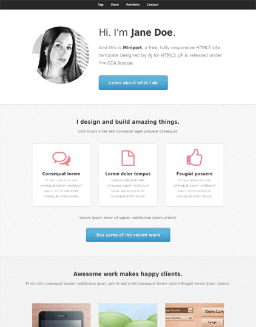
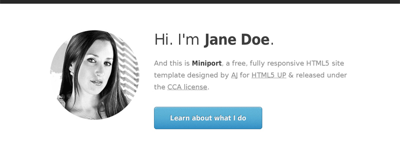
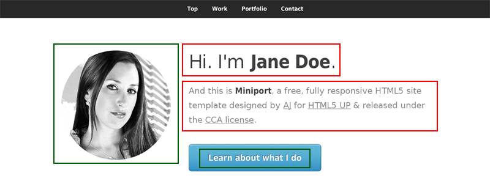
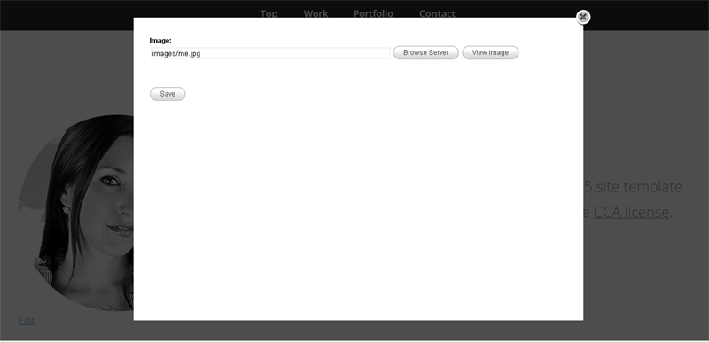
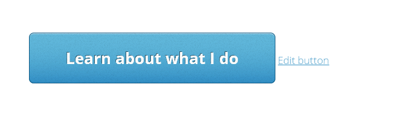
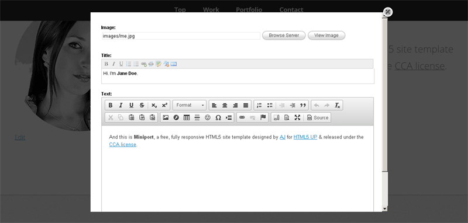
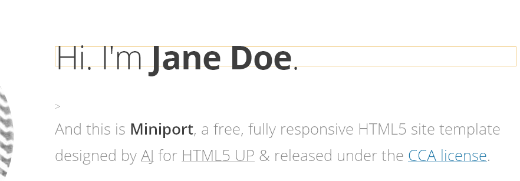
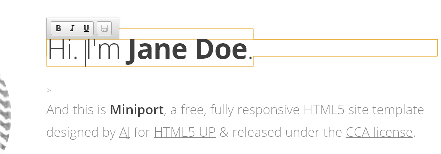
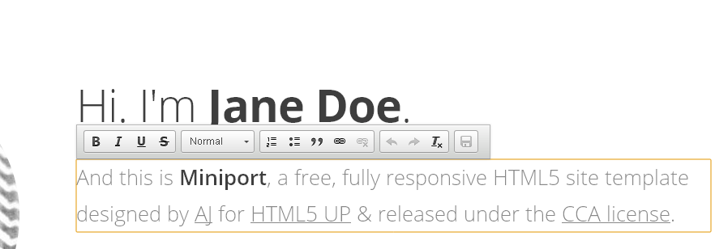

import { Steps } from '@astrojs/starlight/components';

Before we proceed, we must enable the addon first. This involves the standard process of adding an entry in the `couch/addons/kfunctions.php` file.

:::note
If there is no `kfunctions.php` in the 'addons' folder, please rename the `kfunctions.example.php` file to `kfunctions.php`.
:::

Open `kfunctions.php` in your text editor and add the following line to it:

```php
require_once( K_COUCH_DIR.'addons/inline/inline.php' );
```

With the addon enabled, we can now use the tags provided by it to implement on-page editing on any template.

To demonstrate how onpage editing works in Couch, I've gone ahead and completely Couchified (adding onpage editing as well) the popular single-page HTML5 template - [Miniport](http://html5up.net/miniport/).



You can [**download the ported version**](https://www.couchcms.com/docs/code/miniport.zip) and take it for a spin to see for yourself how everything works.

For this particular tutorial, I'll take you step-by-step through the process of adding onpage editing to only the first section of the template.
Following is the section we'll be working with.



Following is the HTML markup behind the section (with the four possible editable portions within it highlighted)

```diff lang="php" title="index.php" ins="images/pic00.jpg" ins="Hi. I am <strong>Jane Doe</strong>." ins="And this is <strong>Miniport</strong>, a free, fully ..."  ins ="Learn about what I do"
<!-- Home -->
    <article id="top" class="wrapper style1">
        <div class="container">
            <div class="row">
                <div class="col-4 col-5-large col-12-medium">
                    <span class="image fit"></span>
                </div>
                <div class="col-8 col-7-large col-12-medium">
                    <header>
                        <h1>
                            Hi. I am <strong>Jane Doe</strong>.
                        </h1>
                    </header>
                    <p>And this is <strong>Miniport</strong>, a free, fully ...</p>
                    <a href="#work" class="button large scrolly">
                        Learn about what I do
                    </a>
                </div>
            </div>
        </div>
    </article>
```

One point I'd like to emphasize here is that **implementing onpage editing requires no changes, whatsoever, to the way you normally implement a site using Couch**. That is to say, you create your templates, define the editable-regions etc. exactly the way you'd normally do and once the site is ready we can bolt on the onpage editing component to the functioning site.

Taking the example of the section we are working with, if you take a look at the attached source files, you'll find that it required defining 4 editable regions:
- *intro_image* (type image)
- *intro_title* (type nicedit)
- *intro_text* (type richtext) 
- *intro_button* (type text)

The modified HTML markup with Couch's editable regions added in now looks like this:

```diff lang="html" title="index.html"
<!-- Home -->
    <article id="top" class="wrapper style1">
        <div class="container">
            <div class="row">
                <div class="col-4 col-5-large col-12-medium">
-                   <span class="image fit"></span>
+                   <span class="image fit">" alt="" /></span>
                </div>
                <div class="col-8 col-7-large col-12-medium">
                    <header>
                        <h1>
-                           Hi. I am <strong>Jane Doe</strong>.
+                           <cms:show intro_title />
                        </h1>
                    </header>
-                   <p>And this is <strong>Miniport</strong>, a free, fully responsive HTML5 site template designed by <a href="http://twitter.com/ajlkn">AJ</a> for <a href="http://html5up.net">HTML5 UP</a> &amp; released under the <a href="http://html5up.net/license">CCA license</a>.</p>
+                   <cms:show intro_text />
                    <a href="#work" class="button large scrolly">
-                       Learn about what I do
+                       <cms:show intro_button />
                    </a>
                </div>
            </div>
        </div>
    </article>
```

So far we have proceeded exactly how we would have with any normal Couch managed template.
In fact, if there were no onpage editing to be added, this would have finished our work on the section with nothing more to do.
However, for implementing onpage editing a finished Couch template is where we start. So lets begin.

Adding onpage editing to a template is a two-step procedure:

<Steps>
1. The first step is always the addition of the following tag in the HEAD section of the template:
    ```php
    <cms:load_edit />
    ```
    After adding the mentioned tag, the template now looks like this:

    ```diff lang="php" title="index.php"
    <head>
	    <title>Miniport by HTML5 UP</title>
	    <meta http-equiv="content-type" content="text/html; charset=utf-8" />
	    <meta name="description" content="" />
	    <meta name="keywords" content="" />
	    <link href="http://fonts.googleapis.com/css?family=Open+Sans:300,600,700" rel="stylesheet" />
	    <script src="js/jquery.min.js"></script>
	    <script src="js/config.js"></script>
	    <script src="js/skel.min.js"></script>
	    <noscript>
	        <link rel="stylesheet" href="css/skel-noscript.css" />
	        <link rel="stylesheet" href="css/style.css" />
	    <link rel="stylesheet" href="css/style-desktop.css" />
	    </noscript>
	    <!--[if lte IE 9]><link rel="stylesheet" href="css/ie9.css" /><![endif]-->
	    <!--[if lte IE 8]><script src="js/html5shiv.js"></script><link rel="stylesheet" href="css/ie8.css" /><![endif]-->
	    <!--[if lte IE 7]><link rel="stylesheet" href="css/ie7.css" /><![endif]-->
        
    +   <cms:load_edit />

    </head>
    ```
    
    This step takes care of loading all the JS/CSS libraries required by the tags we'll add in the second step below.

2. This second step is where all the fun happens.
    Here we'll add the tags that 'inject' onpage editing to existing editable regions.

    Take a look again at the four existing editable regions in the section we are working on:

    

    If you remember from our earlier discussion, onpage editing can take two forms:
    <Steps>
    1. **Inline editing** for text elements
    2. **Popup editing** for non-text (or hidden textual) elements
    </Steps>

    As you can see from the image above, the regions highlighted in red are text. Of the regions in green, the image is, of course, non-textual. The button text, although it looks textual, is actually a link element and hence has to be treated as non-text.

</Steps>
OK, so let us handle the non-text elements first.

### Popup-editing

Following is how the markup for the image exists as of now:

```php
<div class="4u">
    <span class="me image image-full">" alt="" /></span>
</div>
```

We'll add a **popup_edit** tag near it specifying the name of the editable region handled through the popup (the image region in this case):

```diff lang="php"
<div class="4u">
    <span class="me image image-full">" alt="" /></span>
+   <cms:popup_edit 'intro_image' />
</div>
```

Saving the template and visiting it as admin will show the following change:


Notice the 'Edit' link where we placed the **popup_edit** tag.

:::note
The text shown for the link can be changed from the default 'Edit' to anything of your choice using the '*link_text*' parameter of the **popup_edit** tag.
You can also style this link anyway you like - it is a regular anchor element with its class set as 'k_inline'. You can add you own classes using the '*class*' parameter. This can be used, for example, to show a pencil icon instead of the text.
:::

Clicking on the link will bring up the promised popup:



You'll recognize that the editable region shown is the same as you see in the backend admin-panel.
A new image can be selected exactly the way we do in the admin-panel - the 'Browse server' button will bring up the image-explorer with all its related paraphernalia.

The second non-text region i.e. the button text can be handled identically.

The existing markup:

```php
<a href="#work" class="button button-big"><cms:show intro_button /></a>
```

can be appended with a **popup_edit** tag:

```diff lang="php"
    <a href="#work" class="button button-big"><cms:show intro_button /></a>
+   <cms:popup_edit 'intro_button' link_text='Edit button' />
```



In both the cases above, we've specified only one editable region as parameter to the **popup_edit** tag. If the use-case requires, we can also specify multiple editable regions by separating the names with a '|' (pipe) character. For example, the following definition:

```php
<cms:popup_edit 'intro_image|intro_title|intro_text' />
```

would show all the three specified regions in the popup:



In case you didn't notice, the popup has no problems displaying the textual regions. In fact, it can handle all types of Couch editable regions - it is just that the text types can be handled in a more elegant manner using inline (as opposed to popup) editing. We'll see that next.

### Inline-editing

The tag for inline-editing is **inline_edit**. Let us see how it works.

The existing markup for the first text region is as follows:

```php
<header>
    <h1><cms:show intro_title /></h1>
</header>
```

Add an **inline_edit** tag to it as follows:

```diff lang="php" ins="<cms:inline_edit 'intro_title' />"
<header>
    <h1 <cms:inline_edit 'intro_title' /> ><cms:show intro_title /></h1>
</header>
```

:::danger[Important]
Please notice that the **inline_edit** tag is always added as a parameter to a block-level HTML element.
:::

Visiting the template should show the following:



Clicking anywhere within the text will display the editing toolbar:



Changing the heading now only requires editing it directly and clicking the 'save' icon.

:::note
If the light-yellow outline, demarcating the inline editable regions, bothers you, it can be turned off by setting the 'no_border' parameter of the **load_edit** tag we placed in the header:

```php
<cms:load_edit no_border='1' />
```
:::

Let us add inline editing to the final region and complete our tutorial.

The existing markup is as follows:

```php
<cms:show intro_text />
```

Now, if you recall the caveat a little way up that said the "the inline_edit tag is always added **as a parameter to a block-level HTML element**" - you'll notice the quandary here. There is no block level element around the region.

This is one place where a little fudging of the original markup becomes imperative. We can solve such issues by wrapping a block level HTML element (like a DIV or P) around the region in question.

This is what our code becomes:

```php
<div <cms:inline_edit 'intro_text' /> ><cms:show intro_text /></div>
```

As you can see, we chose to add a parent DIV element and then add the **inline_edit** tag to it.

The result:



## Wrapping up...

From our discussion so far, we've really seen everything that needs to be known about implementing onpage editing.
In short, adding onpage editing to any Couch managed template involves only judiciously placing the two tags i.e. **inline_edit** and **popup_edit** at the right spots.

You must have certainly noticed one behaviour of these tags by now - they come into action only when the person visiting the webpage is a Couch admin. For everybody else, the tags practically do not exist.

You can, however, turn these tags off even for the admins. This could be, for example, to give the admin a real feel of how the modified page would look like to the general public. Let us see how.

Place the following statement somewhere at the top of the template (i.e. before any of the three tags we have seen so far):

```php
<cms:no_edit />
```

and you'll find that the onpage editing functionality disappears from our template completely.

Of course, that is not much good. It'd be better if the admin could selectively 'toggle' this **no_edit** tag on/off.
We can use the standard Couch tags for doing that. I'll describe one quick method of doing so below.

:::note
Please bear in mind that the following method is just one of the N number of ways we could implement the toggle - feel free to code/design you own if this method does no suit you.
:::

My solution relies on using a session variable to conditionally output the **no_edit** tag. The line of code mentioned above now becomes:

```php
<cms:if k_user_access_level ge '7' && "<cms:not "<cms:get_session 'inline_edit_on' />" />" >
    <cms:no_edit />
</cms:if>
```

As you can see, the code kicks in only for admin. If checks whether a session variable named **inline_edit_on** is on. If not, it outputs the **no_edit** tag and thus turns off onpage editing.

It now becomes a simple matter of setting the value of the session variable to enable/disable onpage editing.

Place the following FORM code somewhere at the bottom of the template:

```php
<cms:if k_user_access_level ge '7' >
    <br style="clear:both">
    <cms:form method='post' anchor='0' style="float:left;">

        <cms:if k_success>
            <cms:if "<cms:get_session 'inline_edit_on' />" >
                <cms:delete_session 'inline_edit_on' />
            <cms:else />
                <cms:set_session 'inline_edit_on' value='1' />
            </cms:if>
            <cms:redirect k_page_link />
        </cms:if>

        <cms:if "<cms:get_session 'inline_edit_on' />" >
            <cms:input name='submit' type="submit" value="Turn Edit Off" />
        <cms:else />
            <cms:input name='submit' type="submit" value="Turn Edit On" />
        </cms:if>

    </cms:form>
</cms:if>
```

Submitting the form simply toggles the value of the session variable named **inline_edit_on** and refreshes the page. The current state of the variable then dictates whether or not onpage editing becomes available.

That brings us to the end of our little tutorial.

For more reference, see the [concepts](../../concepts/on-page-editing) section.

#### [**Download Sample Template**](https://www.couchcms.com/docs/code/miniport.zip)
