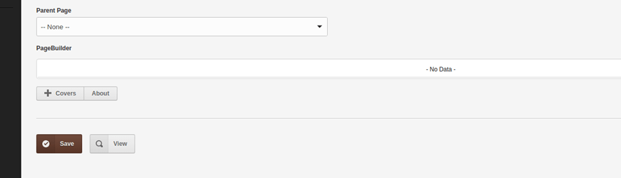
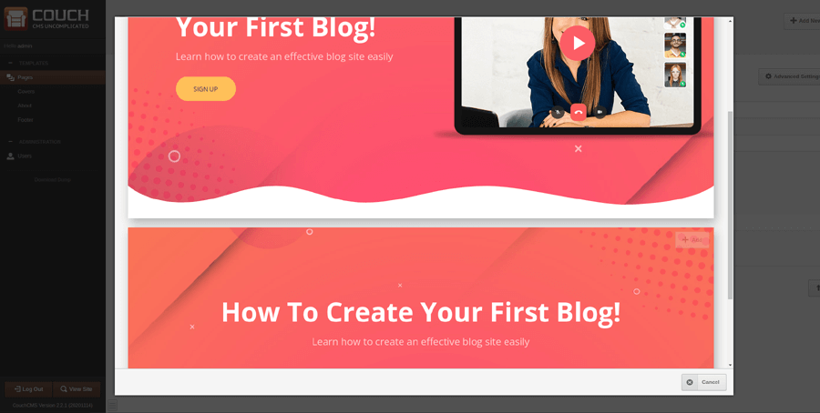
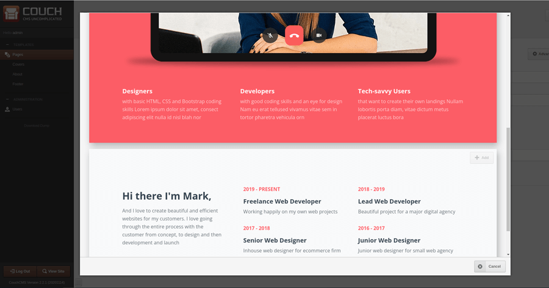

import { LinkButton } from '@astrojs/starlight/components';

This is the part where we put the source blocks we created above into use.

For this demo, I'll use these blocks in a (nestable) template named `index.php`.

Place a file named `index.php` in the site root and put the following into it:
```php title="index.php"
<?php require_once("couch/cms.php"); ?>
<cms:template title='Pages' order='-1' clonable='1' nested_pages='1'>

    <cms:pagebuilder name='main_pb' label='PageBuilder' skip_custom_fields='1' order='-1'>
        <cms:section label='Covers' name='section_covers'  masterpage='blocks/covers.php' mosaic='blocks' />
        <cms:section label='About'  name='section_about'   masterpage='blocks/about.php'  mosaic='blocks' />
    </cms:pagebuilder>

</cms:template>
<?php COUCH::invoke(); ?>
```
And there you finally see the `<cms:pagebuilder>` editable region making its appearance :)

It is defining two sections (i.e. sets of related blocks) named 'Covers' and 'About'.

Params to note in each `<section>` are the 'masterpage' and 'mosaic' params (the 'name' param is arbitrary and can be anything) - you'll recognize that `blocks/covers.php` and `blocks/about.php` are the two source block templates we created in Part I and the 'blocks' is the mosaic region contained within them.

Visit the template as super-admin to register it.

Coming back to the admin-panel, you should see something like this -



Clicking 'Covers' should show a listing of all blocks we created in 'covers' template



while clicking 'About' show a listing of all blocks we created in the 'about' template



The user can now mix-n-match all blocks of her choice and edit the contents to create unique pages.

Which leaves us with the final part of this exercise - display the selected and edited blocks on the frontend.

To do that, modify the template to make it as follows:
```php title="index.php"
<?php require_once("couch/cms.php"); ?>
<cms:template title='Pages' order='-1' clonable='1' nested_pages='1'>

    <cms:pagebuilder name='main_pb' label='PageBuilder' skip_custom_fields='1' order='-1'>
        <cms:section label='Covers' name='section_covers'  masterpage='blocks/covers.php' mosaic='blocks' />
        <cms:section label='About'  name='section_about'   masterpage='blocks/about.php'  mosaic='blocks' />
    </cms:pagebuilder>

</cms:template>

<cms:capture into='pb_tile_content' >
    <cms:show_pagebuilder 'main_pb'>
        <cms:show k_content />
    </cms:show_pagebuilder>
</cms:capture>
<cms:render 'pb_wrapper' 'page' />

<?php COUCH::invoke(); ?>
```
The `<cms:show_pagebuilder 'main_pb'>` block in the code above fetches in the rendered HTML of all the blocks selected for the page being displayed.

It, however, does *not* fetch the 'wrapper' HTML. So, you can either manually place that wrapper HTML in the template itself or use the technique shown above where we capture and pass on the blocks HTML to `<cms:render 'pb_wrapper' 'page' />` which automatically wraps that in the wrapper code we used in the admin-panel.

That concludes this part. It was pretty short which only shows that the bulk of your effort would be required in creating the source blocks - using the blocks is easy.

Hope the community finds the pagebuilder feature a useful addition to Couch.

As always, your thoughts are welcome.

### Attachments

<LinkButton href="https://www.couchcms.com/forum/download/file.php?id=2675"
            icon="download"
            iconPlacement="start"
          >
          Download tutorial files
</LinkButton>

[www.zip](../assets/img/contents/couch-23/www.zip)