import { Steps, Card } from '@astrojs/starlight/components';

<Card icon="download" title="Download Code">
[Download Couchified Code](https://www.couchcms.com/docs/code/blog.zip)
</Card>

## Understanding Pages vs Templates

Before beginning this section, please allow us to clarify the distinction between two terms you'll come across very often in Couch: *page* and *template*.

The way we use both the terms, a page of a web site is what we access using a distinct address or URL. A template, on the other hand, is a physical php file (containing regular HTML and some Couch tags) that is used to generate a page.

Thus, using the example of the *about us* page that we created in the previous section, this page is what appears in the browser when we visit the URL `https://www.mytestsite.com/about.php`. The template in this case is the `about.php` file, which is used to generate the page.
Since in this case, the template is associated with only one page, the distinction might seem superfluous. However a template can be used to create any number of pages, which is when it becomes necessary to make a distinction between the two.
The blog section of any web site, for example, comprises of several blog entries. Each blog entry is usually a page in itself (i.e. has a distinct URL).
To build such a blog section using Couch, we can use a single php file as a template and then use it to generate as many pages as desired. In Couch terminology, this is known as '**cloning**' the template.

## Building the Blog Section

### Initial Setup

Looking at the files that came with Aurelius, you'll find that that the *blog* section is represented by two separate html files: `blog.html` and `single.html`.
The `single.html` represents a discrete blog entry while the `blog.html` merely lists the already existing blog pages.

### Template Configuration

Since `single.html` is the actual blog entry, we'll use it as the template to define the editable regions required for capturing the data for each blog entry and for displaying each entry.

<Steps>
1. Rename `blog.html` to `blog_list.html`
2. Rename `single.html` to `blog.html`
3. Access `https://www.mytestsite.com/blog.html`
</Steps>

Note the various components we'll have to build:

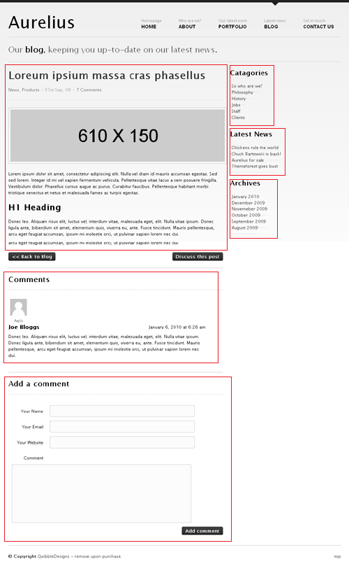

### Required Components

**Components to implement:**

- **a.** The blog entry itself, comprising of its title, content, categories, date and number of comments
- **b.** A list of comments and a form to submit comment
- **c.** A list of blog categories in the right sidebar
- **d.** A list of 'Latest News' (this seems to be the latest four blog entries)
- **e.** Finally a list of archive periods containing blog entries

We'll ignore the list of comments and comment submission form for now (don't worry, we'll get back to them once all other pieces are in place) and concentrate on the blog entry per se.

## Setting Up Editable Regions

### Planning the Structure

Let us identify the editable regions we'll need for each blog entry.

As mentioned previously, each blog entry consists of a title, content, categories, date, and the number of comments.
The title won't require an editable region because each cloned page has a mandatory title field in Couch (we'll see that soon)
The content can be captured by creating a richtext type editable region.
The categories can be represented by the folders in Couch, so no editable regions required for them.
The date field is also already present in each cloned page, so it doesn't need an editable region.
The number of comments will be dynamically provided by Couch for each commentable page.

### Image Configuration

So we are left with only the content portion to deal with.
The content of each blog entry in Aurelius has a 610px x 150px image.
To make it easy for the client to set such an image for each entry, we'll define a second editable region of type image.
It can be set to crop the uploaded image to the specified dimensions thus making things easier for the client.

### Implementation Steps

Having decided upon the editable regions to create, let us now move on to actually doing so.
The following steps should now be familiar (we took them while creating the *about us* section).

<Steps>
1. Rename `blog.html` to `blog.php`
2. Enclose the entire contents of the file with the boilerplate PHP code:
   ```php
   <?php require_once( 'couch/cms.php' ); ?>
   ```
   at the very top and
   ```php
   <?php COUCH::invoke(); ?>
   ```
   at the very end.
</Steps>

### Template Registration

Access `http://www.mytestsite.com/blog.php` while logged on as the super-admin.
Visit the admin section to find `blog.php` added to the list of templates managed by Couch.

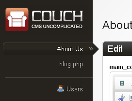

Clicking on `blog.php` in the sidebar will reveal the template has no editable regions defined so far.

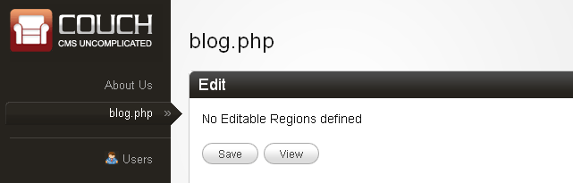

## Template Configuration

### Defining Editable Regions

In the previous chapter, we defined the editable regions in `about.php` by enclosing the relevant HTML blocks by Couch editable tags. While this approach will work for `blog.php` too, we'll take another tack for defining the editable regions in `blog.php`.
The reason is that, unlike `about.php`, `blog.php` will eventually be used as a clonable template to create several pages. As such, as you'll see a little latter, it is going to be a tad more complex than the non-clonable `about.php`. For clonable templates it is better to use the following approach -

### Using the Template Tag

You'll recall using the template tag while building the *About Us* section where we used it to change the display name of the template.
This tag can also be used to enclose structural Couch tags like editable, folder etc.

In `blog.php` add a template tag pair at the top of the document:

```diff lang="php" title="blog.php"
+<?php require_once( 'couch/cms.php' ); ?>
+<cms:template title="blog" >
+
+</cms:template>
<!DOCTYPE html PUBLIC "-//W3C//DTD XHTML 1.0 Transitional//EN" "http://www.w3.org/TR/xhtml1/DTD/xhtml1-transitional.dtd">
<html xmlns="http://www.w3.org/1999/xhtml">
<head>
```

Next we'll place the editable tags defining the two editable regions we identified above within this template tag:

```diff lang="php" title="blog.php"
<?php require_once( 'couch/cms.php' ); ?>
<cms:template title="blog" >
+    <cms:editable name="blog_content" type="richtext" />
+    <cms:editable name="blog_image" 
+        crop="1"
+        width="610" 
+        height="150"
+        type="image"
+    />
</cms:template>
<!DOCTYPE html PUBLIC "-//W3C//DTD XHTML 1.0 Transitional//EN" "http://www.w3.org/TR/xhtml1/DTD/xhtml1-transitional.dtd">
<html xmlns="http://www.w3.org/1999/xhtml">
<head>
```

Notice how we are instructing the image tag to crop the uploaded image to fit a dimension of 610x150.

### Testing the Configuration

Refresh `blog.php` in your browser (needless to say now that you must be logged in as the super-admin) and then visit the admin panel.
Clicking the blog section should reveal that Couch has created the two editable regions for us:

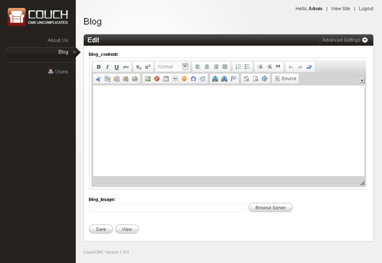

Try placing some content in the richtext editor and saving the page.
Access `https://www.mytestsite.com/blog.php`.
Nothing will seem to change. The content you added in the editor will not appear on the page.
The reason is that, unlike `about.php` where we defined the editable regions by placing the editable tags right where we wanted the edited content to appear, placing the editable tags within the template tag will only create the editable regions. To display the edited content we'll need to use the show tag with the name of the editable region as parameter.

In `blog.php`, find the place where the blog entry's content is displayed:

```diff lang="php" title="blog.php"
<!-- Blog Post -->
<div class="post">
    <!-- Post Title -->
    <h3 class="title"><a href="single.html">Loreum ipsium massa cras phasellus</a></h3>
    <!-- Post Data -->
    <p class="sub"><a href="#">News</a>, <a href="#">Products</a> &bull; 31st Sep, 09 &bull; <a href="#">1 Comment</a></p>
    <div class="hr dotted clearfix">&nbsp;</div>
    <!-- Post Image -->
    
    <!-- Post Content -->
-    <p>Lorem ipsum dolor sit amet, consectetur adipiscing elit. <b>Mauris vel porta erat.</b> Quisque sit amet risus at odio pellentesque sollicitudin. Proin suscipit molestie facilisis. Aenean vel massa magna. Proin nec lacinia augue. Mauris venenatis libero nec odio viverra consequat. In hac habitasse platea dictumst.</p>
-    <p>Cras vestibulum lorem et dui mollis sed posuere leo semper. Integer ac ultrices neque. Cras lacinia orci a augue tempor egestas. Sed cursus, sem ut vehicula vehicula, ipsum est mattis justo, at volutpat nibh arcu sit amet risus. Vestibulum tincidunt, eros ut commodo laoreet, arcu eros ultrices nibh, ac auctor est dui vel nibh.</p>
    <!-- Read More Button -->
    <p class="clearfix"><a href="single.html" class="button right"> Read More...</a></p>
</div>
```

and replace the text shown as content by a show tag:

```diff lang="php" title="blog.php"
<!-- Blog Post -->
<div class="post">
    <!-- Post Title -->
    <h3 class="title"><a href="single.html">Loreum ipsium massa cras phasellus</a></h3>
    <!-- Post Data -->
    <p class="sub"><a href="#">News</a>, <a href="#">Products</a> &bull; 31st Sep, 09 &bull; <a href="#">1 Comment</a></p>
    <div class="hr dotted clearfix">&nbsp;</div>
    <!-- Post Image -->
    
    <!-- Post Content -->
+    <cms:show blog_content />
    <!-- Read More Button -->
    <p class="clearfix"><a href="single.html" class="button right"> Read More...</a></p>
</div>
```

Notice the
`<cms:show blog_content />`

Upload an image into the image type editable region.
In `blog.php`, find the place where the image is displayed:

```diff lang="php" title="blog.php" "images/610x150.gif"
    <!-- Post Image -->
    
    <!-- Post Content -->
    <cms:show blog_content />
```

and replace the src attribute of the image tag with the content of the editable region named *blog_image* using the show tag:

```diff lang="php" title="blog.php" ins="<cms:show blog_image />"
    <!-- Post Image -->
    " />
    <!-- Post Content -->
    <cms:show blog_content />
```

Access `https://www.mytestsite.com/blog.php` again. Your edited contents should appear on the page now.

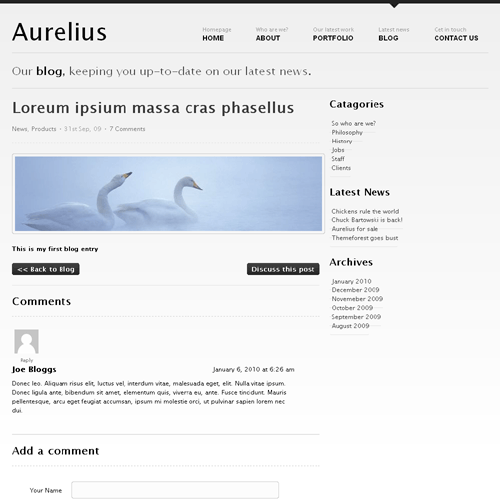

### Cloning the template

What we have succeeded in doing so far is make a single page `blog.php` editable.
The *blog* section, however, will require several such pages - one for each new blog entry.
We can use the `blog.php` template to create more than one page by declaring it as clonable.
The way to do so is setting the *clonable* parameter within the template tag:

```diff lang="php" title="blog.php" ins="clonable="1""
<?php require_once( 'couch/cms.php' ); ?>
<cms:template title="blog" clonable="1" >
    <cms:editable name="blog_content" type="richtext" />
    <cms:editable name="blog_image" 
        crop="1"
        width="610" 
        height="150"
        type="image"
    />
</cms:template>
<!DOCTYPE html PUBLIC "-//W3C//DTD XHTML 1.0 Transitional//EN" "http://www.w3.org/TR/xhtml1/DTD/xhtml1-transitional.dtd">
<html xmlns="http://www.w3.org/1999/xhtml">
<head>
```

Access `https://www.mytestsite.com/blog.php` as super-admin to refresh it and make your changes take effect.
Visit the admin section:

```txt
https://www.mytestsite.com/couch/
```

Click on *Blog* in the list of templates in the sidebar.
Whereas previously clicking on the blog entry immediately showed the editable regions ready for editing in the right panel, once you declared it to be clonable the right panel will now show you a list of all the pages cloned from this template.
Clicking on any of these pages will show the editable regions.

For now notice that in the list of pages cloned from `blog.php` in the right panel, Couch is showing one cloned page that it has created automatically -

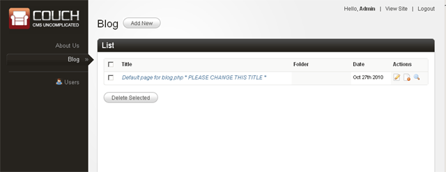

It has named this page:

```txt
Default page for blog.php * PLEASE CHANGE THIS TITLE *
```

Click on this new page:

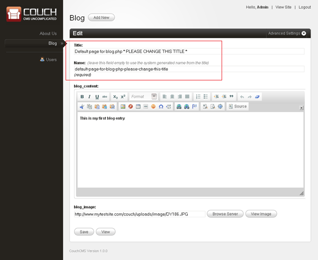

Notice how the two editable regions that we had defined for `blog.php` are present in the panel that opens up.
Also notice that the two regions have the same data that we had entered into `blog.php` when it was not clonable. Whenever a template is declared as being clonable, Couch creates a default page as the first cloned page of the template by moving all the editable data that was previously allocated to the non-clonable template.

Further notice that apart from these two editable regions, Couch has added two more regions - *Title* and *Name*.
Since multiple pages can now be created from the clonable template, each cloned page needs to have a unique identification. The *Name* field is this unique id.
Every cloned page will always have the *Name* and *Title* fields associated with it. Difference between the two is that the *Name* field has restrictions on the characters that you can use within it (only alpha-numeric, hyphen and underscore). The *Title* field, on the other hand, has no such restrictions.

:::tip
If you fill the *Title* field, you can leave the *Name* field empty and Couch will generate a name for the page based on the title you entered.
:::

Change the *title* to something friendlier and leave the *name* blank:

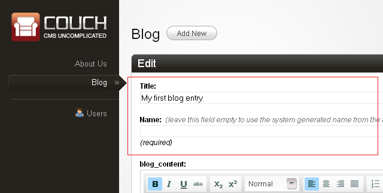

Press the save button at the bottom.

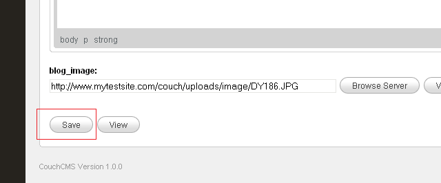

Couch will save the changes and refresh the page. Notice how a name was generated by Couch using the *title* field.

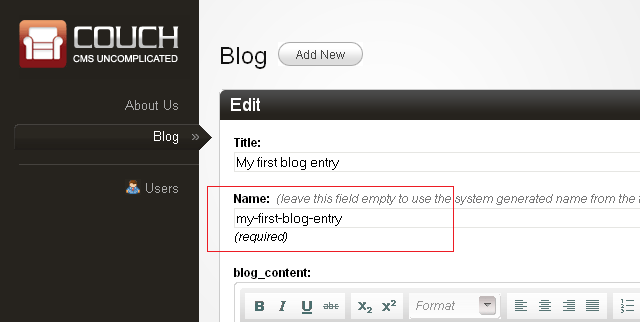

Click the view button to see this page in browser:

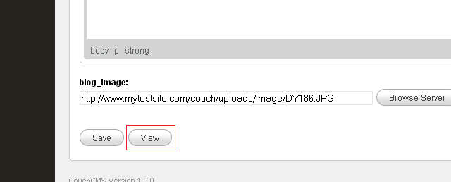

Notice the address of the page in the address bar:

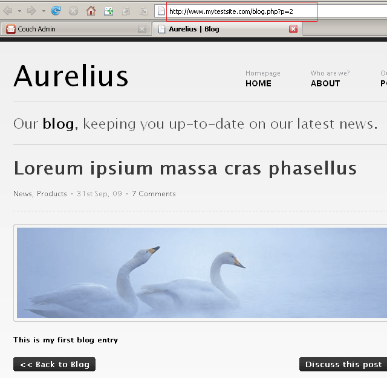

It has an additional '`?p=2`' after the `blog.php`:

```txt "?p=2"
https://www.mytestsite.com/blog.php?p=2
```

Compare it with how uptil now (that is uptil `blog.php` was not declared clonable), we accessed `blog.php` using the following address:

```txt
https://www.mytestsite.com/blog.php
```

Every cloned page has the additional '`?p=x`' after the non-clonable URL where 'x' is a unique number that denotes the cloned page that is being displayed.

Let us create a second cloned page to illustrate the point further.
Click on the button that has been added on the top that says 'Add New':

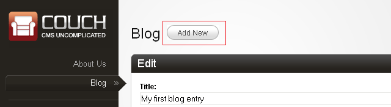

Save the page after filling in the fields.

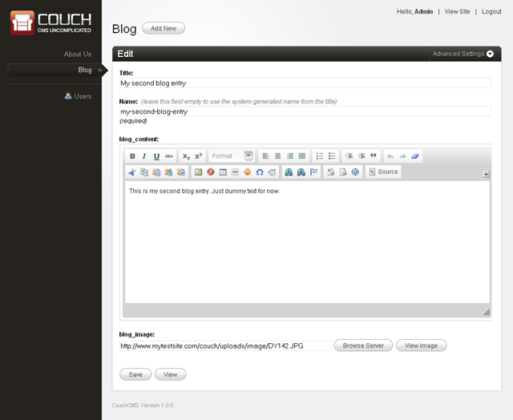

Press view and the second page should show up:

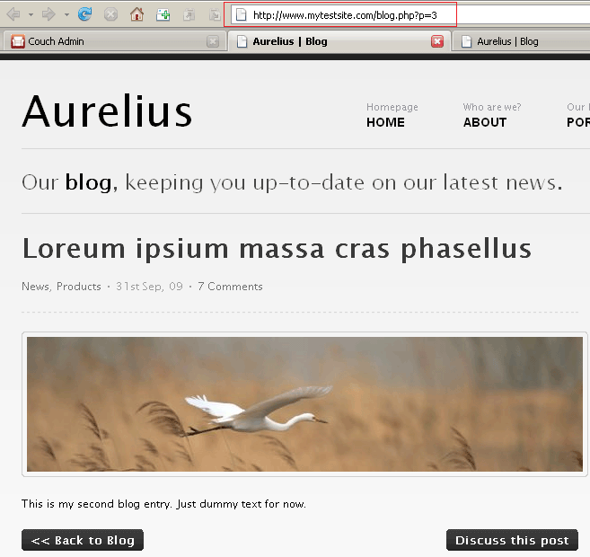

Once again notice the address of this page:

```txt "?p=3"
https://www.mytestsite.com/blog.php?p=3
```

Clearly, the '`?p=2`' and '`?p=3`' after the `blog.php` signal to Couch to generate a page using `blog.php` as template and filling in the editable regions with data associated with the page specified with the number given.
So what happens if we access `blog.php` without any '`?p=n`' appended? Let us try.
Access `https://www.mytestsite.com/blog.php` and the following page should appear:

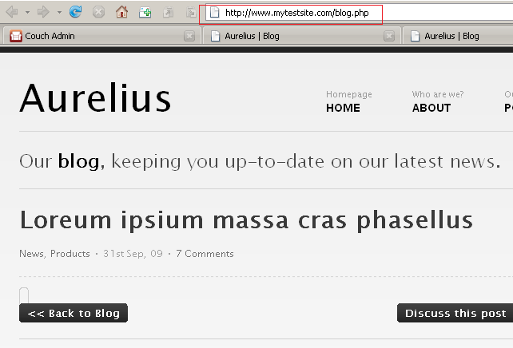

As you can see, a page has been generated using `blog.php` as the template. However, since no cloned page was specified, the two editable regions come up empty.
So if no page's data is associated with the address `https://www.mytestsite.com/blog.php`, is this address useless for clonable templates?
Not at all. We can use it to show a listing of all the pages cloned from the template or display information about this section or do whatever you wish.
Couch, on its part, will signal to you whether or not a cloned page's data is available. This it does by setting up certain variables that you can test and take action accordingly.

URLs of clonable templates that have the '`?p=n`' appended are considered by Couch to be the '*page-views*' (i.e. displaying cloned pages) while the URLs without this information are considered as being the '*list-views*' [see [Views](../../../concepts/views/) in documentation].
In page-view, you'll find set a variable named *k_is_page* while in list-view a variable named *k_is_list* will be found set (see [Variables available in Views](../../../concepts/variables-in-views/)).

### Using the conditionals

We can use Couch's conditional tags (if and else) to test the presence of the two variables mentioned above and then change the output of our template accordingly depending on the view we are in.

Enclose the HTML part of the `blog.php` with Couch's if tags the following way:
Place the opening if tag `<cms:if k_is_page >` before the `<html>` tag:

```diff lang="php" title="blog.php"
<?php require_once( 'couch/cms.php' ); ?>
<cms:template title="blog" clonable="1" >
    <cms:editable name="blog_content" type="richtext" />
    <cms:editable name="blog_image" 
        crop="1"
        width="610" 
        height="150"
        type="image"
    />
</cms:template>

+<cms:if k_is_page >
<!DOCTYPE html PUBLIC "-//W3C//DTD XHTML 1.0 Transitional//EN" "http://www.w3.org/TR/xhtml1/DTD/xhtml1-transitional.dtd">
<html xmlns="http://www.w3.org/1999/xhtml">
<head>
```

and place the closing if tag `</cms:if>` after the `</html>` tag:

```diff lang="php" title="blog.php"
    </div><!--end wrapper-->

</body>
</html>
+</cms:if>

<?php COUCH::invoke(); ?>
```

What we are doing is checking if variable *k_is_page* is set (i.e. a cloned page is being viewed). If it is, we output the full template. Test it by accessing both the cloned pages.
But what happens if *k_is_page* is not set (as when in the list-view)?
Check it by accessing `https://www.mytestsite.com/blog.php` and you'll face a blank page. Not surprising because we were displaying the template only in page-view.
Let us handle the list-view now.
Add an else tag before the ending if tag.

```diff lang="php" title="blog.php"
    </div><!--end wrapper-->

</body>
</html>
+<cms:else />

</cms:if>

<?php COUCH::invoke(); ?>
```

Anything placed after the else tag will be output when *k_is_page* is not set - i.e. when `blog.php` is accessed without being associated with a cloned page.
As a quick and dirty test, place an arbitrary message in this block:

```diff lang="php" title="blog.php"
</body>
</html>
<cms:else />
+    <h1>Hi! You are seeing the list-view</h1>
</cms:if>
```

Access `https://www.mytestsite.com/blog.php` and you'll see:

```txt
Hi! You are seeing the list-view
```

Of course, you'll want to do something more useful than this in this view.
Listing out all the pages that have been cloned from `blog.php` here is not a bad idea.
Remember the `blog_list.html` (the original `blog.html` showing a list of blog entries that we had renamed to `blog_list.html`)?
We'll display this in the list-view.

### Embedding snippets

Couch has a very powerful feature that allows us to keep chunks of HTML code (along with any Couch tags that might be within them) in separate files as snippets, and then use these snippets anywhere using the Couch embed tag.

We'll use the embed tag to display `blog_list.html` in the list-view.
Move `blog_list.html` into the snippets folder found within the couch folder (this is not mandatory, but files kept in this folder are kept safe from being accessed directly by the `.htaccess` file present within the folder and hence is desirable).
See [embed](../../../tags-reference/embed/) tag for snippets folder customization instructions.
Now replace the silly message we were displaying in list-view with the following embed tag:

```diff lang="php" title="blog.php"
</body>
</html>
<cms:else />
+    <cms:embed "blog_list.html" />
</cms:if>
```

Access `https://www.mytestsite.com/blog.php` and you should see the contents of `blog_list.html` being displayed.

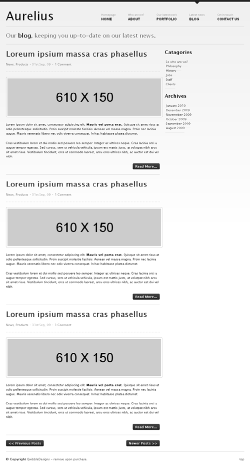

In a way, `blog_list.html` has become a part of the `blog.php` template only that it is displayed in list-view.

Of course, what is being displayed is the hard coded HTML within `blog_list.html` and is not a list of the cloned pages of `blog.php` but we'll change that soon.

Before we set out to dynamically display a list of our cloned pages in the list-view, there is still work to be done in the page-view.
With what we have done so far, for each page we are only displaying the *blog_content* and the *blog_image*.
The blog entry's title, the categories, date and number of comments need to be handled too.

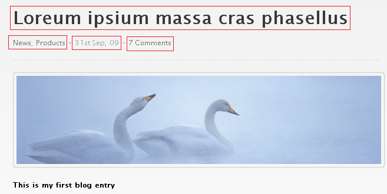

In the step where we decided on the number of editable regions to create, we had discussed that these items are present in other ways within a page and do not need the creation of editable regions to capture them.
Take a look at the '[Variables available in Views](../../../concepts/variables-in-views/)' in the documentation for a list of variables that become available in the various views.

:::tip
You can use `<cms:dump_all />` or `<cms:dump />` to get a quick list of all the variables that are available for use at any particular place.
:::

Variables `k_page_title`, `k_page_date` and `k_comments_count` present in the page-view are what we require.
With `blog.php` open in your editor, find the place where title of the blog entry is displayed:

```diff lang="php" title="blog.php" "Loreum ipsium massa cras phasellus"
<!-- Blog Post -->
<div class="post">
    <!-- Post Title -->
    <h3 class="title"><a href="single.html">Loreum ipsium massa cras phasellus</a></h3>
```

and replace it with:

```diff lang="php" title="blog.php" ins="<cms:show k_page_title />"
<!-- Blog Post -->
<div class="post">
    <!-- Post Title -->
    <h3 class="title"><a href="single.html"><cms:show k_page_title /></a></h3>
```

The titles are currently linked to `single.html`. Let us change this to link them back to the current page.
We'll use the variable `k_page_link`, which is always available to give the link of the current page.
Replace `single.html` with `<cms:show k_page_link />`:

```diff lang="php" title="blog.php" ins="<cms:show k_page_link />"
<!-- Blog Post -->
<div class="post">
    <!-- Post Title -->
    <h3 class="title"><a href="<cms:show k_page_link />"><cms:show k_page_title /></a></h3>
```

Access the cloned pages to see their title being shown instead of the ipsum lorem stuff having the right link.

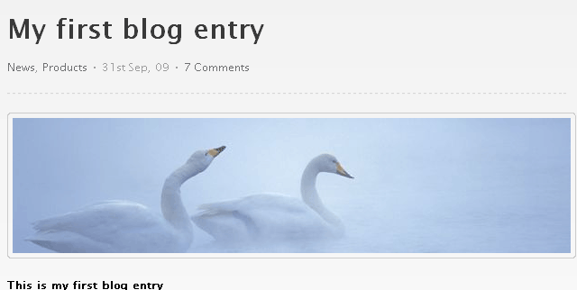

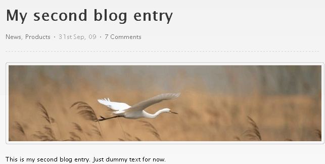

Moving on to fix the date, first find the date in the template:

```diff lang="php" title="blog.php"
<a href="#">Products</a> &bull; 31st Sep, 09 &bull;
```

and replace it with:

```diff lang="php" title="blog.php" ins="<cms:show k_page_date />"
<a href="#">Products</a> &bull; <cms:show k_page_date /> &bull;
```

Accessing any cloned page to see the change:

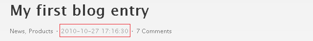

The date that appears, although recognizable, hardly matches the '*31st Sep, 09*' format originally in place.
This is because `k_page_date` shows date in the internal raw format of its storage (yyyy-mm-dd hh:mm:ss).
To make it display in the desired format we'll have to use the Couch date tag that takes a format parameter which can be used to modify the display.
Place the following in place of the show tag:

```php
<cms:date k_page_date format='jS M, y'/>
```

This results in the following display:

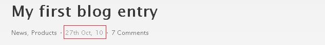

The comments count can be similarly fixed by finding and replacing the count:

```diff lang="php" title="blog.php" "1 Comment"
<cms:date k_page_date format='jS M, y'/> &bull; <a href="#">1 Comment</a></p>
```

with `k_comments_count` variable:

```diff lang="php" title="blog.php" ins="<cms:show k_comments_count />"
<cms:date k_page_date format='jS M, y'/> &bull; <a href="#"><cms:show k_comments_count /> Comment(s)</a></p>
```

Of course for now all blog entries will show a count of 0 because they have no comments yet.

We can now move on to handle the categories of blog entries.

## Managing Categories with Virtual Folders

### Understanding Virtual Folders

Couch supports the notion of virtual folders. Virtual folders can be created for a clonable template and then its cloned pages may be placed in any one such folder.
The real value of virtual folders is seen when pretty-urls are enabled in Couch (after which the '`?p=n`' in the URL of a cloned page gets replaced by the name of the page, making the url more user-friendly). With pretty-urls enabled, if a cloned page resides within a virtual folder or a hierarchy of virtual folders (they can be nested), the names of the folders show up in the URL of the page, making it appear as if the page is physically located within such folders.
Since the virtual folders are designed to mimic the physical folders of a file system, a cloned page can only reside within one folder.

The categories of the blog section can be handled using virtual folders but please keep in mind that you'll only be able to place a blog entry in a single category.

Creation of a virtual folder requires placing the Couch folder tag within the template the virtual folder is defined for.
The template tag is an ideal place within which these folder tags may be placed.

### Setting Up Categories

For our `blog.php`, we will create top-level folders to match the following categories visible in the Aurelius template:

- *Philosophy*
- *History*
- *Jobs*
- *Staff*
- *Clients*

Place the following tags within the template tag already placed at the beginning of `blog.php`:

```diff lang="php" title="blog.php"
<?php require_once( 'couch/cms.php' ); ?>
<cms:template title="blog" clonable="1" >
    <cms:editable name="blog_content" type="richtext" />
    <cms:editable name="blog_image" 
        crop="1"
        width="610" 
        height="150"
        type="image"
    />

+    <cms:folder name="philosophy" title="Philosophy" />
+    <cms:folder name="history" title="History" />
+    <cms:folder name="jobs" title="Jobs" />
+    <cms:folder name="staff" title="Staff" />
+    <cms:folder name="clients" title="Clients" />

</cms:template>

<cms:if k_is_page >
<!DOCTYPE html PUBLIC "-//W3C//DTD XHTML 1.0 Transitional//EN" "http://www.w3.org/TR/xhtml1/DTD/xhtml1-transitional.dtd">
<html xmlns="http://www.w3.org/1999/xhtml">
<head>
```

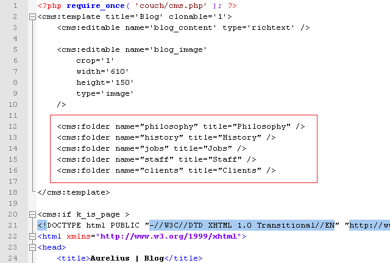

Refresh `blog.php` in your browser by visiting it while still being logged-on as the super-admin.
Visit the *blog* section in Couch admin and you should find a drop-down list being added to it:

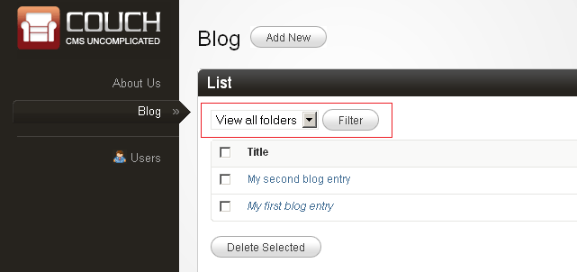

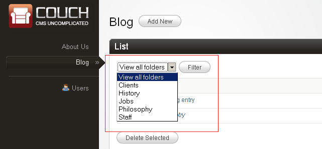

Let us now add the first blog entry to a folder.
Click on '*My first blog entry*' to edit it.
Click on the '*Advanced Settings*' found at the top right:

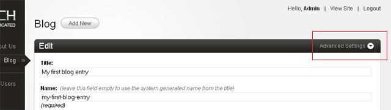

It will expand to reveal several advanced settings. A list of the virtual folders defined for the template is one of them.

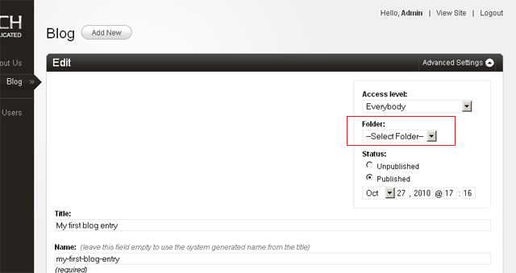

Select one, let us say '*clients*', and save.

Now to display this folder in the blog entry -
As you know, Couch provides information about the page being accessed by setting up variables. The `k_page_foldertitle` variable contains the title of the folder a cloned page resides in (remains blank if the page does not reside in any folder) [see [Variables available in Views](../../../concepts/variables-in-views/)].

:::tip
Once again, when in any doubt about which variables are available for use, place `<cms:dump />` or `<cms:dump_all />` temporarily within the template. On accessing a page, these tags will spill out all the variables (along with their values) that are available.
:::

Find the place where the template displays the name of the categories:

```diff lang="php" title="blog.php" "News</a>, <a href="#">Products"
<!-- Post Title -->
<h3 class="title"><a href="<cms:show k_page_link />"><cms:show k_page_title /></a></h3>
<!-- Post Data -->
<p class="sub"><a href="#">News</a>, <a href="#">Products</a> &bull; <cms:date k_page_date format='jS M, y'/> &bull; <a href="#"><cms:show k_comments_count /> Comment(s)</a></p>
```

Replace it with:

```diff lang="php" title="blog.php" ins="<cms:show k_page_foldertitle />"
<!-- Post Title -->
<h3 class="title"><a href="<cms:show k_page_link />"><cms:show k_page_title /></a></h3>
<!-- Post Data -->
<p class="sub"><a href="#"><cms:show k_page_foldertitle /></a> &bull; <cms:date k_page_date format='jS M, y'/> &bull; <a href="#"><cms:show k_comments_count /> Comment(s)</a></p>
```

Notice how we have eliminated the second category because we can only have one.

Visit '*My first blog entry*' to see the change being reflected on the web page:

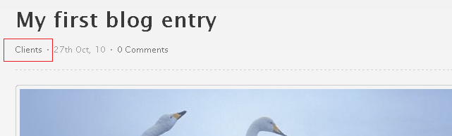

Now visit '*My second blog entry*':

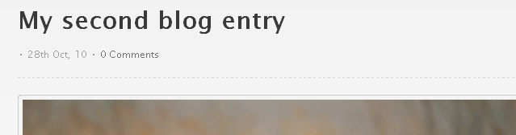

Nothing is displayed for the folder as this page was not placed in any folder but the blank looks awkward.
We'd like to display '*Uncategorised*' for such pages that do not reside in any folder.

To do so, instead of directly using the `k_page_foldertitle` variable, we'll use a variable of our own to display the folder title.

:::note
You might recall from the documentation that apart from the variables set up by Couch (the system variables that are all prefixed by `k_`), we can define our own variables. [see [Variables](../../../concepts/variables/)].
:::

If `k_page_foldertitle` is not blank, we'll set our variable to the folder title but if `k_page_foldertitle` is blank, we'll set it to '*Uncategorised*'. This is how it can be done:

```diff lang="php" title="blog.php" ins="<cms:show my_category />"
<!-- Post Title -->
<h3 class="title"><a href="<cms:show k_page_link />"><cms:show k_page_title /></a></h3>
<!-- Post Data -->
+    <cms:if k_page_foldertitle >
+        <cms:set my_category=k_page_foldertitle />
+    <cms:else />
+        <cms:set my_category="Uncategorised" />
+    </cms:if>
<p class="sub"><a href="#"><cms:show my_category /></a> &bull; <cms:date k_page_date format='jS M, y'/> &bull; <a href="#"><cms:show k_comments_count /> Comment(s)</a></p>
```

Notice how we are now using `my_category`, instead of `k_page_foldertitle`, to display the folder title.

Visiting '*My second blog entry*' now will show:

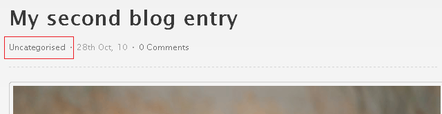

That about wraps up the page-view part of `blog.php` (one that displays a single blog entry).
A few minor points still remain unattended but we'll get back to them after we configure the other parts.
Let us now move on to the list-view of `blog.php` - where we display a paginated list of all cloned pages i.e. blog entries.

[Continue to Part 2](../blog-part-2/)
