import { Steps, Card } from '@astrojs/starlight/components';

<Card icon="download" title="Download Code">
[Download Couchified Code](https://www.couchcms.com/docs/code/blog.zip)
</Card>

## Listing Cloned Pages - The list-view

As already discussed, `https://www.mytestsite.com/blog.php` is the view where we list all the existing blog entries.
Access it through your browser and you'll see that currently it is showing some hard coded HTML.
We are going to change that now to make it display pages cloned from `blog.php` template in descending order of their publication date.

The way we have configured it, template `blog.php` is using an embedded template `blog_list.html` to render the list-view.
File `blog_list.html` is where we'll make the changes now. Open it up in your text editor.

Couch has a tag named *pages* that is used to enumerate or list pages belonging to a particular template.
Let us take a little overview of how this tag works before putting it into real use.
The syntax of pages tag is pretty simple.

```php
<cms:pages masterpage='blog.php' >

</cms:pages>
```

As you can see, the pages tag consists of a pair of opening and closing tags. The *masterpage* attribute specifies the template we wish to enumerate the cloned pages of. This attribute can be skipped if we want to enumerate pages cloned from the template this code is placed in but we'll use it for the sake of clarity.

The tag fetches all the relevant cloned pages of the specified template and then loops through them selecting one page at a time sequentially.
At each iteration, all the variables normally available for the selected page, had it been accessed directly in page-view, are made accessible by the tag. These variables, of course, include all the editable regions too.
Finally anything that appears within the opening and closing tags of pages will be output in the normal way. This content can contain Couch tags that can make use of the variables that are made available.

As a quick and dirty test, place the following code:

```diff lang="php" title="blog_list.html"
<cms:pages masterpage='blog.php' >
+    <h1>Hi, I am a page!</h1>
</cms:pages>
```

anywhere within `blog_list.html` (I chose just after the `<body>` tag) and access `https://www.mytestsite.com/blog.php`.

You'll see that the heading '*Hi, I am a page!*' appears twice.

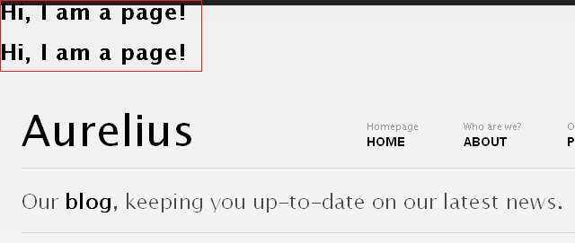

The `blog.php` currently has only two cloned pages. As the pages tag loops through the two cloned pages, it executes the contents nested within itself at each iteration and hence the H1 tag gets output twice.

Since at each iteration it also makes available all the variables belonging to the page currently selected, changing the code to:

```diff lang="php" title="blog_list.html" "<cms:show k_page_title />" "<cms:show blog_content />"
<cms:pages masterpage='blog.php' >
    <h1>Hi, I am a page!</h1>
    My title is <b><cms:show k_page_title /></b>
    <p>
        <cms:show blog_content />
    </p>
</cms:pages>
```
will display:

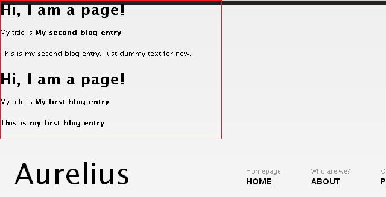

As you can see we can access all variables belonging to each cloned pages just the way we did when the page was accessed in its page-view.

:::note
The [pages](../../../tags-reference/pages/) tag, in a way, is one of the most powerful tags in Couch and supports several parameters that you can use to fine-tune the cloned pages that are fetched and the way they are fetched. Please consult the [documentation](../../../tags-reference/pages/) for a full discussion.
:::

With this ability to list cloned pages and access their data, we can now make changes to the `blog_list.html` snippet to display the cloned pages instead of its hard coded content.

The `blog_list.html` is hard coded to display three blog posts.
Delete two posts so that we are left with only one. Visit `https://www.mytestsite.com/blog.php` to ensure that it displays only one blog post.

We have already seen that the pages tag repeats the contents enclosed by it as many times as there are pages for it to display. We are going to enclose the remaining one post with the pages tag hence we need the HTML for only one blog post.
Enclose the solitary blog post by the pages tag this way:

```diff lang="php" title="blog_list.html"
+<cms:pages masterpage='blog.php' >
<!-- Blog Post -->
<div class="post">
    <!-- Post Title -->
    <h3 class="title"><a href="single.html">Loreum ipsium massa cras phasellus</a></h3>
    <!-- Post Data -->
    <p class="sub"><a href="#">News</a>, <a href="#">Products</a> &bull; 31st Sep, 09 &bull; <a href="#">1 Comment</a></p>
    <div class="hr dotted clearfix">&nbsp;</div>
    <!-- Post Image -->
    
    <!-- Post Content -->
    <p>Lorem ipsum dolor sit amet, consectetur adipiscing elit. <b>Mauris vel porta erat.</b> Quisque sit amet risus at odio pellentesque sollicitudin. Proin suscipit molestie facilisis. Aenean vel massa magna. Proin nec lacinia augue. Mauris venenatis libero nec odio viverra consequat. In hac habitasse platea dictumst.</p>
    <p>Cras vestibulum lorem et dui mollis sed posuere leo semper. Integer ac ultrices neque. Cras lacinia orci a augue tempor egestas. Sed cursus, sem ut vehicula vehicula, ipsum est mattis justo, at volutpat nibh arcu sit amet risus. Vestibulum tincidunt, eros ut commodo laoreet, arcu eros ultrices nibh, ac auctor est dui vel nibh.</p>
    <!-- Read More Button -->
    <p class="clearfix"><a href="single.html" class="button right"> Read More...</a></p>
</div>
<div class="hr clearfix">&nbsp;</div>
+</cms:pages>
```

Visit `http://www.mytestsite.com/blog.php` again and see that now it has repeated the static blog post twice, once for each cloned page of `blog.php`. The two posts are of course identical. We'll now set them to display variables from the cloned pages fetched by the pages tag instead of the hard coded HTML.

We have already been through this step of finding relevant regions within the HTML code and replacing them with the page's variables while configuring the page-view. The finished code should look like this -

```diff lang="php" title="blog_list.html" ins="<cms:show k_page_link />" ins="<cms:show k_page_title />" ins="<cms:show my_category />" ins="<cms:show k_page_date />" ins="<cms:show blog_image />" ins="<cms:show blog_content />"
<cms:pages masterpage='blog.php' >
<!-- Blog Post -->
<div class="post">
    <!-- Post Title -->
    <h3 class="title"><a href="<cms:show k_page_link />"><cms:show k_page_title /></a></h3>
    <!-- Post Data -->
    <cms:if k_page_foldertitle >
        <cms:set my_category=k_page_foldertitle />
    <cms:else >
        <cms:set my_category='Uncategorized' />
    </cms:if >
    <p class="sub"><a href="#"><cms:show my_category /></a> &bull; <cms:show k_page_date /> &bull; <a href="#">1 Comment</a></p>
    <div class="hr dotted clearfix">&nbsp;</div>
    <!-- Post Image -->
    " />
    <!-- Post Content -->
    <cms:show blog_content />
    <!-- Read More Button -->
    <p class="clearfix"><a href="single.html" class="button right"> Read More...</a></p>
</div>
<div class="hr clearfix">&nbsp;</div>
</cms:pages>
```

Visit `http://www.mytestsite.com/blog.php` to see the two cloned pages listed on it:

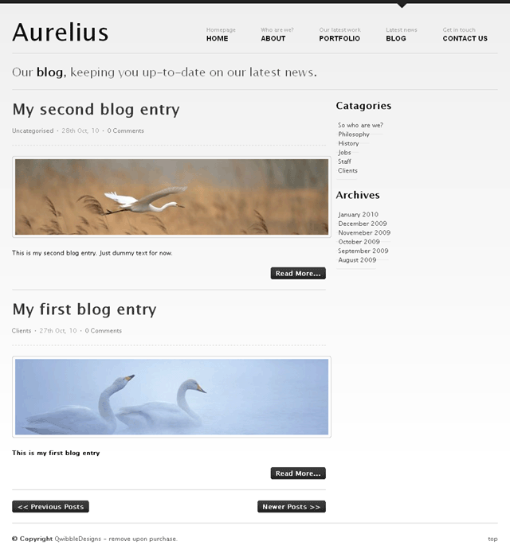

Click on the title of any post to verify that it loads the page-view of that post.

Everything looks good for now.
The '*Read More..*' button at the bottom of each post needs some attention.
Usually when a blog post is displayed in its page-view (i.e. singly), its entire content is displayed. However, when the same post is displayed in the list-view (with several other posts) it is pragmatic to display only an excerpt of its contents and provide a link that leads to its page-view.

Couch has two tags that can be used to get an excerpt from any input provided to them - excerpt and excerptHTML.
The difference between the two, of course, is that excerptHTML preserves the HTML elements present in the input while excerpt strips off all HTML tags.
We'll use the excerptHTML tag for our purpose. It can be additionally configured to ignore certain HTML tags. We'll make it ignore any IMG tag because if it happens to be present within the excerpt it is certainly going to make the post taller than what we desire. We'll set the count of words for the excerpt to 75\.
The modified code is:

```diff lang="php" title="blog_list.html" ins="<cms:show k_page_link />"
<!-- Post Content -->
+<cms:excerptHTML count="75" ignore="img" >
    <cms:show blog_content />
+</cms:excerptHTML>
<!-- Read More Button -->
<p class="clearfix"><a href="<cms:show k_page_link />" class="button right"> Read More...</a></p>
```

Note that we have fixed the '*Read More..*' link too.
Try it out by editing '*My second blog entry*', placing several paragraphs of text within it and then compare its page-view:

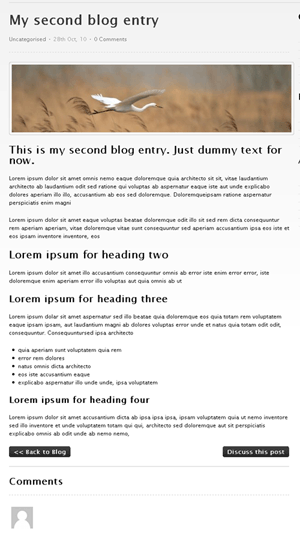

with the list-view:

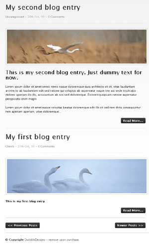

Our blog is beginning to take its final shape.
To illustrate the remaining features, we'll add three more blog entries (i.e. create cloned pages of `blog.php`).
We'll place two pages in '*clients*' folder, two in '*philosophy*' and leave one in the root (i.e. within no folder).

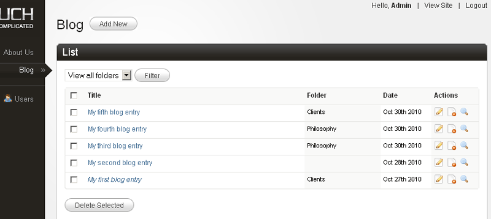

As we keep on adding new blog entries, the list-view faithfully keeps showing them all. It is okay for a few pages but as soon as the number of pages grows it soon becomes untenable to display all of them on a single page.
The solution? Show the pages in fixed chunks of, say, ten pages at a time and give visitors the option to navigate to other chunks by providing links. This is pagination and Couch supports it natively.

### Pagination

For the purpose of our demonstration, we'll show three pages at a time in the list-view.
Add the following parameters to the pages tag:

```diff lang="php" title="blog_list.html" ins="limit="3"" ins="paginate="1""
<cms:pages masterpage='blog.php' limit="3" paginate="1" >
<!-- Blog Post -->
<div class="post">
    <!-- Post Title -->
    <h3 class="title"><a href="<cms:show k_page_link />"><cms:show k_page_title /></a></h3>
```

The *limit* parameter limits the number of pages fetched to 3 while setting the *paginate* parameter to 1 indicates to Couch that it now has to support pagination. Once Couch is made to support pagination, it will set some new variables for us that show the current status of the paginated result [see [Pagination](../../../concepts/pagination/) in documentation for more details].
The new variables include links to the next and the previous set of three pages (if available).
We can use them to modify the links of the two buttons at the bottom that say '*Previous Posts*' and '*Next Posts*', but before we can do that we'll have to move the HTML code for the two buttons within the pages tags (because the variables are available only within this tag's context) -
Before:

```diff lang="php" title="blog_list.html"
<div class="hr clearfix">&nbsp;</div>
-</cms:pages>

<!-- Blog Navigation -->
<p class="clearfix">
    <a href="#" class="button float">&lt;&lt; Previous Posts</a>
    <a href="#" class="button float right">Newer Posts >></a>
</p>
```

After:

```diff lang="php" title="blog_list.html"
<div class="hr clearfix">&nbsp;</div>

<!-- Blog Navigation -->
<p class="clearfix">
    <a href="#" class="button float">&lt;&lt; Previous Posts</a>
    <a href="#" class="button float right">Newer Posts >></a>
</p>
+</cms:pages>
```

But now when you access `blog.php`, you'll see that the next and previous buttons now get repeated for all the posts that are listed on the page. Certainly not what we desired. We wish to display the navigation buttons only after the last post on the page. As noted above, Couch sets up several variables that reflect the current status of the loop as the pages tag iterates through the fetched pages.
*k_paginated_top* and *k_paginated_bottom* are two such variables.

Use `<cms:dump />` or `<cms:dump_all />` anywhere within the opening and closing component of the pages tag to see the variables change values as the cloned pages are looped through.

*k_paginated_top* is set when the first page of the current set of pages is being displayed while *k_paginated_bottom* is set when it is the last page that is getting displayed.
We can use the *k_paginated_bottom* variable to conditionally output the navigation buttons only after the last entry:

```diff lang="php" title="blog_list.html"
<div class="hr clearfix">&nbsp;</div>

+<cms:if k_paginated_bottom >
    <!-- Blog Navigation -->
    <p class="clearfix">
        <a href="#" class="button float">&lt;&lt; Previous Posts</a>
        <a href="#" class="button float right">Newer Posts >></a>
    </p>
+</cms:if>

</cms:pages>
```

Visit `blog.php` and the navigation buttons should now display properly after the last post.
We can now set the two buttons to link to the next and previous set of pages.
Couch sets two variables: *k_paginate_link_prev* and *k_paginate_link_next* that give us these links.
We'll add them to the buttons.

```diff lang="php" title="blog_list.html" ins="<cms:show k_paginate_link_next />" ins="<cms:show k_paginate_link_prev />"
<cms:if k_paginated_bottom >
    <!-- Blog Navigation -->
    <p class="clearfix">
        <a href="<cms:show k_paginate_link_next />" class="button float">&lt;&lt; Previous Posts</a>
        <a href="<cms:show k_paginate_link_prev />" class="button float right">Newer Posts >></a>
    </p>
</cms:if >
```

Visit `blog.php` again and click on the '*Previous Posts*' button. You should now see `blog.php` displaying the remaining two posts.

There is small issue here, however, that needs attention.
The five posts were split into two sets - the first set (or page) had three posts while the second has two posts.
We are at the second set and there are no more posts to display after this. Yet the '*Previous Posts*' is still being displayed.
Similarly, when we were at the first set there were no '*Newer Posts*' to display and yet this button was being displayed.

Couch, in fact, is aware of which set is being displayed and actually sets the *k_paginate_link_prev* and *k_paginate_link_next* variables only if there are any next or previous sets to display.
We simply have to check for these variables before displaying the navigation buttons.
Let us modify the code to do this:

```diff lang="php" title="blog_list.html"
<cms:if k_paginated_bottom >
    <!-- Blog Navigation -->
    <p class="clearfix">
+        <cms:if k_paginate_link_next >
            <a href="<cms:show k_paginate_link_next />" class="button float">&lt;&lt; Previous Posts</a>
+        </cms:if >

+        <cms:if k_paginate_link_prev >
            <a href="<cms:show k_paginate_link_prev />" class="button float right">Newer Posts >></a>
+        </cms:if >
    </p>
</cms:if >
```

Visit `blog.php` again and the pagination should work perfectly.
Time to move our attention to the sidebar.

### The Sidebar

The sidebar of both the views is almost identical. Both show a listing of *Categories* and *Archive periods*.

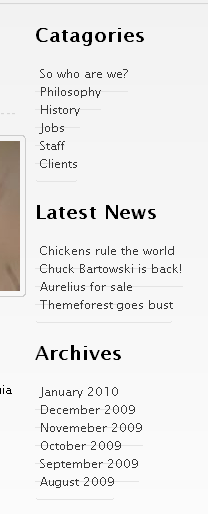

The one shown in page-view has an additional list showing the '*Latest News*'. It is difficult to say what the original designer of Aurelius had in mind as there is no '*news*' section. We'll list our latest four blog posts here.

Since the sidebars are almost identical, we can save the one that has more elements as a snippet and then embed it in both the views.

Find the following sidebar code in `blog.php`.

```diff lang="php" title="blog.php"
<!-- Column 2 / Sidebar -->
<div class="grid_4">

    <h4>Catagories</h4>
    <ul class="sidebar">
        <li><a href="">So who are we?</a></li>
        <li><a href="">Philosophy</a></li>
        <li><a href="">History</a></li>
        <li><a href="">Jobs</a></li>
        <li><a href="">Staff</a></li>
        <li><a href="">Clients</a></li>
    </ul>

    <h4>Latest News</h4>
    <ul class="sidebar">
        <li><a href="">Chickens rules the world</a></li>
        <li><a href="">Chuck Bartowski is back</a></li>
        <li><a href="">Aurelius for sale</a></li>
        <li><a href="">Themeforest goes bust</a></li>
    </ul>
    
    <h4>Archives</h4>
    <ul class="sidebar">
        <li><a href="">January 2010</a></li>
        <li><a href="">December 2009</a></li>
        <li><a href="">Novemeber 2009</a></li>
        <li><a href="">October 2009</a></li>
        <li><a href="">September 2009</a></li>
        <li><a href="">August 2009</a></li>
    </ul>
</div>
```

Cut and paste it into a file and save it as `blog_sidebar.html` in the snippets folder.
Place the following code in `blog.php` in place the code removed above:

```diff lang="php" title="blog.php"
<!-- Column 2 / Sidebar -->
+<cms:embed 'blog_sidebar.html' />

<!-- Footer -->
<p class="grid_12 footer clearfix">
```

Similarly remove the sidebar code from `blog_list.html` (list-view) and replace it with the embed tag shown above.

The two views should now show identical sidebars. However the '*Latest News*' portion of the sidebar was supposed to be visible only in the page-view.
A little conditional code should handle this -
Open up `blog_sidebar.html` in your text editor and enclose the '*Latest News*' list with a conditional tag like this:

```diff lang="html" title="blog_sidebar.html"
+<cms:if k_page_page >
    <h4>Latest News</h4>
    <ul class="sidebar">
        <li><a href="">Chickens rules the world</a></li>
        <li><a href="">Chuck Bartowski is back</a></li>
        <li><a href="">Aurelius for sale</a></li>
        <li><a href="">Themeforest goes bust</a></li>
    </ul>
+</cms:if >
```

The '*Latest News*' section should now be visible only in page-view.

Let us now make the three listings in the sidebar dynamic.
We'll start with the first listing. The first thing to do is correct the header's spelling by changing 'Catagories' to 'Categories'. We'll now list the folders of this template.

### Listing Folders

As we can see, the category (folders) listing in the sidebar is a series of `<li>`'s within a `<ul>` tag:

```diff lang="html" title="blog_sidebar.html"
<h4>Catagories</h4>
<ul class="sidebar">
    <li><a href="">So who are we?</a></li>
    <li><a href="">Philosophy</a></li>
    <li><a href="">History</a></li>
    <li><a href="">Jobs</a></li>
    <li><a href="">Staff</a></li>
    <li><a href="">Clients</a></li>
</ul>
```

In Couch, we can enumerate the folders of a template by using the folders tag. This tag works in a similar fashion as the pages tag we saw a little while back. It fetches the folders and then iterates through them, making available each folder's variables as it loops through each.
The `<li>` portion of the list shown above is the part that needs to be output for each folder found.
Delete all `<li>`'s except one and then enclose this single `<li>` with the folders tag:

```diff lang="html" title="blog_sidebar.html"
<h4>Catagories</h4>
<ul class="sidebar">
+   <cms:folders masterpage="blog.php" >
        <li><a href="">So who are we?</a></li>
+   </cms:folders>
</ul>
```

Next replace the folder's name and its link with the variables that Couch provides for each folder it finds:

```diff lang="html" title="blog_sidebar.html" ins="<cms:show k_folder_link />" ins="<cms:show k_folder_title />"
<h4>Catagories</h4>
<ul class="sidebar">
    <cms:folders masterpage="blog.php" >
        <li><a href="<cms:show k_folder_link />"><cms:show k_folder_title /></a></li>
    </cms:folders>
</ul>
```

This will result in a list of all the five folders we defined for `blog.php` template.

#### Listing pages within a folder

Each folder in the list produced by the folders tag above is also linked to a URL similar to:
```txt "?f=5"
https://www.mytestsite.com/blog.php?f=5
```
Notice how the name of the template is followed by '`?f=n`' (where n is a number denoting a particular folder).
This URL is meant for listing pages that belong to the specified folder only. Such view is a sub-category of the list-view and is known as the folder-view [see [Views](../../../concepts/views/)].

The '`?f=n`' after the template's name makes Couch treat this URL as the template's folder-view and it makes available to you (as variables) all the information about the folder specified in the URL [see: [Variables available in Views](../../../concepts/variables-in-views/)].
Currently, however, if you click on any of the folders in the list, it will lead you to `blog.php` in the same list-view that is displayed when `blog.php` is accessed without any parameter appended after its name. That is, all pages regardless of the folder they belong to, get displayed.

The reason is that, although Couch recognizes the URL as folder-view and sets all relevant variables for us, it is eventually up to us to decide what to display in this view.
We can, for example, display information about the folder in question in this view or display only the pages that belong to the specified folder.
In our case, currently we are not checking at all if the list-view is actually also a folder-view (i.e. we do need to list pages in this view but the pages should belong only to the particular folder that is being specified in the URL).
Let us add this intelligence to our template.

As we know, it is the pages tag in `blog_list.html` template that is fetching and displaying pages in list-view.
Currently it only has the *masterpage* parameter that is constraining the pages fetched.
The tag also supports a parameter named *folder* where we can specify the name of the folder (or folders) the pages belonging to which need to be fetched.
For example, if we hardcode the name of folder as *clients*, the list-view will start showing only the two pages that currently reside in this folder:

```diff lang="php" title="blog_list.html" "folder="clients""
<cms:pages masterpage='blog.php' folder="clients" limit="3" paginate="1" >
<!-- Blog Post -->
<div class="post">
    <!-- Post Title -->
    <h3 class="title"><a href="<cms:show k_page_link />"><cms:show k_page_title /></a></h3>
```

As it happens, during folder-view, a variable named `k_folder_name` gets set by Couch, which gives us the name of the folder specified in the URL. Place this variable as the *folder* parameter in the pages tag:

```diff lang="php" title="blog_list.html" "folder="k_folder_name""
<cms:pages masterpage='blog.php' folder="k_folder_name" limit="3" paginate="1" >
<!-- Blog Post -->
<div class="post">
    <!-- Post Title -->
    <h3 class="title"><a href="<cms:show k_page_link />"><cms:show k_page_title /></a></h3>
```

Refresh `blog.php` and click on the '*Clients*' folder in the sidebar list.
Only two pages, each belonging to '*Clients*' folder will be displayed.
Click on the '*Philosophy*' folder and you should now see only the two pages belonging to '*Philosophy*' being listed.
Remove the '`?f=n`' part from the URL and access `http://www.mytestsite.com/blog.php` directly.
It will display all folders, regardless of their containing folders, as before.
This works as before because this view not being the folder-view, the *k_folder_name* variable comes up empty and hence the *folder* parameter of the pages tag is ignored.

Thus with only the addition of one parameter we were able to handle the folder-view too.
Couch supports one last sub-category of the list-view - the *archive-view*.
In this view we display pages belonging to only a particular time period.
Let us move on to it.

### Listing Archives

This section is very similar to the Listing folders section we handled above:

```html title="blog_sidebar.html"
<h4>Archives</h4>
<ul class="sidebar">
    <li><a href="">January 2010</a></li>
    <li><a href="">December 2009</a></li>
    <li><a href="">Novemeber 2009</a></li>
    <li><a href="">October 2009</a></li>
    <li><a href="">September 2009</a></li>
    <li><a href="">August 2009</a></li>
</ul>
```

Edit `blog_sidebar.html` to delete all the `<li>`'s within the `<ul>` except one.
The Couch tag used to enumerate all the archive periods that have published pages within them is the archives tag.
Enclose the solitary `<li>` with this tag:

```diff lang="html" title="blog_sidebar.html"
<h4>Archives</h4>
<ul class="sidebar">
+    <cms:archives masterpage="blog.php" >
        <li><a href="">January 2010</a></li>
+    </cms:archives>
</ul>
```

Similar to the pages or folders tag, the archives tag makes available all information about each archive period by setting up variables.
Variable *k_archive_date* gives the date that represents the first day of the archive period while *k_archive_link* provides the link to the archive-view that should display all pages belonging to this period.
Add the aforesaid variables to the `<li>`:

```diff lang="html" title="blog_sidebar.html" ins="<cms:date k_archive_date format="F Y" />" ins="<cms:show k_archive_link />"
<h4>Archives</h4>
<ul class="sidebar">
    <cms:archives masterpage="blog.php" >
        <li><a href="<cms:show k_archive_link />"><cms:date k_archive_date format="F Y" /></a></li>
    </cms:archives>
</ul>
```

We have already discussed the use of date tag to format dates.

Visit `blog.php` and you'll see the archives being displayed in the sidebar.
Click on one archive item and it should lead you to a URL like:

```txt "?d=201010"
http://www.mytestsite.com/blog.php?d=201010
```

The '`?d=201010`' after the `blog.php` signals to Couch that an archive-view is being accessed. Couch makes available all information pertaining to the archive period specified in the URL by setting various variables [see [Variables available in Views](../../../concepts/variables-in-views/)].
It is up to the template being accessed to handle the archive period anyway it chooses to.
For now, our `blog.php` will simply display whatever it did in the list-view (remember archive-view and folder-view are sub-categories of list-view) because we have not yet handled the archive-view.
Let us do that now.

Once again it is the pages tag that we placed within the `blog_list.html` (that handles list-view) that needs a little modification.
Pages tag supports two parameters that can be set to constrain the fetched pages to belong to a certain time period - *start_on* and *stop_before*.
We'll set the values of these parameters by using two variables that are set by Couch in archive-view that denote the start and end dates of the archive period - *k_archive_date* and *k_next_archive_date*.
The modified pages tag should look like:

```diff lang="html" title="blog_list.html"
<cms:pages masterpage='blog.php' 
            folder="k_folder_name" 
            limit="3" 
            paginate="1" 
+            start_on="k_archive_date" 
+            stop_before="k_next_archive_date" >

<!-- Blog Post -->
<div class="post">
    <!-- Post Title -->
    <h3 class="title"><a href="<cms:show k_page_link />"><cms:show k_page_title /></a></h3>
```

This minor modification will make our original code handle the archive-view too (i.e. list only pages belonging to that archive period).
As with the folder-view, this works because when `blog.php` is accessed in a view other than the archive-view, the two variables we used are empty and hence are ignored by the pages tag.

This wraps up the two lists that appear in the sidebar of list-view.
The page-view has an additional list, the `Latest News` list, which we'll use to display the latest four blog posts.
Open up `blog_sidebar.html` in your text editor and find the *Latest News* listing.

```diff lang="html" title="blog_sidebar.html"
<cms:if k_page_page >
    <h4>Latest News</h4>
    <ul class="sidebar">
        <li><a href="">Chickens rules the world</a></li>
        <li><a href="">Chuck Bartowski is back</a></li>
        <li><a href="">Aurelius for sale</a></li>
        <li><a href="">Themeforest goes bust</a></li>
    </ul>
</cms:if >
```

Having already configured the folders and archive listings, this one should be a cinch.
We already know that the Couch tag used to list pages is the pages tag.
The steps needed to make this listing dynamic should now be familiar:

- **a.** Delete all but one `<li>` representing one page entry in the list.
- **b.** Enclose the solitary `<li>` with the tag that enumerates the objects being listed - in this case it is the pages tag.
- **c.** Use the variables set by the enumerator tag in the list item.

The finished code is as follows:

```diff lang="html" title="blog_sidebar.html" ins="<cms:show k_page_link />" ins="<cms:show k_page_title />" "limit="4""
<cms:if k_page_page >
    <h4>Latest News</h4>
    <ul class="sidebar">
+        <cms:pages masterpage="blog.php" limit="4" >
            <li><a href="<cms:show k_page_link />"><cms:show k_page_title /></a></li>
+        </cms:pages>
    </ul>
</cms:if >
```

Notice that we have set the limit to four.

Visit any blog entry (page-view) and the latest four blog entries should be found listed in the sidebar.

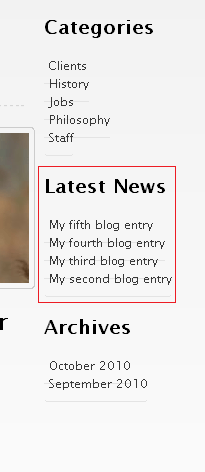

That wraps up all the sidebar sections.
The only features left to complete now are the comments listing and comments form.
Let us move on to them to finally finish the blog in Aurelius.

### Comments

As the very first step in configuring comments, mark the `blog.php` template as being commentable.
This is done by setting the *commentable* attribute to '1' in the template tag present in `blog.php`:

```diff lang="php" title="blog.php" "commentable='1'"
<?php require_once( 'couch/cms.php' ); ?>
<cms:template title='Blog' clonable='1' commentable='1'>
	<cms:editable name='blog_content' type='richtext' />
	
	<cms:editable name='blog_image'
		crop='1'
		width='610'
```

Access `blog.php` in your browser while being logged-in as the super-admin.
Visit the admin section and you'll find that as soon as a template is declared as commentable, a new item is added to the sidebar:

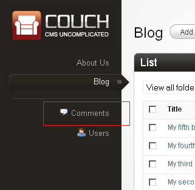

This will be used to administrate all the submitted comments. For now there are no comments for us to administrate so we'll come back to it a little latter.

Let us add the form used to submit comments in the page-view.
Within `blog.php`, find the form that is meant to submit comments:

```php title="blog.php"
<!-- Comment Form -->
<form id="comment_form" action="" method="post"> 
    <h3>Add a comment</h3>
    <div class="hr dotted clearfix">&nbsp;</div>
    <ul>
        <li class="clearfix"> 
            <label for="name">Your Name</label> 
            <input id="name" name="name" type="text" /> 
        </li> 
        <li class="clearfix"> 
            <label for="email">Your Email</label> 
            <input id="email" name="email" type="text" /> 
        </li> 
        <li class="clearfix"> 
            <label for="email">Your Website</label> 
            <input id="website" name="website" type="text" /> 
        </li> 
        <li class="clearfix"> 
            <label for="message">Comment</label> 
            <textarea id="message" name="message" rows="3" cols="40"></textarea> 
        </li> 
        <li class="clearfix">
            <!-- Add Comment Button -->
            <a type="submit" class="button medium black right">Add comment</a>
        </li> 
    </ul> 
</form>
```

We could modify this form to make Couch fit into it. However, since a comments submission form is such a standard component of a blog, in this case we can save some time by reusing the submission form that is described in Couch documentation of [comments](../../../concepts/comments.html).
Copy and save that sample form into a file named `comments_form.html` [\[download it\]](https://www.couchcms.com/docs/code/blog.zip) and save this into the snippet folder of Couch.
Replace the original form block in `blog.php` shown above with:

```diff lang="php" title="blog.php"
<!-- Comment Form -->
+<cms:embed 'comments_form.html' />
```

This will cause the following to display when you are logged in:

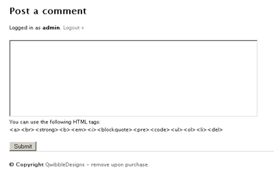

while the following form is shown to non logged-in users:

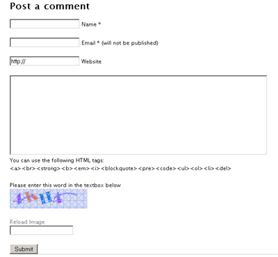

You can style the input elements within this form yourself or simply substitute them with those found in the original Aurelius code.

The code we copied uses the following values from `config.php` to email submission intimation messages to the administrator:

```php title="config.php" "youremail@gmail.com" "contact@yourdomain.com"
    // 13.
    // Your Email address. Will be used in contact forms.
    define( 'K_EMAIL_TO', 'youremail@gmail.com' );

    // 14.
    // Will be used as the sender of messages delivered by contact forms to the address above.
    define( 'K_EMAIL_FROM', 'contact@yourdomain.com' );
```

Don't forget to change them.

Try submitting a few comments being logged in as admin and otherwise.
Comments submitted by non-admins are, by default, not published immediately but are enqueued for moderation.
\[This can be changed by editing the `config.php` but we strongly advice against doing this.\]

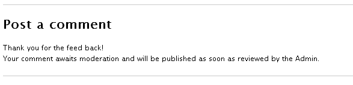

Visit your admin panel and click on the comments item in the sidebar that we mentioned previously.
All the submitted comments should be available here.

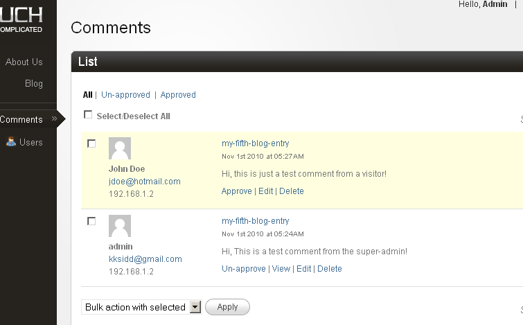

Approve the comments that need approval and now we can move on to getting all the approved comments listed on the page they were submitted to.

### Listing Comments

Listing comments follows the same pattern we have seen so far with all the listings we have configured i.e. pages, folders and archives.
The enumerator tag for listing comments is, no prizes for guessing, the comments tag.
With no parameters specified, comments tag will list all the approved comments in the system regardless of the template they belong to. However, you can use the *masterpage*, *page_id* or *page_name* parameters to make it fetch only the comments that belong to a particular template or page.

To put the comments tag into use, follow the usual method of isolating a single item and enclosing it with the enumerator tags.
Here is how the sample comment contained in `blog.php` looks like after being enclosed by the comments tag:

```diff lang="php" title="blog.php"
<!-- Comments List -->
<h3>Comments</h3>
<div class="hr dotted clearfix">&nbsp;</div>

<ol class="commentlist">
+    <cms:comments page_id=k_page_id order='asc' >
    <li class="comment"> 
        <div class="gravatar"> 
            
            <a class="comment-reply-link" href=''>Reply</a>     
        </div> 
        <div class="comment_content"> 
            <div class="clearfix">
                <cite class="author_name"><a href="">Joe Bloggs</a></cite>       
                <div class="comment-meta commentmetadata">January 6, 2010 at 6:26 am</div> 
            </div>
            <div class="comment_text"> 
                <p>Donec leo. Aliquam risus elit, luctus vel, interdum vitae, malesuada eget, elit. Nulla vitae ipsum. Donec ligula ante, bibendum sit amet, elementum quis, viverra eu, ante. Fusce tincidunt. Mauris pellentesque, arcu eget feugiat accumsan, ipsum mi molestie orci, ut pulvinar sapien lorem nec dui.</p> 
            </div> 
        </div>
    </li>
+   </cms:comments>
</ol>
```

Notice how we are using the system variable *k_page_id*, which is set by Couch to give the current page's id, to fetch only the comments that are associated with the page being accessed in page-view.

Follow this with the usual step of replacing the static content with the variables set by the enumerator tag.

```diff lang="php" title="blog.php" ins="<cms:show k_comment_author />" ins="<cms:show k_comment_author_email />" ins="<cms:date k_comment_date format='F j, Y'/>" ins="<cms:date k_comment_date format='h:ia'/>" ins="<cms:show k_comment />"
<!-- Comments List -->
<h3>Comments</h3>
<div class="hr dotted clearfix">&nbsp;</div>

<ol class="commentlist">
    <cms:comments page_id=k_page_id order='asc' >
    <li class="comment"> 
        <div class="gravatar"> 
            <cms:gravatar email="<cms:show k_comment_author_email />" size="60" />
            <a name="<cms:show k_comment_anchor />">     
        </div> 
        <div class="comment_content"> 
            <div class="clearfix">
                <cite class="author_name"><a href=""><cms:show k_comment_author /></a></cite>       
                <div class="comment-meta commentmetadata"><cms:date k_comment_date format='F j, Y'/> at <cms:date k_comment_date format='h:ia'/></a></div> 
            </div>
            <div class="comment_text"> 
                <p><cms:show k_comment /></p> 
            </div> 
        </div>
    </li>
   </cms:comments>
</ol>
```

Notice the use of the gravatar tag. Also please notice the use of the following code:

```diff lang="php" title="blog.php"
<div class="gravatar"> 
    <cms:gravatar email="<cms:show k_comment_author_email />" size="60" />
+    <a name="<cms:show k_comment_anchor />">    
</div>
```

which is used to give every comment a unique anchor. This is helpful in linking back to specific comments from other pages.

If you wish you can add pagination to this list of comments. The method is the same as that we used to paginate the list of pages before.

```diff lang="php" title="blog.php" ins="<cms:paginator />" ins="limit='5' paginate='1'"
<ol class="commentlist">
    <cms:comments page_id=k_page_id order='asc' limit='5' paginate='1' >
    <li class="comment"> 
        <div class="gravatar"> 
            <cms:gravatar email="<cms:show k_comment_author_email />" size="60" />
            <a name="<cms:show k_comment_anchor />">     
        </div> 
        <div class="comment_content"> 
            <div class="clearfix">
                <cite class="author_name"><a href=""><cms:show k_comment_author /></a></cite>       
                <div class="comment-meta commentmetadata"><cms:date k_comment_date format='F j, Y'/> at <cms:date k_comment_date format='h:ia'/></a></div> 
            </div>
            <div class="comment_text"> 
                <p><cms:show k_comment /></p> 
            </div> 
        </div>
    </li>
    <cms:paginator />
   </cms:comments>
</ol>
```

For the pagination, we have opted to use the Couch paginator instead of the usual '*next*' and '*prev*' buttons. This tag automatically generates a Google style pagination. You'll need to add a bit of CSS though to make the looks suit your needs (please see [Pagination documentation](../../../../concepts/pagination.html) for a sample CSS)

As a final tweak, we'll add a conditional tag to display this list only if the page has any comments available else show a '*No comments*' message. The final code:

```diff lang="php" title="blog.php"
<!-- Comments List -->
<h3>Comments</h3>
<div class="hr dotted clearfix">&nbsp;</div>

+<cms:if k_comments_count >
<ol class="commentlist">
    <cms:comments page_id=k_page_id order='asc' limit='5' paginate='1' >
    <li class="comment"> 
        <div class="gravatar"> 
            <cms:gravatar email="<cms:show k_comment_author_email />" size="60" />
            <a name="<cms:show k_comment_anchor />">     
        </div> 
        <div class="comment_content"> 
            <div class="clearfix">
                <cite class="author_name"><a href=""><cms:show k_comment_author /></a></cite>       
                <div class="comment-meta commentmetadata"><cms:date k_comment_date format='F j, Y'/> at <cms:date k_comment_date format='h:ia'/></a></div> 
            </div>
            <div class="comment_text"> 
                <p><cms:show k_comment /></p> 
            </div> 
        </div>
    </li>
    <cms:paginator />
   </cms:comments>
</ol>
+<cms:else >
+    <p>No comments</p>
+</cms:if >
```

That completes the last feature of the blog section.

### Finishing Touches

Let us tie up some loose ends before wrapping up the blog section.

Below every blog post in page-view, there is a button that says '*Back to Blog*'. We need to make it link to our list view: `https://www.mytestsite.com/blog.php`.
We could hard-code the link ourselves but in Couch it is never a good idea to do so with any link.
The reason is that, latter on when all the templates have been configured, usually you'll want to turn on the prettyURLs feature. With this feature enabled, all default links of Couch will change to become more SEO friendly.

Thus, for example:

```txt "blog.php"
https://www.mytestsite.com/blog.php
```
will become:
```txt "blog/"
https://www.mytestsite.com/blog/
```
And:
```txt "?p=2"
https://www.mytestsite.com/blog.php?p=2
```
will become:
```txt "/my-first-blog-entry.html"
https://www.mytestsite.com/blog/my-first-blog-entry.html
```
And:
```txt "?f=5"
https://www.mytestsite.com/blog.php?f=5
```
will become:
```txt "/clients/"
https://www.mytestsite.com/blog/clients/
```

etc.

The right way to code any link in Couch is to use the *link* tag.
This tag takes as parameters the names of the masterpage, page, folder etc. and depending on whether or not prettyURL is turned on, outputs the proper link.

Find the following in `blog.php`:

```diff lang="php" title="blog.php" "blog.html"
<!-- Post Links -->
<p class="clearfix">
    <a href="blog.html" class="button float" >&lt;&lt; Back to Blog</a>
    <a href="#commentform" class="button float right" >Discuss this post</a>
</p>
```

and change it to:

```diff lang="php" title="blog.php" ins="<cms:link masterpage='blog.php' />"
<!-- Post Links -->
<p class="clearfix">
    <a href="<cms:link masterpage='blog.php' />" class="button float" >&lt;&lt; Back to Blog</a>
    <a href="#commentform" class="button float right" >Discuss this post</a>
</p>
```

Congratulations. The blog section is finally complete.

Next: [The portfolio section](../portfolio/)

