import { Card, CardGrid, Steps } from '@astrojs/starlight/components';

<Card icon="download" title="Download Code">
    [Download Couchified Code](https://www.couchcms.com/docs/code/portfolio.zip)
</Card>

Having already built the *blog* section, building the *portfolio* section will see us only repeating what we have already done. As such, we'll go into the details of only those steps that are new for this section.

Aurelius provides us with two files: `portfolio.html` and `portfolio_single.html`. The `portfolio_single.html` file represents a single portfolio entry, while `portfolio.html` lists all existing portfolio entries. It is clear that `portfolio_single.html` will serve as the page-view for this section, and `portfolio.html` will serve as the list-view. Similar to the blog section, we will use `portfolio_single.html` as the main template for the portfolio section. This is because this view will define all the editable regions needed to capture all relevant information about a single portfolio entry.

First, rename the file `portfolio.html` to `portfolio_list.html`. Then, rename the file `portfolio_single.html` to `portfolio.php`.

After renaming, open `portfolio.php` and wrap its entire content with the CouchCMS boilerplate PHP code. This means adding the following line at the very top of the file:

```php
<?php require_once( 'couch/cms.php' ); ?>
```

And place the following line at the very end of the file:

```php
<?php COUCH::invoke(); ?>
```

Access `https://www.mytestsite.com/portfolio.php` while logged on as the super-admin to attach Couch to this template. Visit your admin section and `portfolio.php` should now appear added to the list of templates managed by Couch.

### Defining editable regions

Let us take a look at one portfolio entry to decide which editable regions will be required to capture all its data.

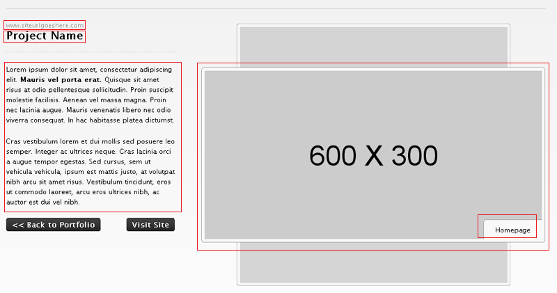

The following regions can be identified:

<Steps>

1. The portfolio item's website
2. Name
3. Content
4. Image
5. Image's caption

</Steps>

Every cloned page already has a mandatory *Title* field, which we can use for the second item (*Name*) above, reducing the number of editable regions by one. Each portfolio item has three images displayed in a rotating carousel, so we'll need to repeat the last two items listed above for two more images. Additionally, we'll need an editable region to hold the thumbnail displayed in the list-view, which we'll associate with Image 1. Each image and its caption, along with the thumbnail for the first image, form a logical group, so we'll use three editable regions of type group to visually place them together.

The final list of the editable regions required and their types:

<Card title="Text" icon="pen">
  1. The item's website (text)
</Card>

<Card title="RichText" icon="pen">
  2. Content (richtext)
</Card>

<Card title="Image Group 1" icon="seti:image">
  3. Image Group 1 (group)
  4. Image 1 (image)
  5. Image 1's thumbnail (thumbnail)
  6. Image 1's caption (text)
</Card>

<Card title="Image Group 2" icon="seti:image">
  7. Image Group 2 (group)
  8. Image 2 (image)
  9. Image 2's caption (text)
</Card>

<Card title="Image Group 3" icon="seti:image">
  10. Image Group 3 (group)
  11. Image 3 (image)
  12. Image 3's caption (text)
</Card>

As we did in the *blog* section, define all these editable regions within a template tag as follows:

```php title="portfolio.php" {2-6} {8-14} {16} {18-27} {29-39} {41-46} {48} {50-59} {61-66} {68} {70-79} {81-86}
<cms:template title='Portfolio' clonable='1'>
    <cms:editable 
        name='content' 
        label='Content'
        desc='Enter description of portfolio item here'
        type='richtext' />

    <cms:editable 
        name='website' 
        label='Website'
        desc='Enter site\'s URL here'
        type='text'>
        www.siteurlgoeshere.com
    </cms:editable>
    
    <cms:editable name='group_img1' label='First Image' desc='First Image' type='group' />

    <cms:editable
        name='image_1'
        label='Image 1'
        desc='Upload first image of portfolio here'
        crop='1'
        width='600'
        height='300'
        group='group_img1'
        type='image'
    />

    <cms:editable
        name='thumb'
        label='Image Thumbnail'
        desc='Thumbnail of first image'
        width='223'
        height='112'
        show_preview='1'
        assoc_field='image_1'
        group='group_img1'
        type='thumbnail' 
    />

    <cms:editable 
        name='image_1_title' 
        label='Image Title'
        desc='Enter image\'s title here'
        group='group_img1'
        type='text'/>
    
    <cms:editable name='group_img2' label='Second Image' desc='Second Image' type='group' />

    <cms:editable
        name='image_2'
        label='Image 2'
        desc='Upload second image of portfolio here'
        width='600'
        height='300'
        crop='1'
        group='group_img2'
        type='image'
    />

    <cms:editable 
        name='image_2_title' 
        label='Image Title'
        desc='Enter image\'s title here'
        group='group_img2'
        type='text'/>
    
    <cms:editable name='group_img3' label='Third Image' desc='Third Image' type='group' />

    <cms:editable
        name='image_3'
        label='Image 3'
        desc='Upload third image of portfolio here'
        width='600'
        height='300'
        crop='1'
        group='group_img3'
        type='image'
    />

    <cms:editable 
        name='image_3_title' 
        label='Image Title'
        desc='Enter image\'s title here'
        group='group_img3'
        type='text'/>

</cms:template>
```

Notice that we have also declared the template as clonable.

Refresh `https://www.mytestsite.com/portfolio.php` by visiting it again logged in as super-admin. Visit the admin section to find the first default page created for you. Clicking on it should reveal that Couch has created the following editable regions as instructed:

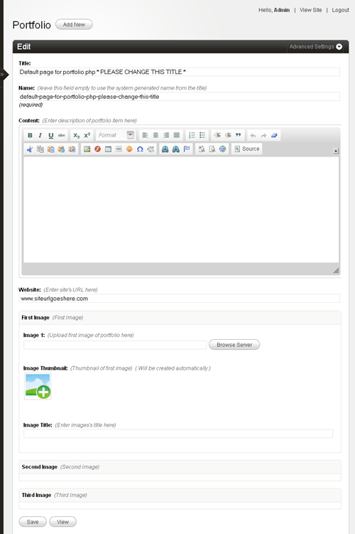

Edit the default page to create the first portfolio item. Once you have entered and saved all data, click on 'view' to see the page. The page-view of `portfolio.php` should load with the URL of the cloned page being similar to:

```txt "?p="
https://www.mytestsite.com/portfolio.php?p=7
```

where the number after `?p=` will be the unique id of this portfolio item.

Of course, none of the data we entered in the editable regions of this page should be visible because we have not used the variables representing the editable regions in the template yet. Let us do so now. The original HTML code:

```php title="portfolio_single.html"
<!-- Column 1 / Project Information -->
<div class="grid_4">
    <a class="meta" href="#">www.siteurlgoeshere.com</a>
    <h4 class="title">Project Name</h4>
    <div class="hr dotted clearfix">&nbsp;</div>
    <p>Lorem ipsum dolor sit amet, consectetur adipiscing elit. <b>Mauris vel porta erat.</b> Quisque sit amet risus at odio pellentesque sollicitudin. Proin suscipit molestie facilisis. Aenean vel massa magna. Proin nec lacinia augue. Mauris venenatis libero nec odio viverra consequat. In hac habitasse platea dictumst.</p>
    <p>Cras vestibulum lorem et dui mollis sed posuere leo semper. Integer ac ultrices neque. Cras lacinia orci a augue tempor egestas. Sed cursus, sem ut vehicula vehicula, ipsum est mattis justo, at volutpat nibh arcu sit amet risus. Vestibulum tincidunt, eros ut commodo laoreet, arcu eros ultrices nibh, ac auctor est dui vel nibh.</p>
    <p class="clearfix">
        <a href="portfolio.html" class="button float">&lt;&lt; Back to Portfolio</a>
        <a href="#" class="button float right">Visit Site</a>
    </p>
</div>

<!-- Column 2 / Image Carosuel -->
<div id="folio_scroller_container" class="grid_8 cleafix">
    <ul id="folio_scroller">
        <li><span>Homepage</span><a href="#"></a></li>
        <li><span>Content Page</span><a href="#"></a></li>
        <li><span>Dropdown Menu</span><a href="#"></a></li>
        <li><span>Comments List</span><a href="#"></a></li>
        <li><span>Comment Form</span><a href="#"></a></li>
    </ul>
</div>
```

After replacing with Couch variables:

```php title="portfolio_single.html" ins="<cms:show website />" ins="<cms:show k_page_title />" ins="<cms:show content />" ins="<cms:show image_1_title />" ins="<cms:show image_2_title />"  ins="<cms:show image_3_title />"  ins="<cms:show image_1 />" ins="<cms:show image_2 />" ins="<cms:show image_3 />"
<!-- Column 1 / Project Information -->
<div class="grid_4">
    <a class="meta" href="http://<cms:show website />"><cms:show website /></a>
    <h4 class="title"><cms:show k_page_title /></h4>
    <div class="hr dotted clearfix">&nbsp;</div>
    <cms:show content />
    <p class="clearfix">
        <a href="<cms:link masterpage='portfolio.php' />" class="button float">&lt;&lt; Back to Portfolio</a>
        <a href="http://<cms:show website />" class="button float right">Visit Site</a>
    </p>
</div>

<!-- Column 2 / Image Carosuel -->
<div id="folio_scroller_container" class="grid_8 cleafix">
    <ul id="folio_scroller">
        <li><span><cms:show image_1_title /></span><a href="#">" /></a></li>
        <li><span><cms:show image_2_title /></span><a href="#">" /></a></li>
        <li><span><cms:show image_3_title /></span><a href="#">" /></a></li>
    </ul>
</div>
```

Revisit the cloned page and it should now display the contents placed in its editable regions:

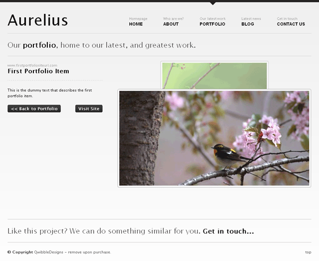

That completes the page-view part of portfolio. Let us move on to the list-view.

### The List View

As we had already decided, the `portfolio_list.html` will serve as the list view. Move `portfolio_list.html` to the snippets folder and it is ready to be embedded within `portfolio.php`.

Just the way we handled list-view in `blog.php`, add conditional Couch tags to check for page-view and list-view and display the relevant content. Display the existing content of `portfolio.php` if variable `k_is_page` is set (i.e. we are handling page-view):

```php title="portfolio.php" "<cms:if k_is_page >"
<cms:editable
    name='image_3_title'
    label='Image Title'
    desc='Enter image\'s title here'
    group='group_img3'
    type='text'/>

</cms:template>

<cms:if k_is_page >
<!DOCTYPE html PUBLIC "-//W3C//DTD XHTML 1.0 Transitional//EN" "http://www.w3.org/TR/xhtml1/DTD/xhtml1-transitional.dtd">
<html xmlns="http://www.w3.org/1999/xhtml">
<head>
    <title>Aurelius | Portfolio >> Project Title</title>
```

else display the embedded `portfolio_list.html` (this has to be the list-view):

```php title="portfolio.php" {5-7}
    </div><!--end wrapper-->

</body>
</html>
<cms:else />
    <cms:embed 'portfolio_list.html' />
</cms:if>
<?php COUCH::invoke(); ?>
```

Access:

```txt
https://www.mytestsite.com/portfolio.php
```

(it is the list-view because no page information is appended to the template name) and the contents of `portfolio_list.html` should appear:

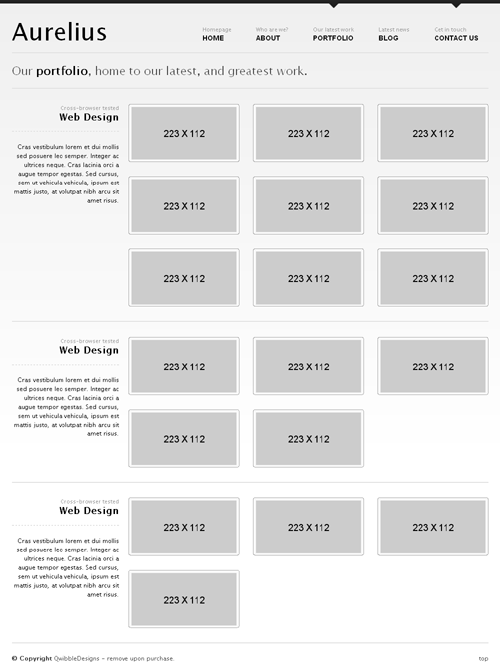

This is the static HTML contained within the embedded snippet and does not reflect the portfolio items (cloned pages) currently existing. To make this listing dynamic, we'll need to add some Couch tags to `portfolio_list.html`. Open `portfolio_list.html` in your text editor for some modifications.

If we take a look at the static listing shown above, it can be seen that Aurelius is displaying portfolio items grouped together into three separate categories. Categories, as we have seen in `blog.php`, can be simulated in Couch by the virtual folders. Let us create three folders for `portfolio.php`. For the sake of simplicity, we'll name them *First Category*, *Second Category* and *Third Category*. We already know how to create the folders. The following is the finished code:

```php title="portfolio.php" {8-10}
    <cms:editable
        name='image_3_title'
        label='Image Title'
        desc='Enter image\'s title here'
        group='group_img3'
        type='text'/>

        <cms:folder name='cat_1' title='First Category' />
        <cms:folder name='cat_2' title='Second Category' />
        <cms:folder name='cat_3' title='Third Category' />
</cms:template>

<cms:if k_is_page >
<!DOCTYPE html PUBLIC "-//W3C//DTD XHTML 1.0 Transitional//EN" "http://www.w3.org/TR/xhtml1/DTD/xhtml1-transitional.dtd">
<html xmlns="http://www.w3.org/1999/xhtml">
<head>
```

Refresh `portfolio.php` by revisiting `https://www.mytestsite.com/portfolio.php` logged on as super-admin. Visit admin to find the three categories visible in the drop-down list:

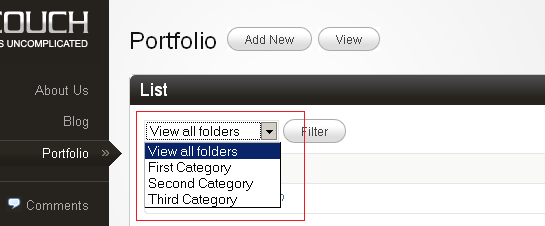

Create some more dummy portfolio items and distribute them amongst the three folders:

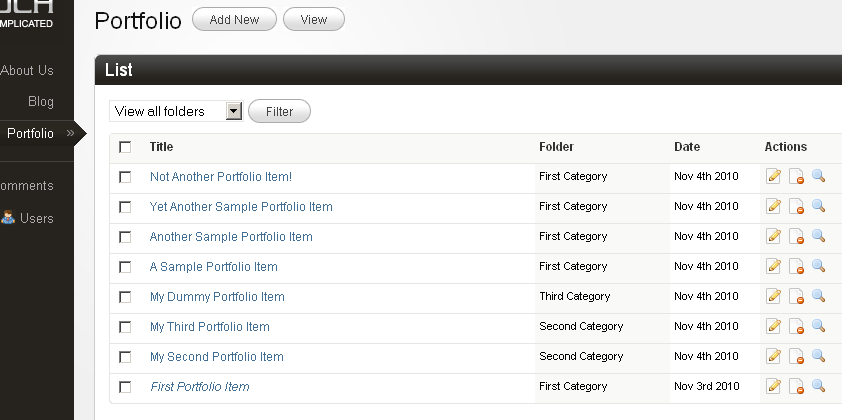

Time now to actually display the portfolio items grouped according to the categories. We are already familiar with the Couch tags named folders and pages, which we used to enumerate the folders and cloned pages of blog.php template respectively in the previous tutorial. We'll use both the tags for this portfolio section in much the same way. To list the portfolio items grouped together in categories, however, we'll use the pages tag nested within the folders tag. This is not something we've done so far before, so we'll go into the process in detail. Here is how we proceed - We'll tackle the categories first.

### Listing Categories

If you take a look at `portfolio_list.html`, you'll find the following block of code being repeated, with very minor modifications, thrice. This is a category block displaying all pages belonging to that category.

```html title="portfolio_list.html"
<div class="catagory_1 clearfix">
    <!-- Row 1 -->
    <div class="grid_3 textright" >
        <span class="meta">Cross-browser tested</span>
        <h4 class="title ">Web Design</h4>
        <div class="hr clearfix dotted">&nbsp;</div>
        <p>Cras vestibulum lorem et dui mollis sed posuere leo semper. Integer ac ultrices neque. Cras lacinia orci a augue tempor egestas. Sed cursus, sem ut vehicula vehicula, ipsum est mattis justo, at volutpat nibh arcu sit amet risus.</p>
    </div>
    <div class="grid_9">
        <a class="portfolio_item float alpha" href="portfolio_single.html">
            <span>Project Name</span>
            
        </a>
        <a class="portfolio_item float " href="portfolio_single.html">
            <span>Project Name</span>
            
        </a>
        <a class="portfolio_item float omega" href="portfolio_single.html">
            <span>Project Name</span>
            
        </a>
        <a class="portfolio_item float alpha" href="portfolio_single.html">
            <span>Project Name</span>
            
        </a>
        <div class="clear"></div>
    </div>
</div>

<div class="hr grid_12 clearfix">&nbsp;</div>
```

Following the pattern we set for using any enumerator tag in Couch, we'll delete two of the three blocks from `portfolio_list.html` to be left with only one block. Then we enclose this remaining solitary block within the enumerator folders tag. This will cause the block to be output as many times as there are folders in this template. Finally, we make use of the variables set by the folders tag that describe each folder:

```php title="portfolio_list.html" ins="<cms:folders masterpage='portfolio.php'>" ins="</cms:folders>" ins="<cms:show k_folder_title />"
<cms:folders masterpage='portfolio.php'>
<div class="catagory_1 clearfix">
    <!-- Row 1 -->
    <div class="grid_3 textright" >
        <span class="meta">Cross-browser tested</span>
        <h4 class="title "><cms:show k_folder_title /></h4>
        <div class="hr clearfix dotted">&nbsp;</div>
        <p>Cras vestibulum lorem et dui mollis sed posuere leo semper. Integer ac ultrices neque. Cras lacinia orci a augue tempor egestas. Sed cursus, sem ut vehicula vehicula, ipsum est mattis justo, at volutpat nibh arcu sit amet risus.</p>
    </div>
    <div class="grid_9">
        <a class="portfolio_item float alpha" href="portfolio_single.html">
            <span>Project Name</span>
            
        </a>
        <a class="portfolio_item float " href="portfolio_single.html">
            <span>Project Name</span>
            
        </a>
        <a class="portfolio_item float omega" href="portfolio_single.html">
            <span>Project Name</span>
            
        </a>
        <a class="portfolio_item float alpha" href="portfolio_single.html">
            <span>Project Name</span>
            
        </a>
        <div class="clear"></div>
    </div>
</div>

<div class="hr grid_12 clearfix">&nbsp;</div>
</cms:folders>
```

Accessing `https://www.mytestsite.com/portfolio.php` now should reveal that the three categories we created for `portfolio.php` are being enumerated correctly.

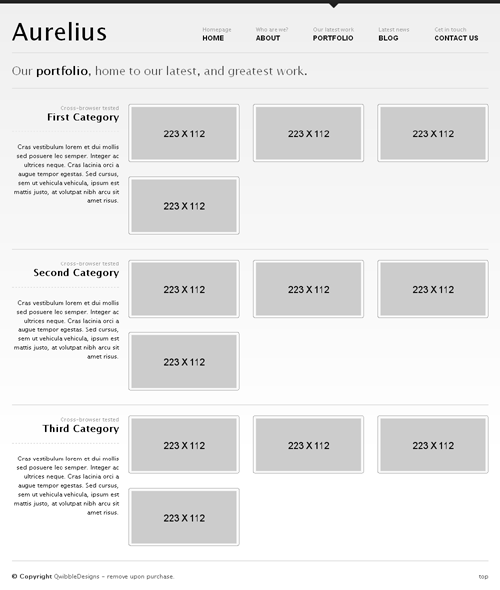

The pages being listed within each category are still static. Let us change that.

### Listing Cloned Pages

Within the category block we were working upon above, the following marked portion is displaying the four static pages entries.

```php title="portfolio_list.html" {10-28}
<cms:folders masterpage='portfolio.php'>
<div class="catagory_1 clearfix">
    <!-- Row 1 -->
    <div class="grid_3 textright" >
        <span class="meta">Cross-browser tested</span>
        <h4 class="title "><cms:show k_folder_title /></h4>
        <div class="hr clearfix dotted">&nbsp;</div>
        <p>Cras vestibulum lorem et dui mollis sed posuere leo semper. Integer ac ultrices neque. Cras lacinia orci a augue tempor egestas. Sed cursus, sem ut vehicula vehicula, ipsum est mattis justo, at volutpat nibh arcu sit amet risus.</p>
    </div>
    <div class="grid_9">
        <a class="portfolio_item float alpha" href="portfolio_single.html">
            <span>Project Name</span>
            
        </a>
        <a class="portfolio_item float " href="portfolio_single.html">
            <span>Project Name</span>
            
        </a>
        <a class="portfolio_item float omega" href="portfolio_single.html">
            <span>Project Name</span>
            
        </a>
        <a class="portfolio_item float alpha" href="portfolio_single.html">
            <span>Project Name</span>
            
        </a>
        <div class="clear"></div>
    </div>
</div>

<div class="hr grid_12 clearfix">&nbsp;</div>
</cms:folders>
```

By now, it's clear that the Couch tag for enumerating cloned pages is the pages tag. Before implementing it by deleting all but one of the four static page entries and enclosing it with the pages tag, note that these entries are identical except for their class attributes. The first entry has a class named alpha, the second has an empty class, and the third has a class of omega, with this pattern repeating. This pattern is crucial for wrapping pages after every third item. Since the enumerator tag needs only one entry to repeat for each cloned page, we must ensure it outputs the correct class-name based on the page's position. Couch simplifies this with the zebra tag, which helps cycle through class names like `alpha`, `''`, and `omega` for each page.

The zebra tag is meant to be used within any enumerator tag and will sequentially output each of its parameters at each iteration. If the numbers of iterations (i.e. objects being enumerated) are more than the number of parameters supplied to it, the zebra tag will wrap back and start from the first parameter.

Take the usual steps of deploying the pages tag and use the zebra tag with the three class-names as parameters (`alpha`, `''` and `delta`)

```php title="portfolio_list.html" ins="<cms:pages masterpage='portfolio.php'>" ins="</cms:pages>" ins="<cms:zebra 'alpha' '' 'omega' />" ins="<cms:show k_page_link />" ins="<cms:show k_page_title />" ins="<cms:show thumb />"
<cms:folders masterpage='portfolio.php'>
<div class="catagory_1 clearfix">
    <!-- Row 1 -->
    <div class="grid_3 textright" >
        <span class="meta">Cross-browser tested</span>
        <h4 class="title "><cms:show k_folder_title /></h4>
        <div class="hr clearfix dotted">&nbsp;</div>
        <p>Cras vestibulum lorem et dui mollis sed posuere leo semper. Integer ac ultrices neque. Cras lacinia orci a augue tempor egestas. Sed cursus, sem ut vehicula vehicula, ipsum est mattis justo, at volutpat nibh arcu sit amet risus.</p>
    </div>
    <div class="grid_9">
        <cms:pages masterpage='portfolio.php'>
            <a class="portfolio_item float <cms:zebra 'alpha' '' 'omega' />" href="<cms:show k_page_link />">
                <span><cms:show k_page_title /></span>
                "  alt=""/>
            </a>
        </cms:pages>
        <div class="clear"></div>
    </div>
</div>

<div class="hr grid_12 clearfix">&nbsp;</div>
</cms:folders>
```

The folders tag should output three category blocks, and within each block, the pages tag should output the cloned pages. This setup uses the pages tag nested within the folders tag. However, the issue is that the pages tag in each category block displays all cloned pages, not just those belonging to the specific category. From the blog section, we know the pages tag supports a folder parameter to fetch pages belonging only to that folder. This issue can be resolved by setting the folder parameter to the name of the folder being iterated. The folders tag sets a variable, `k_folder_name`, for each folder during iteration. By using this variable to set the folder parameter of the pages tag, we can dynamically link the folders and pages tags.

```php title="portfolio_list.html" ins="folder=k_folder_name"
<cms:folders masterpage='portfolio.php'>
<div class="catagory_1 clearfix">
    <!-- Row 1 -->
    <div class="grid_3 textright" >
        <span class="meta">Cross-browser tested</span>
        <h4 class="title "><cms:show k_folder_title /></h4>
        <div class="hr clearfix dotted">&nbsp;</div>
        <p>Cras vestibulum lorem et dui mollis sed posuere leo semper. Integer ac ultrices neque. Cras lacinia orci a augue tempor egestas. Sed cursus, sem ut vehicula vehicula, ipsum est mattis justo, at volutpat nibh arcu sit amet risus.</p>
    </div>
    <div class="grid_9">
        <cms:pages masterpage='portfolio.php' folder=k_folder_name>
            <a class="portfolio_item float <cms:zebra 'alpha' '' 'omega' />" href="<cms:show k_page_link />">
                <span><cms:show k_page_title /></span>
                "  alt=""/>
            </a>
        </cms:pages>
        <div class="clear"></div>
    </div>
</div>

<div class="hr grid_12 clearfix">&nbsp;</div>
</cms:folders>
```

This should result in:

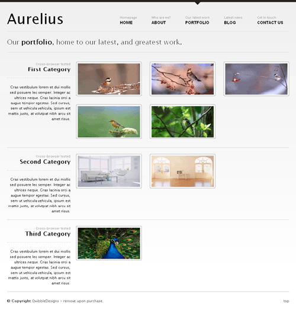

As can be seen, each of the categories now shows only the pages belonging to it.

We are now almost done with configuring the list-view. The only thing that remains is handling the description and a short blurb about each category:

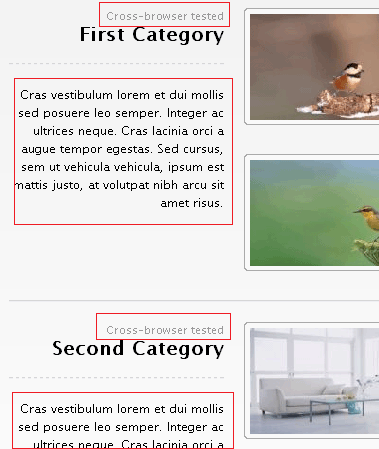

Ideally, we'd want to provide the user with a richtext editor for entering the description of each folder and a single line text field for its blurb. However, Couch currently has no provision for adding any custom information to folders. To get around this limitation, we'll use a method that should prove useful in several other scenarios too and hence is worth taking a look.

We'll create a separate new template containing the desired editable regions. For each folder (category) that we define for `portfolio.php`, we'll then create a matching cloned page out of this new template. In these cloned pages we'll store information about each folder. Finally, while listing the folders, we'll fetch back the data from each associated page and display it. This technique does entail the maintenance of a separate set of pages that need to be kept synchronized with the original objects, however, it will get the job done quite well.

Let's create a new file named `portfolio_desc.php`, place the mandatory Couch boilerplate code at the start and end of this file, and define the two editable regions to hold the description and blurb of the folders. The finished code should look like this:

```php title="portfolio_desc.php" "executable='0'"
<?php require_once( 'couch/cms.php' ); ?>
<cms:template clonable='1' title='Portfolio Categories' executable='0'>
    <cms:editable 
        name='folder_desc' 
        label='Description'
        desc='Enter description of portfolio category here'
        type='richtext' />
    
    <cms:editable 
        name='folder_blurb' 
        label='Short Description'
        desc='Enter one line description of portfolio category here'
        type='text' />
</cms:template>
<?php COUCH::invoke(); ?> 
```

:::note
Everything should look familiar in the code above except for the highlighted parameter that needs a little explanation.

A clonable template in Couch serves three purposes:

<Steps>

1. It defines the URL that will be used to access the pages created from this template.
2. It defines the editable regions that will hold data belonging to each cloned page.
3. It provides the HTML code that will be used to display each page (after processing the Couch tags within it).

</Steps>

Normally when we create any cloned template, the template serves all the three mentioned purposes. However, this is not mandatory and a template could be used to fulfill only some of these functions.

The `portfolio_desc.php` template that we created is meant to serve only the second purpose mentioned in the list above. Its only purpose is to define the two editable regions that will then be used to store data pertaining to the folders. The pages cloned out of it are not meant to be accessed directly in a browser through a URL. As such, it also does not contain any HTML code whatsoever.

By declaring this template as non-executable (executable='0'), we are signaling to Couch that this template is not meant to be accessed directly via a URL. When you are logged-in as the super-admin and access `https://www.mytestsite.com/portfolio_desc.php`, Couch loads up this template as a normal template (because without doing this the changes you made will not take effect). However, try accessing the same URL without being logged-in as the super-admin and you'll receive a 'HTTP 404 Page not found' error.
:::

Access `https://www.mytestsite.com/portfolio_desc.php` while being logged-in as the super-admin. You'll get a blank page because the template contains no HTML. However, the purpose of this visit was to execute the Couch tags contained within the template. To verify that, visit the admin section and you should find that Couch has created the default cloned page for this template and has also created the two editable regions.

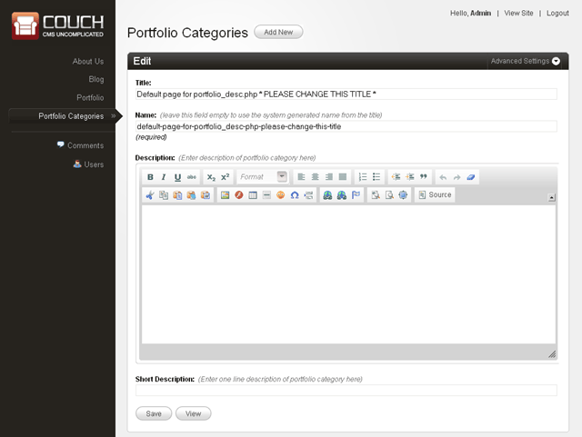

Rename the default page to one of the folders of `portfolio.php` and create two new pages with the same names as that of the remaining two folders. Be careful—the names, not the titles, of the pages need to match that of the folders. The names of the folders, for this tutorial, were *cat_1*, *cat_2* and *cat_3*. We'll give the same names to the cloned pages of `portfolio_desc.php`.

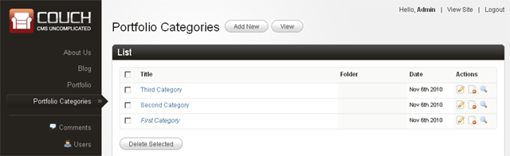

We can now move on to display the contents of these pages while listing the categories. This is the original code that is displaying the static information about each category:

```php title="portfolio_list.html" {5-8}
<cms:folders masterpage='portfolio.php'>
<div class="catagory_1 clearfix">
    <!-- Row 1 -->
    <div class="grid_3 textright" >
        <span class="meta">Cross-browser tested</span>
        <h4 class="title "><cms:show k_folder_title /></h4>
        <div class="hr clearfix dotted">&nbsp;</div>
        <p>Cras vestibulum lorem et dui mollis sed posuere leo semper. Integer ac ultrices neque. Cras lacinia orci a augue tempor egestas. Sed cursus, sem ut vehicula vehicula, ipsum est mattis justo, at volutpat nibh arcu sit amet risus.</p>
    </div>
    <div class="grid_9">
        <cms:pages masterpage='portfolio.php' folder=k_folder_name>
            <a class="portfolio_item float <cms:zebra 'alpha' '' 'omega' />" href="<cms:show k_page_link />">
                <span><cms:show k_page_title /></span>
                "  alt=""/>
            </a>
        </cms:pages>
        <div class="clear"></div>
    </div>
</div>

<div class="hr grid_12 clearfix">&nbsp;</div>
</cms:folders>
```

We'll make the following modifications:

```diff lang="php" title="portfolio_list.html" ins="<cms:show folder_blurb />" ins="<cms:show folder_desc />"
<cms:folders masterpage='portfolio.php'>
<div class="catagory_1 clearfix">
    <!-- Row 1 -->
    <div class="grid_3 textright" >
+        <cms:pages masterpage='portfolio_desc.php' page_name=k_folder_name >
            <span class="meta"><cms:show folder_blurb /></span>
            <h4 class="title "><cms:show k_folder_title /></h4>
            <div class="hr clearfix dotted">&nbsp;</div>
            <cms:show folder_desc />
+        </cms:pages>
    </div>
    <div class="grid_9">
        <cms:pages masterpage='portfolio.php' folder=k_folder_name>
            <a class="portfolio_item float <cms:zebra 'alpha' '' 'omega' />" href="<cms:show k_page_link />">
                <span><cms:show k_page_title /></span>
                "  alt=""/>
            </a>
        </cms:pages>
        <div class="clear"></div>
    </div>
</div>

<div class="hr grid_12 clearfix">&nbsp;</div>
</cms:folders>
```

Notice how we have used the pages tag to enclose the section highlighted previously. The pages tag, as usual, is used to fetch the cloned pages. This time we have set the masterpage to `portfolio_desc.php` so only pages cloned from this template will be fetched. Most importantly, we have also set the `page_name` parameter to the variable `k_folder_name`. This variable, as we know, is set by the folders tag to the name of the folder being currently enumerated. Using this as the `page_name` parameter causes the pages tag to fetch only the page that has the same name as the current folder. Since there can be only one page for the given name, the contents enclosed by the pages tag are output only once. Once we get the right page, we use the variables representing the two editable regions the usual way.

Accessing `https://www.mytestsite.com/portfolio.php` will now show the category description and blurb as entered into `portfolio_desc.php` pages:

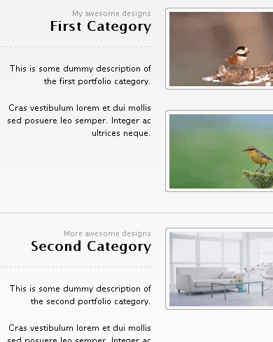

That wraps up the portfolio section.

[Next we set up the Contact Us section.](../contact-form/)
