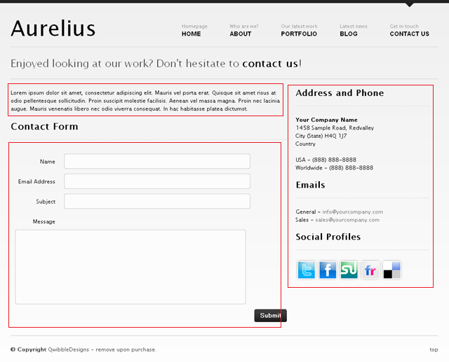
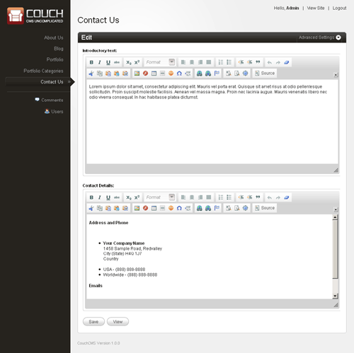
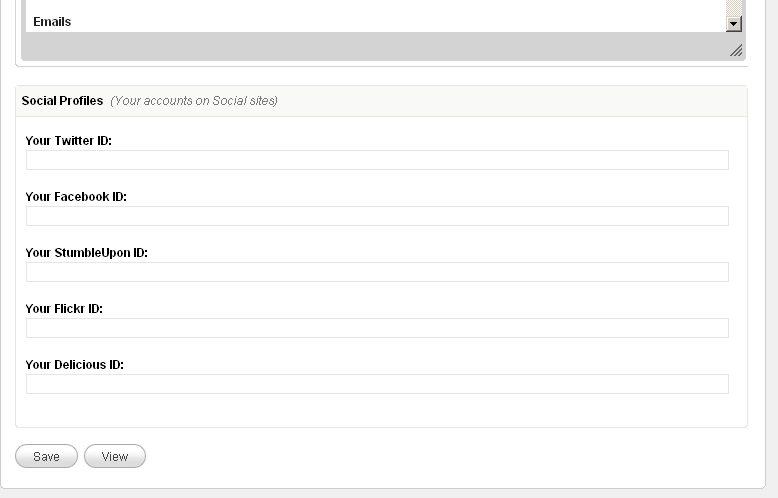
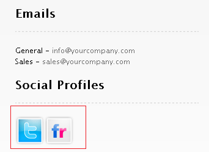
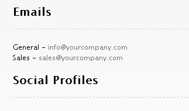
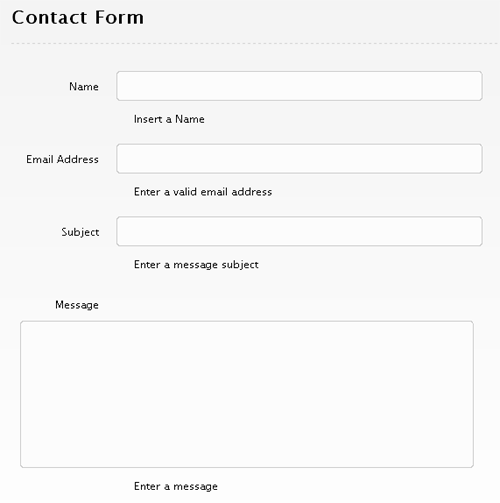

import { Card } from '@astrojs/starlight/components';

<Card icon="download" title="Download Code">
[Download the Couchified Code](https://www.couchcms.com/docs/code/contact.zip)
</Card>

The `contact.html` that comes with Aurelius provides a contact form as well as some contact details.

Let us begin by attaching Couch to this template.
Take the usual steps to do so -
Change the extension of `contact.html` to make it `contact.php`
Add the two lines of boilerplate PHP code to enclose the contents of this file and use the template tag to change the display-name of the template.

```php title="contact.php" ins="<?php require_once( 'couch/cms.php' ); ?>" ins="<cms:template title='Contact Us' >"
<?php require_once( 'couch/cms.php' ); ?>
<cms:template title='Contact Us' >
<!DOCTYPE html PUBLIC "-//W3C//DTD XHTML 1.0 Transitional//EN" "http://www.w3.org/TR/xhtml1/DTD/xhtml1-transitional.dtd"> 
<html xmlns="http://www.w3.org/1999/xhtml">
<head>
    <title>Aurelius | About Us</title>
    <meta http-equiv="Content-Type" content="text/html; charset=utf-8" />
```

```php title="contact.php" ins="<?php COUCH::invoke(); ?>"
    </div><!--end wrapper-->

</body>
</html>
<?php COUCH::invoke(); ?>
```

Access `http://www.mytestsite.com/contact.php` while logged on as the super-admin.
This will hook up Couch to the template.

### Defining editable regions

As can be seen, there are three distinct parts to this template - An introductory paragraph at the top, the contact form and a sidebar containing several contact details.



Of these three, the contact form will be handled by the Couch form and input tags. The introductory top paragraph can be easily made into an editable region. The sidebar too can be turned into an editable region - we only need to decide how granular the division needs to be. We can, if needed, create an editable region each for the _Address_, _Email_ and _Social Profiles_ sections or create one single region for the entire sidebar.
For the purpose of this tutorial, we'll create one editable region that will span both the _Address_ as well as the _Email_ section and will sub-divide the _Social Profiles_ section into one editable region for each social site.

Let us define the editable regions for the introductory paragraph and the address and email in the sidebar by directly enclosing these parts by Couch editable tags:

```php title="contact.php" ins="<cms:editable name='contact_intro' label='Introductory text' type='richtext'>" ins="</cms:editable>"
<!-- Column 1 / Content -->
<div class="grid_8">
    <cms:editable name='contact_intro' label='Introductory text' type='richtext'>
    <p>Lorem ipsum dolor sit amet, consectetur adipiscing elit. Mauris vel porta erat. Quisque sit amet risus at odio pellentesque sollicitudin. Proin suscipit molestie facilisis. Aenean vel massa magna. Proin nec lacinia augue. Mauris venenatis libero nec odio viverra consequat. In hac habitasse platea dictumst.</p>
    </cms:editable>

    <!-- Contact Form -->
    <form action='index.html' method='post' id='contact_form'>
```

```php title="contact.php" ins="<cms:editable name='contact_details' label='Contact Details' type='richtext'>" ins="</cms:editable>"
<!-- Column 2 / Sidebar -->
<div class="grid_4 contact">
    <cms:editable name='contact_details' label='Contact Details' type='richtext'>
    <!-- Adress and Phone Details -->
    <h4>Address and Phone</h4> 
    <div class="hr dotted clearfix">&nbsp;</div>
    <ul> 
        <li> 
            <strong>Your Company Name</strong><br /> 
            1458 Sample Road, Redvalley<br /> 
            City (State) H4Q 1J7<br /> 
            Country<br /><br /> 
        </li> 
        <li>USA - (888) 888-8888</li> 
        <li>Worldwide - (888) 888-8888</li> 
    </ul> 
    
    <!-- Email Addresses -->
    <h4>Emails</h4> 
    <div class="hr dotted clearfix">&nbsp;</div>
    <ul> 
        <li>General - <a href="mailto:info@yourcompany.com">info@yourcompany.com</a></li> 
        <li>Sales - <a href="mailto:sales@yourcompany.com">sales@yourcompany.com</a></li> 
    </ul> 
    </cms:editable>
```

Refreshing `https://www.mytestsite.com/contact.php` by revisiting it as super-admin will yield the following results for the changes made so far:



Editing any of these regions and saving the changes will cause the modifications to appear on the page immediately.

As for the *Social Profiles* section, instead of defining its editable regions by enclosing the actual elements with the editable tags in-situ (the way we did for the previous sections), we'll define them within the template tag (the way we did in *blog* and *portfolio* sections) and use variables to display them.
The reason for this is that, as you'll soon see, we'll be outputting these social links conditionally (i.e. only under certain circumstances). If we place the definition of the editable regions within conditional tags, the condition where an editable region will not be output will also cause the region to be deleted.

Make the following changes to the template tag at the top:

```php title="contact.php" {3-8}
<?php require_once( 'couch/cms.php' ); ?>
<cms:template title='Contact Us' >
    <cms:editable name='group_social' label='Social Profiles' desc='Your accounts on Social sites' type='group' />
    <cms:editable name='twitter_id' label='Your Twitter ID' group='group_social' type='text'/>
    <cms:editable name='facebook_id' label='Your Facebook ID' group='group_social' type='text'/>
    <cms:editable name='stumbleupon_id' label='Your StumbleUpon ID' group='group_social' type='text'/>
    <cms:editable name='flickr_id' label='Your Flickr ID' group='group_social' type='text'/>
    <cms:editable name='delicious_id' label='Your Delicious ID' group='group_social' type='text'/>		
</cms:template>
<!DOCTYPE html PUBLIC "-//W3C//DTD XHTML 1.0 Transitional//EN" "http://www.w3.org/TR/xhtml1/DTD/xhtml1-transitional.dtd"> 
<html xmlns="http://www.w3.org/1999/xhtml">
<head>
    <title>Aurelius | Contact Us</title>
```

Note how we have grouped the five text type editable regions by creating an editable region of type group and linking the other regions to it.
Refresh `https://www.mytestsite.com/contact.php` and then visit the admin section. The following regions should appear:



Since we have defined these editable regions in the template tag, for their contents to appear on the web page we need to use the variables representing them at the required places.
The original HTML code for the profiles section is:

```php title="contact.php"
<!-- Social Profile Links -->
<h4>Social Profiles</h4> 
<div class="hr dotted clearfix">&nbsp;</div>
<ul> 
    <li class="float"><a href="#"></a></li> 
    <li class="float"><a href="#"></a></li> 
    <li class="float"><a href="#"></a></li> 
    <li class="float"><a href="#"></a></li> 
    <li class="float"><a href="#"></a></li> 
</ul>
```

The same after using the variables set for the editable regions:

```php title="contact.php" ins="<cms:show twitter_id />" ins="<cms:show facebook_id />" ins="<cms:show stumbleupon_id />" ins="<cms:show flickr_id />" ins="<cms:show delicious_id />"
<!-- Social Profile Links -->
<h4>Social Profiles</h4> 
<div class="hr dotted clearfix">&nbsp;</div>
<ul> 
    <li class="float"><a href="<cms:show twitter_id />"></a></li> 
    <li class="float"><a href="<cms:show facebook_id />"></a></li> 
    <li class="float"><a href="<cms:show stumbleupon_id />"></a></li> 
    <li class="float"><a href="<cms:show flickr_id />"></a></li> 
    <li class="float"><a href="<cms:show delicious_id />"></a></li> 
</ul>
```

Edit the ids in the admin section and the changes should get reflected in the generated page.
So far there has been nothing that we have not already done.
For the sake of illustrating an important and useful technique, let us now throw a little complexity into this profiles section.
What we wish is that a social icon should appear on the web page only if the user has placed any content within the editable region associated with the icon. If the user chooses to leave the textbox of an id blank, the icon for that should not appear.
We can deploy simple conditional tags to handle this:

```php title="contact.php" ins="<cms:if "<cms:not_empty twitter_id />">" ins="<cms:if "<cms:not_empty facebook_id />">" ins="<cms:if "<cms:not_empty stumbleupon_id />">" ins="<cms:if "<cms:not_empty flickr_id />">" ins="<cms:if "<cms:not_empty delicious_id />">" ins="</cms:if>"
<!-- Social Profile Links -->
<h4>Social Profiles</h4> 
<div class="hr dotted clearfix">&nbsp;</div>
<ul> 
    <cms:if "<cms:not_empty twitter_id />">
        <li class="float"><a href="<cms:show twitter_id />"></a></li>
    </cms:if>
    
    <cms:if "<cms:not_empty facebook_id />">
        <li class="float"><a href="<cms:show facebook_id />"></a></li>
    </cms:if>
    
    <cms:if "<cms:not_empty stumbleupon_id />">
        <li class="float"><a href="<cms:show stumbleupon_id />"></a></li>
    </cms:if>
    
    <cms:if "<cms:not_empty flickr_id />">
        <li class="float"><a href="<cms:show flickr_id />"></a></li>
    </cms:if>
    
    <cms:if "<cms:not_empty delicious_id />">
        <li class="float"><a href="<cms:show delicious_id />"></a></li>
    </cms:if>
    
</ul>
```

We enclose each `<li>` element representing an icon within Couch conditional if tag that tests for the result of Couch *not_empty* tag. The *not_empty* tag returns 1 only if the variable it is testing has any value within it. This way an icon is output only if the associated variable is not empty.

:::note
In case you are wondering why we are using the construct
**`<cms:if "<cms:not_empty flickr_id />"> Display this </cms:if>`**
instead of the more straightforward
**`<cms:if flickr_id > Display this </cms:if>`**
The answer is that for richtext type editable regions, even if seemingly the region is empty, the CKEditor used to create the editor silently places some **`<br/>`** or empty **`<p>`** elements within it. This will cause the simpler version of if to fail as it will consider these empty elements to be the input of the region.

The **not_empty** tag, on the other hand, strips off these empty HTML tags and returns 1 only if some value remains after this cleansing.
The editable regions in the case of profiles section above are not of richtext type, hence the simpler conditional check would have worked the same as the one we used.
:::

Place values only in two of the five social links regions and icons for only those two should appear on the web page:



Now remove values from all the five social links regions and see the output:



As you can see that no icons appear in the output, however, the heading 'Social Profiles' still does.
What we wish to accomplish is that this heading should appear only if at least one social link is output.

This can be achieved by enclosing the heading in a conditional tag that checks for the presence of all the five variables but we'll use another very powerful method, the technique we hinted about before, to achieve the same result.

### Buffering output

Couch has a tag named capture that can be used to enclose any arbitrary section of code. The output of the code that is enclosed within it, instead of being directly output as is normally the case, is buffered by the capture tag into any variable that you set as its 'into' parameter.

Enclose the _profiles_ section we are working on within the capture tag like this:

```php title="contact.php" ins="<cms:capture into='profiles_output' >" ins="</cms:capture>" ins="<cms:show profiles_output />"
<!-- Social Profile Links -->
<cms:capture into='profiles_output' >
<h4>Social Profiles</h4> 
<div class="hr dotted clearfix">&nbsp;</div>
<ul> 
    <cms:if "<cms:not_empty twitter_id />">
        <li class="float"><a href="<cms:show twitter_id />"></a></li>
    </cms:if>
    
    <cms:if "<cms:not_empty facebook_id />">
        <li class="float"><a href="<cms:show facebook_id />"></a></li>
    </cms:if>
    
    <cms:if "<cms:not_empty stumbleupon_id />">
        <li class="float"><a href="<cms:show stumbleupon_id />"></a></li>
    </cms:if>
    
    <cms:if "<cms:not_empty flickr_id />">
        <li class="float"><a href="<cms:show flickr_id />"></a></li>
    </cms:if>
    
    <cms:if "<cms:not_empty delicious_id />">
        <li class="float"><a href="<cms:show delicious_id />"></a></li>
    </cms:if>
    
</ul> 
</cms:capture>
<cms:show profiles_output />
```

Notice that we are instructing the capture tag to buffer all output of its enclosed content into a variable named *profiles_output*. Also note that at the end we are showing this *profiles_output* variable.
Try removing this show statement and the entire profiles block will disappear.

The value of buffering everything into one variable and then outputting the single variable is that now we can conditionally output the single variable.

What we'll do is, within the block enclosed by the capture tag, everyplace where we check whether or not a social link variable is present, if the variable is indeed present we set a variable named *has_profile* to 1.
If even one social link variable is present, the *has_profile* variable will be set to 1 else this variable will simply not be present.
Finally, we'll check for this variable as the condition to output the contents buffered within *profiles_output*.

```diff lang="php" title="contact.php" ins="<cms:set has_profile='1' 'global' />"
<!-- Social Profile Links -->
<cms:capture into='profiles_output' >
<h4>Social Profiles</h4> 
<div class="hr dotted clearfix">&nbsp;</div>
<ul> 
    <cms:if "<cms:not_empty twitter_id />">
        <li class="float"><a href="<cms:show twitter_id />"></a></li> 
        <cms:set has_profile='1' 'global' />
    </cms:if>
    
    <cms:if "<cms:not_empty facebook_id />">
        <li class="float"><a href="<cms:show facebook_id />"></a></li> 
        <cms:set has_profile='1' 'global' />
    </cms:if>
    
    <cms:if "<cms:not_empty stumbleupon_id />">
        <li class="float"><a href="<cms:show stumbleupon_id />"></a></li> 
        <cms:set has_profile='1' 'global' />
    </cms:if>
    
    <cms:if "<cms:not_empty flickr_id />">
        <li class="float"><a href="<cms:show flickr_id />"></a></li> 
        <cms:set has_profile='1' 'global' />
    </cms:if>
    
    <cms:if "<cms:not_empty delicious_id />">
        <li class="float"><a href="<cms:show delicious_id />"></a></li> 
        <cms:set has_profile='1' 'global' />
    </cms:if>
    
</ul> 
</cms:capture>

+<cms:if has_profile >
    <cms:show profiles_output />
+</cms:if>
```

The 'global' used in each set statement instructs the set tag to set the variable at a global scope i.e. someplace where the variable is accessible throughout the page. The default scope of set is 'local' in which case a variable is set within the parent tag within which the set statement is used (if the parent tag supports scope, that is - see Scope of variables).

Now try placing values within some of the social profile editable regions. The associated icons should appear on the page. Try setting all of them to empty, and the entire block, along with the 'Social Profiles' heading should disappear.

As already admitted, this complexity was not really required for this template. We chose to describe this method anyways because we have seen this technique help us render some very complex layouts, which would have otherwise been very sticky to handle, and think that it is a technique worthwhile knowing.

What is left to configure now is the contact form itself.

### Form

Couch has two tags that are used for building forms - the form tag and the input tag.
If you already have an existing form, it is straightforward to port it to Couch, as we'll soon see. But first we must ask the question that if we already have an HTML form, why would we want to port it to Couch at all?
The reason is that having a HTML form is only half the story. The other half is processing the submitted form. This includes validating all submitted values, reporting errors if any and taking the desired action after successful form submission.
This processing of a form normally requires a custom coded PHP script, which usually is a painful task for a web-designer.
A form created using Couch tags, on the other hand, doesn't require any such processing script. The Couch tags have enough intelligence built into themselves to handle all the required processing.
This makes it immensely easy, even for someone who is not very comfortable with PHP, to build web forms of almost any complexity.

The `contact.php` we have been working on already has a web form. Let us see how to port it to Couch.
Let us begin by converting the HTML form tag to its Couch counterpart.
Replace the original opening HTML form tag with its Couch equivalent:

```diff lang="php" title="contact.php"
<!-- Contact Form -->
-<form action='index.html' method='post' id='contact_form'>
+<cms:form action='' method='post' id='contact_form'>
        <h3>Contact Form</h3>
    <div class="hr dotted clearfix">&nbsp;</div>
    <ul>
```

Notice how the modification required only adding the 'cms:' prefix to the form tag. Also that the action attribute, pointing to the PHP script that processed the submitted form, is no longer needed and hence is set to blank.
Don't forget to modify the closing tag too:

```diff lang="php" title="contact.php"
    <ul>
-</form>
+</cms:form>
```

Next convert the input elements of the form to their Couch equivalents.

```diff lang="php" title="contact.php"			
<li class="clearfix"> 
    <label for="name">Name</label>
-    <input type='text' name='name' id='name' />
+    <cms:input type='text' name='name' id='name' />
    <div class="clear"></div>
    <p id='name_error' class='error'>Insert a Name</p>
</li> 
<li class="clearfix"> 
    <label for="email">Email Address</label>
-    <input type='text' name='email' id='email' />
+    <cms:input type='text' name='email' id='email' />
    <div class="clear"></div>
    <p id='email_error' class='error'>Enter a valid email address</p>
</li> 
<li class="clearfix"> 
    <label for="subject">Subject</label>
-    <input type='text' name='subject' id='subject' />
+    <cms:input type='text' name='subject' id='subject' />
    <div class="clear"></div>
    <p id='subject_error' class='error'>Enter a message subject</p>
</li> 
<li class="clearfix"> 
    <label for="message">Message</label>
-    <textarea name='message' id='message' rows="30" cols="30"></textarea>
+    <cms:input type='textarea' name='message' id='message' rows="30" cols="30"></cms:input>
    <div class="clear"></div>
    <p id='message_error' class='error'>Enter a message</p>
</li>
```

Note how all the HTML input tags simply needed the `cms:` prefix to convert them to their Couch equivalents.
The textarea tag required a little more work. It had to be replaced by its Couch input tag that had a type of 'textarea'.

Access `https://www.mytestsite.com/contact.php` and the form should appear, as well as work, exactly the same as it did with the original HTML tags.
Uptil now we've used the Couch tags to simply generate the form. The real power of these tags, however, lies in processing the submitted form.
The form, as it was originally built, makes use of JavaScript to validate the inputs and display the errors (try submitting the form with empty fields to see it in action).
JavaScript is, of course, a client-side technology and cannot be relied upon for validating forms because it is only trivial to turn off JavaScript in a browser.
Server-side validation is an absolute must for validating forms. The Couch tags we used provide this server-side validation. To see this in action we'll first have to remove the existing JavaScript validation.
To do so, scroll up the `contact.php` template and you'll find the following script tags:

```diff lang="php" title="contact.php"
-<!-- Scripts -->
-<script type="text/javascript" src="http://ajax.googleapis.com/ajax/libs/jquery/1.4.1/jquery.min.js"></script>
-<script type="text/javascript"  src="js/contact.js"></script>
```	

Remove these lines and this will remove the JavaScript code that was being used for validation.
One more step is required. The JavaScript code upon validation failure made visible the following HTML blocks:

```php title="contact.php" {5} {11} {17} {23}			
<li class="clearfix"> 
    <label for="name">Name</label>
    <cms:input type='text' name='name' id='name' />
    <div class="clear"></div>
    <p id='name_error' class='error'>Insert a Name</p>
</li> 
<li class="clearfix"> 
    <label for="email">Email Address</label>
    <cms:input type='text' name='email' id='email' />
    <div class="clear"></div>
    <p id='email_error' class='error'>Enter a valid email address</p>
</li> 
<li class="clearfix"> 
    <label for="subject">Subject</label>
    <cms:input type='text' name='subject' id='subject' />
    <div class="clear"></div>
    <p id='subject_error' class='error'>Enter a message subject</p>
</li> 
<li class="clearfix"> 
    <label for="message">Message</label>
    <cms:input type='textarea' name='message' id='message' rows="30" cols="30"></cms:input>
    <div class="clear"></div>
    <p id='message_error' class='error'>Enter a message</p>
</li>
```

These HTML paragraphs have a class of 'error' that has been declared in the styles.css stylesheet used by `contact.php` to have a `display: none` style.

```css title="styles.css"
.error,
.success {
    display: none;
}
```

This makes these paragraphs normally invisible and are made visible only by the JavaScript code upon validation failure.

We need to make these error-reporting paragraphs visible by default so add the following inline code to each of them:

```php title="contact.php" ins="style="display:block""					
<li class="clearfix"> 
    <label for="name">Name</label>
    <cms:input type='text' name='name' id='name' />
    <div class="clear"></div>
    <p id='name_error' class='error' style="display:block">Insert a Name</p>
</li> 
<li class="clearfix"> 
    <label for="email">Email Address</label>
    <cms:input type='text' name='email' id='email' />
    <div class="clear"></div>
    <p id='email_error' class='error' style="display:block">Enter a valid email address</p>
</li> 
<li class="clearfix"> 
    <label for="subject">Subject</label>
    <cms:input type='text' name='subject' id='subject' />
    <div class="clear"></div>
    <p id='subject_error' class='error' style="display:block">Enter a message subject</p>
</li> 
<li class="clearfix"> 
    <label for="message">Message</label>
    <cms:input type='textarea' name='message' id='message' rows="30" cols="30"></cms:input>
    <div class="clear"></div>
    <p id='message_error' class='error' style="display:block">Enter a message</p>
</li>
```

The inline style will override the existing styles and all the error-reporting paragraphs will now become permanently visible, regardless of any validation:



Don't worry though. We'll now make Couch display these messages upon validation failures.

### Validating submitted values

To make Couch validate the submitted values, the input tags need to have validation constrains placed upon them.
The most common constrain is to make sure an input is not left empty. This can be enforced by setting the *required* parameter of input tag to 1.
There are several other kinds of validations available (e.g. *min_len*, *max_len* etc.) which are set using the *validator* parameter (see Forms).
We'll use the *validator='email'* with the input meant for email address.
The modified code with the validation constrains in place:

```php title="contact.php" ins="required='1'" ins="validator='email'"					
<li class="clearfix"> 
    <label for="name">Name</label>
    <cms:input type='text' name='name' id='name' required='1' />
    <div class="clear"></div>
    <p id='name_error' class='error' style="display:block">Insert a Name</p>
</li> 
<li class="clearfix"> 
    <label for="email">Email Address</label>
    <cms:input type='text' name='email' id='email' required='1' validator='email' />
    <div class="clear"></div>
    <p id='email_error' class='error' style="display:block">Enter a valid email address</p>
</li> 
<li class="clearfix"> 
    <label for="subject">Subject</label>
    <cms:input type='text' name='subject' id='subject' required='1' />
    <div class="clear"></div>
    <p id='subject_error' class='error' style="display:block">Enter a message subject</p>
</li> 
<li class="clearfix"> 
    <label for="message">Message</label>
    <cms:input type='textarea' name='message' id='message' required='1' rows="30" cols="30"></cms:input>
    <div class="clear"></div>
    <p id='message_error' class='error' style="display:block">Enter a message</p>
</li>
```

Once the validation constrains are imposed, Couch validates the submitted values accordingly at each form submission.
If any of the constrains are violated, the form tag sets up a variable named `k_error` to indicate this.
Additionally, it also sets up variables named after the input tags that failed the validation, prefixing their names with a `k_error_` string. Thus for example, in the case of our form here, if the input tag named 'email' fails to validate, a variable named `k_error_email` will be set up.
We can test for the presence of these variables to find whether a validation error has occurred and take actions accordingly.

On the flip side of it, if all the inputs pass the validation constrains successfully, the form tag also signals this by setting up similar variables. On successful submission of form a variable named `k_success` gets set up. In addition to it, variables named after all the input tags, with `frm_` prefixed to their names, are set up. These variables contain the respective submitted values.

For the form we are configuring, we'll use the 'k_error_tagname' variables to detect validation failures and then conditionally output the error reporting paragraphs we made visible above:

```php title="contact.php" ins="<cms:if k_error_name>" ins="<cms:if k_error_email>" ins="<cms:if k_error_subject>" ins="<cms:if k_error_message>" ins="</cms:if>"			
<li class="clearfix"> 
    <label for="name">Name</label>
    <cms:input type='text' name='name' id='name' required='1' />
    <div class="clear"></div>
    <cms:if k_error_name>
        <p id='name_error' class='error' style="display:block">Insert a Name</p>
    </cms:if>
</li> 
<li class="clearfix">
    <label for="email">Email Address</label>
    <cms:input type='text' name='email' id='email' required='1' validator='email' />
    <div class="clear"></div>
    <cms:if k_error_email>
        <p id='email_error' class='error' style="display:block">Enter a valid email address</p>
    </cms:if>
</li> 
<li class="clearfix"> 
    <label for="subject">Subject</label>
    <cms:input type='text' name='subject' id='subject' required='1' />
    <div class="clear"></div>
    <cms:if k_error_subject>
        <p id='subject_error' class='error' style="display:block">Enter a message subject</p>
    </cms:if>
</li> 
<li class="clearfix"> 
    <label for="message">Message</label>
    <cms:input type='textarea' name='message' id='message' required='1' rows="30" cols="30"></cms:input>
    <div class="clear"></div>
    <cms:if k_error_message>
        <p id='message_error' class='error' style="display:block">Enter a message</p>
    </cms:if>
</li>
```

Try using the form by leaving some inputs empty and placing malformed email address. The error messages should display correctly.

Now to handle the success condition.
We'll make use of the `k_success` variable to detect this condition and take appropriate action.
The form already has a message for successful condition:

```php title="contact.php"
<p id='mail_success' class='success'>Thank you. I'll get back to you as soon as possible.</p>
```

We'll display it conditionally only when `k_success` variable is found set:

```php title="contact.php" ins="<cms:if k_success >" ins="</cms:if>" ins="style="display:block""
<cms:if k_success >	
    <p id='mail_success' class='success' style="display:block">Thank you. I'll get back to you as soon as possible.</p>
</cms:if>
```

Please also notice the `style="display:block"` inline style that is needed to override the default `display:none` set in the stylesheet, as noted previously.

Test out the form by filling in all the values and the success message should get displayed.

### Taking action

On successful submission of form, you usually will want to do something more than just display the success message.
In the case of this form, we'd wish to send an email to the site owner, informing him about the contact request and providing him the submitted data.

```php title="contact.php" ins="<cms:send_mail from=k_email_from to=k_email_to subject='Feedback from your site'>" ins="</cms:send_mail>" ins="<cms:show k_success />"
<cms:if k_success >	
    <p id='mail_success' class='success' style="display:block">Thank you. I will get back to you as soon as possible.</p>
    
    <cms:send_mail from=k_email_from to=k_email_to subject='Feedback from your site'>
        The following is an email sent by a visitor to your site:
        <cms:show k_success />
    </cms:send_mail>
</cms:if>
```

We'll use the Couch email tag to send an email to the site owner. Anything enclosed within the email tags will form the body of the email to be sent. Notice how we are using the `k_success` variable (contains submitted values of all the inputs) to inform him of the submitted values.

The `k_email_from` and the `k_email_to` contain these values set in `config.php`:

```php title="config.php" "contact@yourdomain.com"
// 13.
// Your Email address. Will be used in contact forms.
define( 'K_EMAIL_TO', 'contact@yourdomain.com' );

// 14.
// Will be used as the sender of messages delivered by contact forms to the address above.
define( 'K_EMAIL_FROM', 'contact@yourdomain.com' );
```

This wraps up the contact form section. The last template that now remains to be configured is the `index.html` - the home page.

[That is next.](../home-page/)
