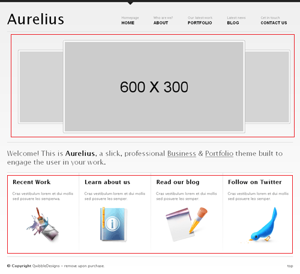
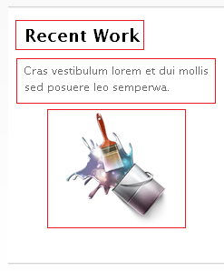
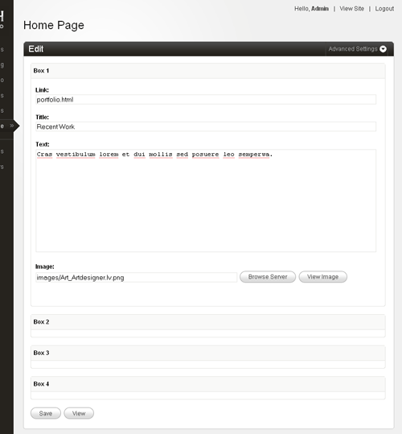
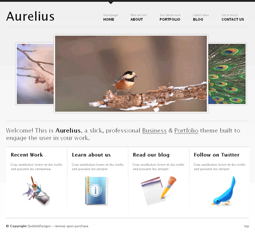

import { Card } from '@astrojs/starlight/components';

<Card icon="download" title="Download Code">
[Download Couchified Code](https://www.couchcms.com/docs/code/home.zip)
</Card>

The **Home Page** in Aurelius is represented by `index.html`.

Having configured all the other sections of this web site, configuring the **Home Page** should now be pretty straightforward.

Let us begin by attaching Couch to this template.
Take the usual steps to do so -
Change the extension of `index.html` to make it `index.php`
Add the two lines of boilerplate PHP code to enclose the contents of this file and use the [**template**](../../tags-reference/template/) tag to change the display-name of the template.

```php title="index.php" ins="<?php require_once( 'couch/cms.php' ); ?>" ins="<cms:template title='Home Page' />" ins="<?php COUCH::invoke(); ?>"
<?php require_once( 'couch/cms.php' ); ?>
<cms:template title='Home Page' />
<!DOCTYPE html PUBLIC "-//W3C//DTD XHTML 1.0 Transitional//EN" "http://www.w3.org/TR/xhtml1/DTD/xhtml1-transitional.dtd">
<html xmlns="http://www.w3.org/1999/xhtml">
<head>
    <title>Aurelius | A premium Business and Portfolio theme</title>
    <meta http-equiv="Content-Type" content="text/html; charset=utf-8" />

    // ... existing code ...

	</div><!--end wrapper-->
</body>
</html>
<?php COUCH::invoke(); ?>
```

Access `https://www.mytestsite.com/` while logged on as the super-admin.
This will hook up Couch to the template.
Visit the admin panel. An new entry '**Home Page**' should appear in the list of templates.

### Defining editable regions

Take a look at the home page:



It has two distinct regions that will need to be handled.
The top region shows images of the five latest **Portfolio** entries in a carousel while the bottom region displays four separate boxes that have some content.
The **Portfolio** images will be fetched from the existing portfolio pages and hence do not require the creation of any editable regions.
The boxes at the bottom need to be looked at a little closer:



The three marked elements can do with an editable region each. A fourth editable region will be required to hold the link of the page that this box leads to.

This is the original code for the boxes with the proposed editable regions marked out for one box:

```php title="index.php" "portfolio.html" "Recent Work" "Cras vestibulum lorem et dui mollis sed posuere leo semper." "images/Art_Artdesigner.lv.png"
<div id="quicknav" class="grid_12">
    <a class="quicknavgrid_3 quicknav alpha" href="portfolio.html">
        <h4 class="title ">Recent Work</h4>
        <p>Cras vestibulum lorem et dui mollis sed posuere leo semper.</p>
        <p style="text-align:center;"></p>
    </a>
    <a class="quicknavgrid_3 quicknav" href="about.html">
        <h4 class="title ">Learn about us</h4>
        <p>Lorem ipsum dolor sit amet, consectetur adipiscing elit.</p>
        <p style="text-align:center;"></p>
    </a>
    <a class="quicknavgrid_3 quicknav" href="blog.html">
        <h4 class="title ">Read our blog</h4>
        <p>Lorem ipsum dolor sit amet, consectetur adipiscing elit.</p>
        <p style="text-align:center;"></p>
    </a>
    <a class="quicknavgrid_3 quicknav lastelem" href="#">
        <h4 class="title ">Follow on Twitter</h4>
        <p>Lorem ipsum dolor sit amet, consectetur adipiscing elit. </p>
        <p style="text-align:center;"></p>
    </a>
</div>
<div class="hr grid_12 clearfix">&nbsp;</div>
```

Create editable regions out of the marked regions by enclosing them with [**editable**](../../tags-reference/editable/) tags.
Here is how the editable regions are created for all the boxes:

```php title="index.php" ins="<cms:editable name='box1_group' label='Box 1' type='group' />" ins="<cms:editable name='box1_link' label='Link' group='box1_group' type='text'>" ins="<cms:editable name='box1_title' label='Title' group='box1_group' type='text'>" ins="<cms:editable name='box1_text' label='Text' group='box1_group' type='textarea'>" ins="</cms:editable>" ins="<cms:editable name='box1_image' label='Image' width='150' height='125' group='box1_group' type='image'>"
<div id="quicknav" class="grid_12">
    <cms:editable name='box1_group' label='Box 1' type='group' />
	<a class="quicknavgrid_3 quicknav alpha" href="<cms:editable name='box1_link' label='Link' group='box1_group' type='text'>portfolio.html</cms:editable>">
        <h4 class="title "><cms:editable name='box1_title' label='Title' group='box1_group' type='text'>Recent Work</cms:editable></h4>
        <p><cms:editable name='box1_text' label='Text' group='box1_group' type='textarea'>Cras vestibulum lorem et dui mollis sed posuere leo semper.</cms:editable></p>
        <p style="text-align:center;">images/Art_Artdesigner.lv.png</cms:editable>" /></p>
	</a>
    <a class="quicknavgrid_3 quicknav" href="about.html">
        <h4 class="title ">Learn about us</h4>
        <p>Lorem ipsum dolor sit amet, consectetur adipiscing elit.</p>
        <p style="text-align:center;"></p>
    </a>
    <a class="quicknavgrid_3 quicknav" href="blog.html">
        <h4 class="title ">Read our blog</h4>
        <p>Lorem ipsum dolor sit amet, consectetur adipiscing elit.</p>
        <p style="text-align:center;"></p>
    </a>
    <a class="quicknavgrid_3 quicknav lastelem" href="#">
        <h4 class="title ">Follow on Twitter</h4>
        <p>Lorem ipsum dolor sit amet, consectetur adipiscing elit. </p>
        <p style="text-align:center;"></p>
    </a>
</div>
<div class="hr grid_12 clearfix">&nbsp;</div>
```

(There is not sufficient space to show the full width of the code so the closing tags of editable regions are not visible. However it is fairly regular stuff and you can check it out from the php file you'll find linked to this tutorial.)

If defining the editable regions in-line seems too cluttered to you, you can define them, the way we did for **Blog** and **Portfolio**, within the template tag instead. In that case, you'll need to show only the variables representing the editable regions at the marked regions.

Please note in the code above that the labels of several regions are the same however, as is mandatory, their names are different.
Also note that we have grouped together the editable regions belonging to each box by creating [**group**](../../tags-reference/editable/) type editable regions for each box and linking them to the regions.

Refresh the home page by visiting `https://www.mytestsite.com/` logged-in as the super-admin.
Visit the admin panel and you should find the following:



Edit the links to make the boxes lead to the proper sections and we can then move on.

### Listing the portfolio items

Let us now get the carousel display images from the latest five portfolio items.
This is the original code:

```php title="index.php"
<!-- Featured Image Slider -->
<div id="featured" class="clearfix grid_12">
    <ul>
        <li>
            <a href="portfolio_single.html">
                <span>Read about this project</span>
                
            </a>
        </li>
        <li>
            <a href="portfolio_single.html">
                <span>Read about this project</span>
                
            </a>
        </li>
        <li>
            <a href="portfolio_single.html">
                <span>Read about this project</span>
                
            </a>
        </li>
        <li>
            <a href="portfolio_single.html">
                <span>Read about this project</span>
                
            </a>
        </li>
        <li>
            <a href="portfolio_single.html">
                <span>Read about this project</span>
                
            </a>
        </li>
    </ul>
</div>
```

As you can see, it consists of an unordered list with each LI representing one portfolio item.
You must have guessed that we'll use the Couch [**pages**](../../tags-reference/pages/) tag to fetch the pages cloned from `portfolio.php` template.
We'll proceed the way we have done several times while working with the enumerator tags ([**pages**](../../tags-reference/pages/), [**folders**](../../tags-reference/folders/), [**archives**](../../tags-reference/archives/)) in **Blog** and **Portfolio** sections -
Delete all items representing the object to be enumerated (the pages, in this case), except one.

```php title="index.php"
<!-- Featured Image Slider -->
<div id="featured" class="clearfix grid_12">
    <ul>
        <li>
            <a href="portfolio_single.html">
                <span>Read about this project</span>
                
            </a>
        </li>
    </ul>
</div>
```

Enclose the solitary item by the enumerator tag. The tag will cause this item to be repeated as many times as the objects fetched by it.

```php title="index.php" ins="<cms:pages masterpage='portfolio.php' limit='5'>" ins="</cms:pages>"
<!-- Featured Image Slider -->
<div id="featured" class="clearfix grid_12">
    <ul>
        <cms:pages masterpage='portfolio.php' limit='5'>
        <li>
            <a href="portfolio_single.html">
                <span>Read about this project</span>
                
            </a>
        </li>
        </cms:pages>
    </ul>
</div>
```

Finally, use the variables set by the enumerator tag belonging to each fetched object


```php title="index.php" ins="<cms:show k_page_link />" ins="<cms:show image_1 />"
<!-- Featured Image Slider -->
<div id="featured" class="clearfix grid_12">
    <ul>
        <cms:pages masterpage='portfolio.php' limit='5'>
        <li>
            <a href="<cms:show k_page_link />">
                <span>Read about this project</span>
                " alt="" />
            </a>
        </li>
        </cms:pages>
    </ul>
</div>
```

Visit `https://www.mytestsite.com/` to see the results of your work:



Couldn't have been any easier.

Well, that completes our last template. A little more work still needs to be done before we can finally call it quits - e.g. make the menu links work etc.

---

[Next Chapter: **Tying the Loose Ends**](../08-tying-the-loose-ends/)
