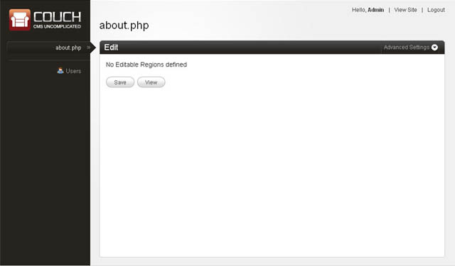
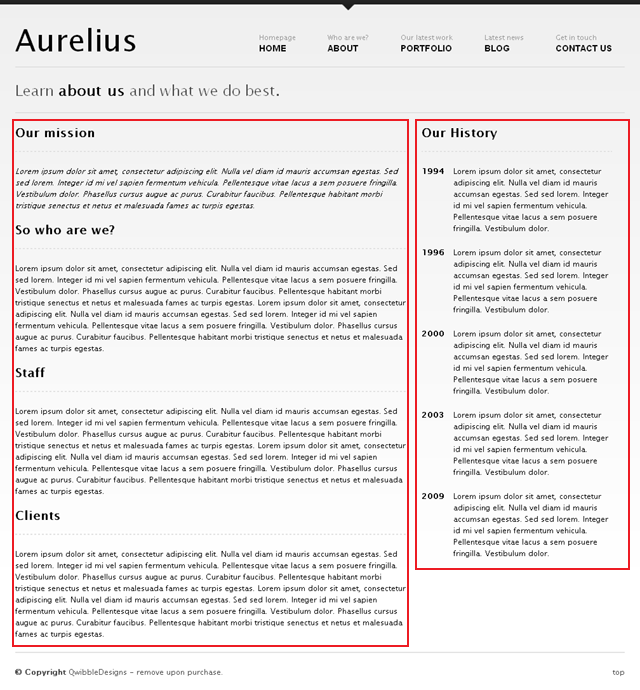
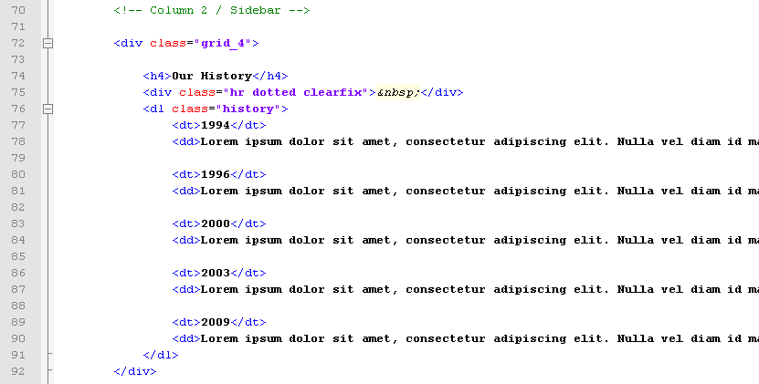
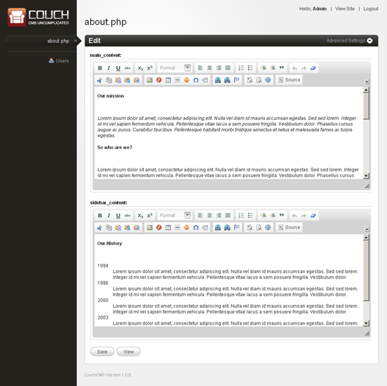
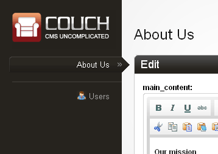

[⬇️ Download Couchified Code](https://www.couchcms.com/docs/code/about.zip)

Of all the five sections that Aurelius has (i.e. `About-Us`, `Portfolio`, `Blog`, `Contact-Us` and `Home`), the `Portfolio` and `Blog` sections will need the 'cloned pages' feature of Couch because they consist of multiple pages each cloned out of the same template.

We'll tackle the cloned pages in the next chapter. For now let us begin with a simpler section that doesn't require cloning. The `About Us` page will serve our purpose.
Before proceeding further, make sure that you are logged into Couch using the super-admin account that got created during installation.

Access `about.html` in your browser by visiting `http://www.mytestsite.com/about.html`.
The `About Us` page should appear.

Change the extension of the template from `.html` to `.php` so that `about.html` now becomes `about.php`. Access `about.php` in your browser -
`http://www.mytestsite.com/about.php`
The same `About Us` page should appear as did when the file's extension was `.html`.
This change of extension from `.html` to `.php` is necessary before Couch can be retrofitted into a template.

Time to fit Couch into `about.php`.
Open up `about.php` in your favorite text editor and paste the following line to the very top of the file -

```php
<?php require_once( 'couch/cms.php' ); ?>
```

```diff lang="php"
+   <?php require_once( 'couch/cms.php' ); ?>
    <!DOCTYPE html PUBLIC "-//W3C//DTD XHTML 1.0 Transitional//EN" "http://www.w3.org/TR/xhtml1/DTD/xhtml1-transitional.dtd"> 
    <html xmlns="http://www.w3.org/1999/xhtml">
    <head>
	    <title>Aurelius | About Us</title>
	    <meta http-equiv="Content-Type" content="text/html; charset=utf-8" />
```

:::note
If you had chosen to rename the default admin folder from couch to something else, make sure the line pasted above also reflects the change. Thus if the new name of the folder was myadmin, the line to be pasted will become -

&lt;?php require\_once( 'myadmin/cms.php' ); ?&gt;
:::

As the final step, paste the following to `about.php` as the last line of the file (i.e. after all other content of the file) -

```php
<?php COUCH::invoke(); ?>
```

```diff lang="php"
    	</div><!--end wrapper-->

    </body>
    </html>
+   <?php COUCH::invoke(); ?>
```

These two boilerplate lines of code are the only PHP that you should ever need to write to work with Couch.

Refresh the template within your browser by revisiting `about.php` and now visit the admin section once again.



Notice how `about.php` now appears in the list of templates in the sidebar on the left and how the right panel informs you that `about.php` has no editable regions defined yet.

These steps are all that you need to take in order to port any template to Couch.

### Defining editable regions

With Couch now hooked into `about.php`, let us now decide which regions within the template should be editable by the client.
Looking at `about.php` in the browser, it appears that these two regions are the ones that the client will want to edit -



With `about.php` open in the text editor, find the HTML block representing the main content region -

```html
<!-- Column 1 / Content -->

<div class="grid_8">
    <h4 class="page_title">Our mission</h4>
    <div class="hr dotted clearfix">&nbsp;</div>
    <p><i>Lorem ipsum dolor sit amet, consectetur adipiscing elit. Nulla vel diam id mauris accumsan egestas. Sed sed lorem. Integer id mi vel sapien fermentum vehicula. Pellentesque vitae lacus a sem posuere fringilla. Vestibulum dolor. Phasellus cursus augue ac purus. Curabitur faucibus. Pellentesque habitant morbi tristique senectus et netus et malesuada fames ac turpis egestas.</i></p> 
    <h4 class="page_title">So who are we?</h4>
    <div class="hr dotted clearfix">&nbsp;</div>
    <p>Lorem ipsum dolor sit amet, consectetur adipiscing elit. Nulla vel diam id mauris accumsan egestas. Sed sed lorem. Integer id mi vel sapien fermentum vehicula. Pellentesque vitae lacus a sem posuere fringilla. Vestibulum dolor. Phasellus cursus augue ac purus. Curabitur faucibus. Pellentesque habitant morbi tristique senectus et netus et malesuada fames ac turpis egestas. Lorem ipsum dolor sit amet, consectetur adipiscing elit. Nulla vel diam id mauris accumsan egestas. Sed sed lorem. Integer id mi vel sapien fermentum vehicula. Pellentesque vitae lacus a sem posuere fringilla. Vestibulum dolor. Phasellus cursus augue ac purus. Curabitur faucibus. Pellentesque habitant morbi tristique senectus et netus et malesuada fames ac turpis egestas.</p> 
    <h4 class="page_title">Staff</h4>
    <div class="hr dotted clearfix">&nbsp;</div>
    <p>Lorem ipsum dolor sit amet, consectetur adipiscing elit. Nulla vel diam id mauris accumsan egestas. Sed sed lorem. Integer id mi vel sapien fermentum vehicula. Pellentesque vitae lacus a sem posuere fringilla. Vestibulum dolor. Phasellus cursus augue ac purus. Curabitur faucibus. Pellentesque habitant morbi tristique senectus et netus et malesuada fames ac turpis egestas. Lorem ipsum dolor sit amet, consectetur adipiscing elit. Nulla vel diam id mauris accumsan egestas. Sed sed lorem. Integer id mi vel sapien fermentum vehicula. Pellentesque vitae lacus a sem posuere fringilla. Vestibulum dolor. Phasellus cursus augue ac purus. Curabitur faucibus. Pellentesque habitant morbi tristique senectus et netus et malesuada fames ac turpis egestas.</p> 
    <h4 class="page_title">Clients</h4>
    <div class="hr dotted clearfix">&nbsp;</div>
    <p>Lorem ipsum dolor sit amet, consectetur adipiscing elit. Nulla vel diam id mauris accumsan egestas. Sed sed lorem. Integer id mi vel sapien fermentum vehicula. Pellentesque vitae lacus a sem posuere fringilla. Vestibulum dolor. Phasellus cursus augue ac purus. Curabitur faucibus. Pellentesque habitant morbi tristique senectus et netus et malesuada fames ac turpis egestas. Lorem ipsum dolor sit amet, consectetur adipiscing elit. Nulla vel diam id mauris accumsan egestas. Sed sed lorem. Integer id mi vel sapien fermentum vehicula. Pellentesque vitae lacus a sem posuere fringilla. Vestibulum dolor. Phasellus cursus augue ac purus. Curabitur faucibus. Pellentesque habitant morbi tristique senectus et netus et malesuada fames ac turpis egestas.</p> 
</div>

```

and surround it with Couch's editable tags as follows -

```php
<cms:editable name='main_content' type='richtext'> original content </cms:editable>
```

```diff lang="php"
    <!-- Column 1 / Content -->
+   <cms:editable name='main_content' type='richtext'>
    <div class="grid_8">
        <h4 class="page_title">Our mission</h4>
        <div class="hr dotted clearfix">&nbsp;</div>
        <p><i>Lorem ipsum dolor sit amet, consectetur adipiscing elit. Nulla vel diam id mauris accumsan egestas. Sed sed lorem. Integer id mi vel sapien fermentum vehicula. Pellentesque vitae lacus a sem posuere fringilla. Vestibulum dolor. Phasellus cursus augue ac purus. Curabitur faucibus. Pellentesque habitant morbi tristique senectus et netus et malesuada fames ac turpis egestas.</i></p> 
        <h4 class="page_title">So who are we?</h4>
        <div class="hr dotted clearfix">&nbsp;</div>
        <p>Lorem ipsum dolor sit amet, consectetur adipiscing elit. Nulla vel diam id mauris accumsan egestas. Sed sed lorem. Integer id mi vel sapien fermentum vehicula. Pellentesque vitae lacus a sem posuere fringilla. Vestibulum dolor. Phasellus cursus augue ac purus. Curabitur faucibus. Pellentesque habitant morbi tristique senectus et netus et malesuada fames ac turpis egestas. Lorem ipsum dolor sit amet, consectetur adipiscing elit. Nulla vel diam id mauris accumsan egestas. Sed sed lorem. Integer id mi vel sapien fermentum vehicula. Pellentesque vitae lacus a sem posuere fringilla. Vestibulum dolor. Phasellus cursus augue ac purus. Curabitur faucibus. Pellentesque habitant morbi tristique senectus et netus et malesuada fames ac turpis egestas.</p> 
        <h4 class="page_title">Staff</h4>
        <div class="hr dotted clearfix">&nbsp;</div>
        <p>Lorem ipsum dolor sit amet, consectetur adipiscing elit. Nulla vel diam id mauris accumsan egestas. Sed sed lorem. Integer id mi vel sapien fermentum vehicula. Pellentesque vitae lacus a sem posuere fringilla. Vestibulum dolor. Phasellus cursus augue ac purus. Curabitur faucibus. Pellentesque habitant morbi tristique senectus et netus et malesuada fames ac turpis egestas. Lorem ipsum dolor sit amet, consectetur adipiscing elit. Nulla vel diam id mauris accumsan egestas. Sed sed lorem. Integer id mi vel sapien fermentum vehicula. Pellentesque vitae lacus a sem posuere fringilla. Vestibulum dolor. Phasellus cursus augue ac purus. Curabitur faucibus. Pellentesque habitant morbi tristique senectus et netus et malesuada fames ac turpis egestas.</p> 
        <h4 class="page_title">Clients</h4>
        <div class="hr dotted clearfix">&nbsp;</div>
        <p>Lorem ipsum dolor sit amet, consectetur adipiscing elit. Nulla vel diam id mauris accumsan egestas. Sed sed lorem. Integer id mi vel sapien fermentum vehicula. Pellentesque vitae lacus a sem posuere fringilla. Vestibulum dolor. Phasellus cursus augue ac purus. Curabitur faucibus. Pellentesque habitant morbi tristique senectus et netus et malesuada fames ac turpis egestas. Lorem ipsum dolor sit amet, consectetur adipiscing elit. Nulla vel diam id mauris accumsan egestas. Sed sed lorem. Integer id mi vel sapien fermentum vehicula. Pellentesque vitae lacus a sem posuere fringilla. Vestibulum dolor. Phasellus cursus augue ac purus. Curabitur faucibus. Pellentesque habitant morbi tristique senectus et netus et malesuada fames ac turpis egestas.</p> 
    </div>
+   </cms:editable>
```

Similarly find the content in the sidebar -

```html
<!-- Column 2 / Sidebar -->
<div class="grid_4">

    <h4>Our History</h4>
    <div class="hr dotted clearfix">&nbsp;</div>
    <dl class="history"> 
        <dt>1994</dt> 
        <dd>Lorem ipsum dolor sit amet, consectetur adipiscing elit. Nulla vel diam id mauris accumsan egestas. Sed sed lorem. Integer id mi vel sapien fermentum vehicula. Pellentesque vitae lacus a sem posuere fringilla. Vestibulum dolor.</dd> 
    
        <dt>1996</dt> 
        <dd>Lorem ipsum dolor sit amet, consectetur adipiscing elit. Nulla vel diam id mauris accumsan egestas. Sed sed lorem. Integer id mi vel sapien fermentum vehicula. Pellentesque vitae lacus a sem posuere fringilla. Vestibulum dolor.</dd> 
    
        <dt>2000</dt> 
        <dd>Lorem ipsum dolor sit amet, consectetur adipiscing elit. Nulla vel diam id mauris accumsan egestas. Sed sed lorem. Integer id mi vel sapien fermentum vehicula. Pellentesque vitae lacus a sem posuere fringilla. Vestibulum dolor.</dd> 
    
        <dt>2003</dt> 
        <dd>Lorem ipsum dolor sit amet, consectetur adipiscing elit. Nulla vel diam id mauris accumsan egestas. Sed sed lorem. Integer id mi vel sapien fermentum vehicula. Pellentesque vitae lacus a sem posuere fringilla. Vestibulum dolor.</dd> 
    
        <dt>2009</dt> 
        <dd>Lorem ipsum dolor sit amet, consectetur adipiscing elit. Nulla vel diam id mauris accumsan egestas. Sed sed lorem. Integer id mi vel sapien fermentum vehicula. Pellentesque vitae lacus a sem posuere fringilla. Vestibulum dolor.</dd> 
    </dl>
</div>
```



and surround it with the editable tags -

```diff lang="php"
    <!-- Column 2 / Sidebar -->
+   <cms:editable name='sidebar_content' type='richtext'>
		<div class="grid_4">
		
			<h4>Our History</h4>
			<div class="hr dotted clearfix">&nbsp;</div>
			<dl class="history"> 
				<dt>1994</dt> 
				<dd>Lorem ipsum dolor sit amet, consectetur adipiscing elit. Nulla vel diam id mauris accumsan egestas. Sed sed lorem. Integer id mi vel sapien fermentum vehicula. Pellentesque vitae lacus a sem posuere fringilla. Vestibulum dolor.</dd> 
			
				<dt>1996</dt> 
				<dd>Lorem ipsum dolor sit amet, consectetur adipiscing elit. Nulla vel diam id mauris accumsan egestas. Sed sed lorem. Integer id mi vel sapien fermentum vehicula. Pellentesque vitae lacus a sem posuere fringilla. Vestibulum dolor.</dd> 
			
				<dt>2000</dt> 
				<dd>Lorem ipsum dolor sit amet, consectetur adipiscing elit. Nulla vel diam id mauris accumsan egestas. Sed sed lorem. Integer id mi vel sapien fermentum vehicula. Pellentesque vitae lacus a sem posuere fringilla. Vestibulum dolor.</dd> 
			
				<dt>2003</dt> 
				<dd>Lorem ipsum dolor sit amet, consectetur adipiscing elit. Nulla vel diam id mauris accumsan egestas. Sed sed lorem. Integer id mi vel sapien fermentum vehicula. Pellentesque vitae lacus a sem posuere fringilla. Vestibulum dolor.</dd> 
			
				<dt>2009</dt> 
				<dd>Lorem ipsum dolor sit amet, consectetur adipiscing elit. Nulla vel diam id mauris accumsan egestas. Sed sed lorem. Integer id mi vel sapien fermentum vehicula. Pellentesque vitae lacus a sem posuere fringilla. Vestibulum dolor.</dd> 
			</dl>
		</div>
+   </cms:editable>
```

Refresh `about.php` by revisiting it in your browser. Go to the admin section and click on `about.php` in the list on the left.
The right panel should now display the following -



As you can see, Couch has now created the two editable regions for you.
Try editing the contents in them and revisit `about.php` after saving your changes. Your changes should now appear on the website.

:::note
The editable tag, particularly the richtext type, has a plethora of options that you can set to tailor the created editable region to your client's need. Please consult the [documentation](../../../../concepts/editable-regions/) for details.
:::

This is all that is needed to make a single page editable.
To further refine the experience for your client, a few minor enhancements can be made.
The name of the template appears as `about.php` in the admin panel. Let us make it appear as `About Us`.
Couch has a tag named `template`. Add the following line containing the template tag to somewhere at the top of the page (below the boilerplate PHP include code we added, of course) -

```php
<cms:template title='About Us' />
```

```diff lang="php"
    <?php require_once( 'couch/cms.php' ); ?>
+   <cms:template title='About Us' />
    <!DOCTYPE html PUBLIC "-//W3C//DTD XHTML 1.0 Transitional//EN" "http://www.w3.org/TR/xhtml1/DTD/xhtml1-transitional.dtd"> 
    <html xmlns="http://www.w3.org/1999/xhtml">
    <head>
	    <title>Aurelius | About Us</title>
	    <meta http-equiv="Content-Type" content="text/html; charset=utf-8" />
```

Repeat the mandatory step of refreshing the template in browser and then revisit the admin panel.
The template should now be listed as 'About Us' instead of its file-name.



In the next chapter we'll tackle the templates that will be used to create multiple cloned pages.

[⬇️ Download Couchified Code](https://www.couchcms.com/docs/code/about.zip)

[Diving deep - the Blog (Part 1)](../blog/)
