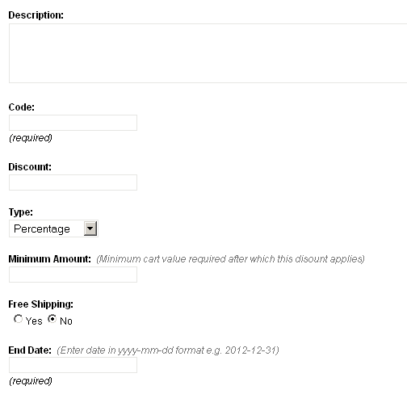

import { Steps, Card } from '@astrojs/starlight/components';

<Card icon="star" title="CouchCart">
    Please refer to [Core Concepts - CouchCart](../../../concepts/couchcart.html) for additional information regarding **CouchCart**.
</Card>

By this point, our [initial store assembly is nearly complete](../shopping-cart-1.html).

The product catalog is built, the shopping cart is in place and we can accept online payments via PayPal.
However, almost every eStore will need to configure a few **adjustments** before it can finally throw open its (virtual) doors to the world and start doing business.

These adjustments are elements that affect the final amount payable by the buyer.
Some of them, like **shipping charges** and **taxes**, increase the payable amount while others, like **discounts**, go on to decrease it.
As to how these adjustments are calculated - that really depends on the specific requirements of the business in question. No two businesses are run alike. There are simply too many ways people do business to come up with a 'one-size-fits-all' kind of solution acceptable to everybody.

So what does CouchCart do? Well. It does nothing!
Yes, you read that right. Rather than trying and falling short (like many others before it), CouchCart's approach is to **make you do the calculations instead, and hand it back the calculated values** to incorporate in the cart.

The way this works is as follows: while executing, CouchCart looks for a PHP script file named `cart_ex.php` within its own folder (i.e. `addons/cart`). If such a file is found, it delegates the responsibility of calculating discounts, shipping charges and taxes to specific functions expected to be in that file. Whatever values are returned by these functions will then be used in the totals calculated for the cart.

Of course, this means that somebody has to code those functions.
Now, I realize that it would be unreasonable to expect designers (Couch's primary users) to write all that PHP code by themselves.
I have, therefore, gone ahead and coded up for them, some of the most common calculation methods used by businesses.
You can find my implementation in a file named `cart_ex.example.php` within the `addons/cart` folder. Rename it to `cart_ex.php`. CouchCart will now use the code within it. The designer or the shop-owner, now needs only to set certain values with CouchCart's config file to use these calculations.

Please keep in mind that this is just my implementation of the required calculations. As I said, I've tried to cover some of the most common ways of doing them. However, it might, or might not, be suitable for your client's business requirements.
In case it is not, feel free to tweak, modify heavily or even discard this implementation completely and put in your version tailored to your specific needs.

:::note
If it comes down to having to use your own custom implementation and you are not conversant with PHP, it is likely that you'll require the services of a competent PHP developer. In which case, my implementation can at least serve as sample code to guide the developer. All the functions are profusely commented for this very purpose.
:::

**All the calculation methods discussed below assume that you've decided to use my implementation** (by renaming `cart_ex.example.php` to `cart_ex.php`).

Before we delve into the details of available calculations, however, a little concept (used both by shipping and by discount calculations that follow) requires some explanation.

:::note
**Sliding Scale:**
This is a scale in which the indicated shipping charges or discounts vary in accordance with another factor - e.g. _count of items_, _total price_ etc. For example, more the total cost of the order, more the discount offered or more the number of items in cart, less the shipping charges payable.

The accepted format for such scale is simple and looks like the following

```php
[ 0=3 | 50=7 | 100=10 ]
```
where, in the example above, the scale has three tiers.
Important (and potentially confusing) thing to remember is that this is a **more than** scale (and not **starts from** scale as you might think).

So, assuming the scale above denotes shipping charges based on number of items in cart, the three tiers in the scale would stand for
- More than 0 items - charge 3
- More than 50 items - charge 7
- More than 100 items - charge 10

This, in other words, could also be written as:
- 1 to 50 items - charge 3
- 51 to 100 - charge 7
- 101 to infinity - charge 10
:::

## Shipping Charges

Shipping charges can be calculated at two levels - **cart level** and individual **item level**.

### Cart level charges

There are 4 different ways to calculate cart level shipping charges. All of them can be set in `addons/cart/config.php` file.

*   Flat rate per order
*   Flat rate per item
*   Ship by order total
*   Ship by quantity ordered

#### Flat rate per order

This option can be set if you want to specify a shipping cost for **each order, no matter how many items it contains**.
For example, if you charge $5 for each order (that is, if John Doe places an order for 5 books, whereas Jane Doe places an order for one book, both orders are charged $5 for shipping) set it to '5'.

```php
$pp['shipping_flat_rate_per_order'] = '5';
```

#### Flat rate per item

This option can be set if you want to specify a shipping cost for **each item, no matter how many are included in an order**.
For example, if you charge $1 for each item in the order (that is, if a customer orders ten books, the shipping charge is $10) set it to '1'.

```php
$pp['shipping_flat_rate_per_item'] = '1';
```

#### Ship by order total

This option can be set if you want to set up a sliding scale of shipping charges based on the **order's total cost**.
For example, if you charge $6 for orders between $1 to $50, $3 for orders between $51 to $100, and free shipping for orders worth $101 and more, set it to

```php
$pp['shipping_by_order_total'] = '[ 0=6 | 50=3 | 100=0 ]';
```

where the string above stands for '6 for more than 0, 3 for more than 50, 0 for more than 100'.

To set up the shipping charges as a **percentage of order's total cost** (as opposed to **fixed values** as we did above), add a **%** after the string e.g.

```php
$pp['shipping_by_order_total'] = '[ 0=6 | 50=3 | 100=0 ]%';
```

which now makes it 6% of the cart's total for orders over $0, 3% of the cart's total for orders over $50 and 0% (free) for over $100\.

#### Ship by quantity ordered

This option can be set if you want to set up a sliding scale of shipping charges based on the **number of items in cart**.
For example, if you charge $3 to deliver one to five books, $7 to ship six to 15 books, and $10 to ship more than 15 books, set it to

```php
$pp['shipping_by_quantity_ordered'] = '[ 0=3 | 5=7 | 15=10 ]';
```

where the string above stands for '3 for more than 0, 7 for more than 5, 10 for more than 15'.

### Item level charges

To enable specifying shipping charges on individual products, **an editable region named `pp_shipping_scale` needs to be defined** in the product template.
If you are using the editable region definitions contained in our sample template, this region is already defined and you can enter the shipping scale for each product in the following panel:


This region allows you to set up for each product a sliding scale of shipping charges that is based on the number of the product ordered.
For example, if you charge $3 to deliver one to five units, $7 to ship six to 15 units, and $10 to ship more than 15 units, set it to:

```php
[ 0=3 | 5=7 | 15=10 ]
```

where the string above stands for '3 for more than 0, 7 for more than 5, 10 for more than 15'.

:::note
The shipping charges will be **calculated for only** those items that have their `pp_requires_shipping` editable region set to 'Yes'.
:::


All the 5 calculation methods discussed above are **cumulative**. That is, if you choose to set more than one, the values returned by each of them will be **added together** to arrive at a single shipping charge for the cart.

## Discounts

Like shipping, discounts can also be set at both **cart level** as well as at individual **product level**.

### Cart level discounts

There are two different ways cart level discounts may be calculated. Both of them can be set in `addons/cart/config.php` file.

*   Discount by order total
*   Discount by quantity ordered

#### Discount by order total

This option can be set if you want to set up a sliding scale of discounts based on the **order's total cost**.
For example, if you offer a discount of $5 for orders over $50, and $15 for orders over $100, set it to

```php
$pp['discount_by_order_total'] = '[ 50=5 | 100=15 ]';
```

To set up discounts as a **percentage** of the order's total cost (as opposed to **fixed values** as we did above), add a **%** after the string e.g.

```php
$pp['discount_by_order_total'] = '[ 50=5 | 100=15 ]%';
```

which now sets up a discount of 5% of the cart's total for orders over $50, and 10% for orders over $100\.

To set up a **flat discount (fixed value or percentage)** off orders above a particular value, create only a single tier in the scale
e.g. the following will provide a flat discount of $10 on any order above $100

```php
$pp['discount_by_order_total'] = '[ 100=10 ]';
```

while the following will provide a flat discount of 10% on any order above $100\.

```php
$pp['discount_by_order_total'] = '[ 100=10 ]%';
```

#### Discount by quantity ordered

This option can be set if you want to set up a sliding scale of discounts based on the number of items in cart.
For example, for "Buy any 5 products, get $10 off your order" kind of promotion, set it to

```php
$pp['discount_by_quantity_ordered'] = '[ 4=10 ]';
```

where the string above stands for '10 for more than 4 items'.

### Item level discounts

Similar to setting item-level shipping charges, we can also set item level discounts (i.e. discounts **set directly over individual products**).
However, unlike shipping, item level discounts **don't appear in the 'Discounts' total of the cart** (the one output by `<cms:pp_discount />`), as do the two cart level discounts discussed above. Rather, these discounts **serve to decrease the base-price of the product**.

This property can be used to implement **Quantity based pricing** (also known as **tiered pricing**) where the product's base price varies based on the quantity of it purchased (useful for bulk purchases).

This method **requires defining an editable region named `pp_discount_scale`** in the products template.
If you are using the editable region definitions contained in our sample template, this region is already defined and you can enter the discount scale for each product in the following panel:


Using the editable region, individual products can now be set with a sliding scale for price-reductions (discounts). For example

```php
[ 5=10 | 10=15 ]
```

where the scale above stands for 'reduce product's base-price by $10 if customer buys more than 5 units of it, by $15 if buys more than 10'.

To setup price-reductions (discounts) as a **percentage** of the product's base price (instead of **fixed values** as in the example above), a **%** can be added to the scale e.g.

```php
[ 5=10 | 10=15 ]%
```

where the scale now becomes 'reduce product's base-price by 10% if customer buys more than 5 units of it, by 15% if buys more than 10'.

:::note
If a product's base price gets reduced by this method, two custom variables are made available within `<cms:pp_cart_items />` tag (the tag used to display the cart) -

+ **line_discount**: this shows the discounted value
+ **orig_price**: this shows the original base price without the discount applied.

e.g. in `cart.php` template, this is how we display the original price of discounted cart items (with a strikethrough style)

```php title="cart.php"
<cms:if line_discount><span class="compare-price">$<cms:number_format orig_price /></span></cms:if>$<cms:number_format price />
```
:::

## Taxes

Implementation of taxes calculation is much simpler than the shipping and discount calculations.
The config file has two settings for taxes:

<Steps>

1. You can specify the tax percentage applied to the **cart's total value**. For example, the following sets a 10% tax

    ```php
    $pp['tax_percent'] = '10';
    ```

2. You can specify whether the tax percentage set above is applied **after shipping charges** are added to cart total **or before** doing so (i.e. whether or not shipping is taxed). The default is '0' which makes the shipping taxable. Set it to '1' to make it otherwise.

    ```php
    $pp['tax_excludes_shipping'] = '1';
    ```

</Steps>

## Promotional Coupons

Coupons can be used to provide **cart level discount** and/or **free shipping** to buyers presenting a valid coupon code.
This simple implementation of the coupon feature is an example of using Couch's cloned pages in tandem with CouchCart to add features not originally available.
The finished version of our sample site contains a template named `coupons.php`. It is a regular Couch template defining a set of editable regions. Execute it as super-admin to register it with Couch. In the admin-panel, we can now create coupons as cloned pages of this template.

:::note
The `End Date` field defined by this template makes use of the [**Date-Picker addon**](https://www.couchcms.com/forum/viewtopic.php?f=8&t=7126) for ease in inputting dates. If you don't wish to use the addon, you may safely remove the `editable name='datepicker'` region from the template.
:::

### Creating coupons

Let us create one. This is what the edit-panel for a coupon looks like.



A short description of what the fields stand for is in order.

#### Description

Self-explanatory. For example '10% off on orders over $200'

#### Code

This is the coupon code that will be distributed by the shop owner and then added by the buyers to the shopping cart for the coupon to take effect.

#### Discount

The value of the discount provided by the coupon.

#### Type

Can be either `Percentage` or `Fixed Amount`. This refers to the discount value mentioned above and specifies whether it is a fixed value or a percentage of the cart total.

#### Minimum Amount

If the coupon is meant to be applied to only orders worth at least a certain amount, that amount can be set here.

#### Free Shipping

If set to `Yes`, this coupon will set the cart's shipping charges to 0. A coupon that provides only free shipping and no other discount can be created by setting the `Discount` field to 0 and this field to `Yes`.

#### End Date

If the coupon is meant to be valid only for a definite period, the end date of the period can be set here. Actually, this is a mandatory field (technical reasons) so you'll have to set this even for coupons that will never expire. For such coupons, simply set this date to somewhere far into the future, say 100 years from now.

:::note
You'll notice that, while there is an end date, there is no corresponding **start date** field for the coupons. That is because, defining one would be redundant. Since coupons are simply cloned pages, they already have an implicit start date - their **publish date**. Set the publish date (from `Advanced settings` dropdown) to a future date for the coupon to be effective from that date onwards.
:::

### Processing coupons

With the coupons created (and the coded distributed to the buyers or displayed on the site), the next step is to allow the buyers to enter the coupon code into the shopping cart.
For our example, it is the checkout page that seems the most appropriate place for this purpose.
If you have been following this tutorial, the `checkout.php` template, as it stands at this point, simply redirects all the info to PayPal.
We'll now modify it to show a form where the buyer can input the coupon code, if he has one. This is also a good place to show him a summary of his shopping cart before he checks out to PayPal to make the payment.

The `checkout.php` template found in the finished version of our sample site shows how this can be done.


The cart summary is a simple modification of the code we used to display the cart in `cart.php` and `cart-modal.php` (this one does not allow editing of values). As for the input box for coupon code, we've used Couch's `form` tag to handle its submission.
You can simply copy the entire form code (every thing between the `<!-- START COUPON FORM -->` to `<!-- END COUPON FORM -->`) and paste it in your own templates to allow buyers to enter their coupons.

:::note
You can use the code as it is but a little understanding of what it does will do no harm (feel free to skip this section if it does not interest you).

The logic is pretty simple - successful submission of the form will trigger the `k_success` condition.
In this condition, we use `pages` tag to fetch the cloned page (i.e. the coupon) that contains the submitted coupon code as value of its edtitable region named `code`.

```php
<cms:if k_success >
<cms:pages masterpage="<cms:pp_config 'tpl_coupons' />" custom_field="code==<cms:show frm_coupon_code /> | end_date>=<cms:date format='Y-m-d' />" limit='1'>

</cms:pages>
</cms:if>
```
If one is found, the inputted coupon is valid. Now comes the important technique. As we know, it is `cart_ex.php` that does all the calculations for discounts and shipping. We provide `cart_ex.php` all the coupon data we fetched via `cms:pages` by using '**session variables**' (these variables can be accessed site-wide. The shopping cart itself is internally implemented as a session variable).
Note the last statement `pp_refresh_cart`. By refreshing the cart, we make `cart_ex.php` redo all the calculations (which now will take into account the coupon data we provided)

```php
<cms:if k_success >
<cms:pages masterpage="<cms:pp_config 'tpl_coupons' />" custom_field="code==<cms:show frm_coupon_code /> | end_date>=<cms:date format='Y-m-d' />" limit='1'>
   <cms:set_session name='coupon_found' value='1' />
   <cms:set_session name='coupon_code' value=code />
   <cms:set_session name='coupon_discount' value=discount />
   <cms:set_session name='coupon_type' value=type />
   <cms:set_session name='coupon_min_amount' value=min_amount />
   <cms:set_session name='coupon_free_shipping' value=free_shipping />

  <cms:pp_refresh_cart />
</cms:pages>
</cms:if>
```
So this basically is how the coupon feature was implemented. The same technique (i.e. using cms:form and then setting session variables with submitted values) can be used to implement other features e.g. capturing buyer's address etc.
:::

## The end, finally...

So that wraps up our tutorial (cum documentation) of CouchCart.
It's a lean, yet quite extensible, little shopping cart that should come in handy with a lot of sites with simpler ECommerce requirements.

What CouchCart is NOT (at least not as yet) is:

*   An Order management system
*   An Inventory management system
*   A Customer management system

As the feature-set of CouchCMS expands, we can expect this to change.

For now, adieu!

<Card icon="star" title="CouchCart">
    Please refer to [Core Concepts - CouchCart](../../../concepts/couchcart.html) for additional information regarding **CouchCart**.
</Card>